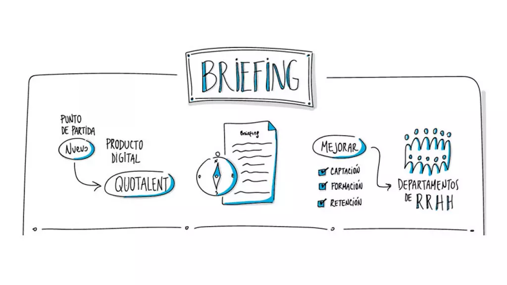
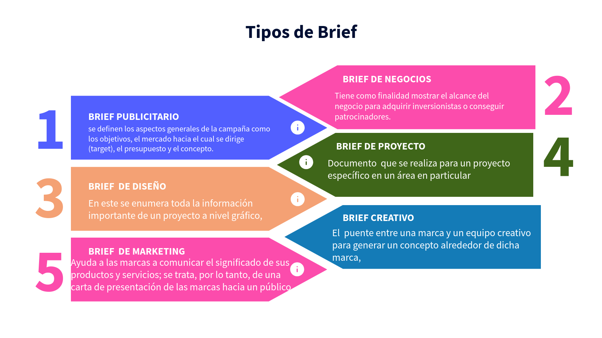
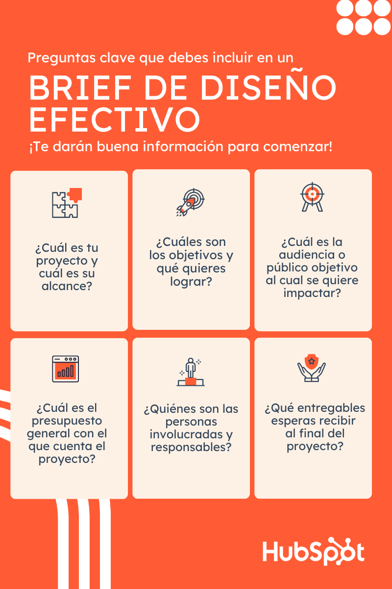
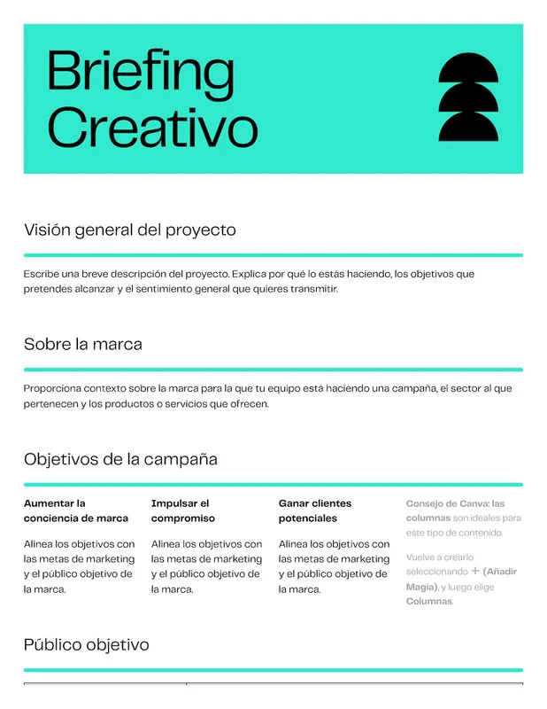
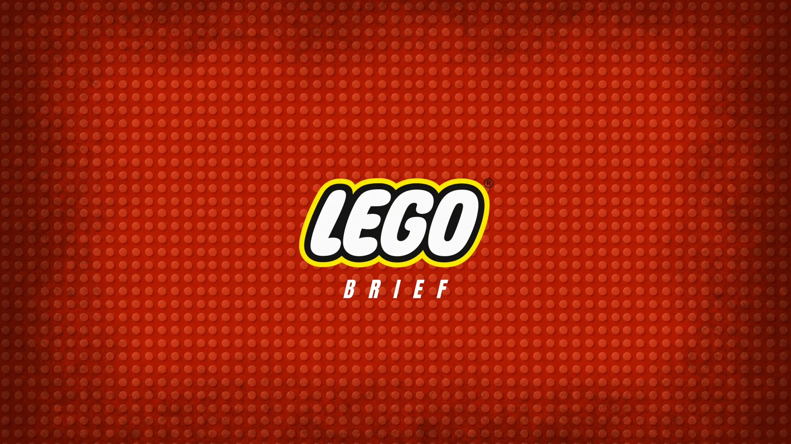
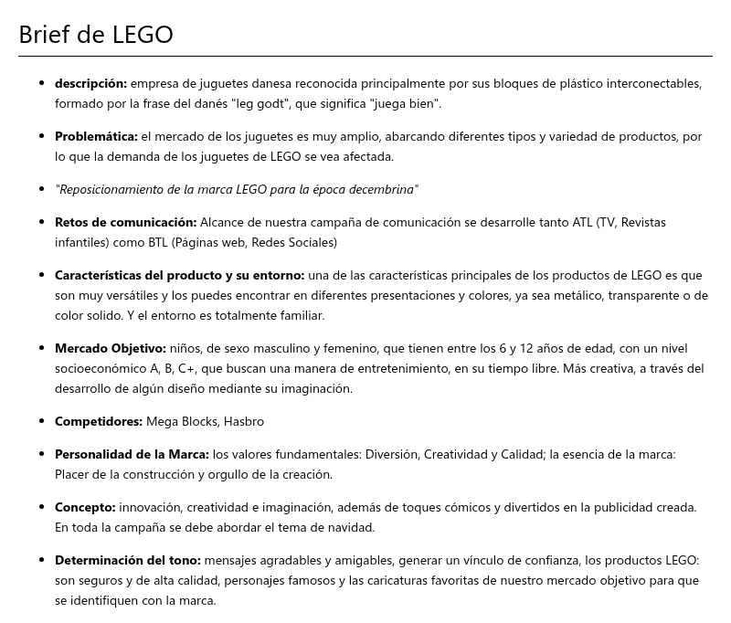
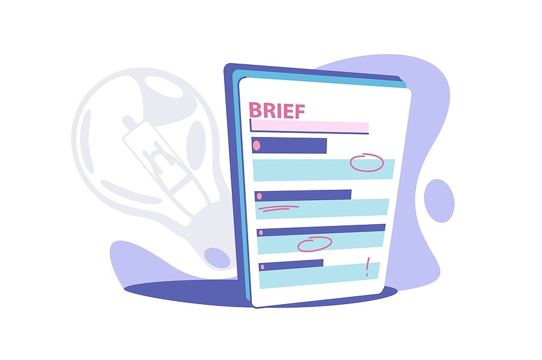
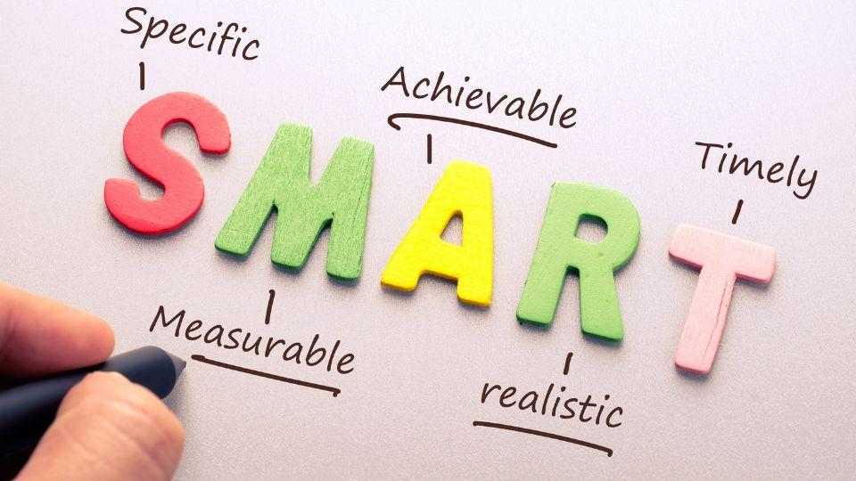

# El Brief: 

### Tu Mapa para Navegar Todo Proyecto Creativo

Bienvenido hoy vamos a dominar el **brief**: el documento que transforma una idea vaga en un proyecto tangible. Como Director de Arte, te confieso que el 90% de los problemas en un proyecto surgen de un brief mal hecho. Vamos a asegurarnos de que ese nunca sea tu caso.

El brief no es un trámite burocrático; es la **hoja de ruta**, la **constitución** y el **traductor universal** de cualquier iniciativa. Vamos a desarmarlo, entender su anatomía y aprender a construir uno a prueba de balas.

---

### ¿Qué es un Brief? Más Allá del Papel

Técnicamente, un **brief** es un documento informativo que contiene la información esencial para planificar o ejecutar un proyecto. Su objetivo es asegurar que todos los involucrados estén sincronizados.

En el mundo real, el brief es tu **kit de supervivencia**. Imagina que eres un chef: el brief no es solo la lista de ingredientes, es la receta, la foto del plato terminado, las alergias del comensal y el tiempo que tienes para cocinar. Sin él, solo estás lanzando especias al aire y esperando que salga algo bueno.

*   **Es una Herramienta:** Imprescindible en el día a día de equipos creativos, de marketing, diseño o programación.
*   **Es un Documento:** Contiene la información que evita 500 correos preguntando lo mismo.
*   **Es un Protocolo de Comunicación:** Asegura que el cliente, el diseñador, el redactor y el desarrollador estén viendo la misma película.

**La clave:** Un brief siempre genera una **danza de dos elementos**: el brief en sí (la pregunta) y la *respuesta al brief* (la solución creativa). Tu trabajo, como creador, es bailar al ritmo que marca el primero.

---

### La Anatomía de un Brief Básico: Tu Checklist Infalible

Un buen brief no nace por generación espontánea. Sigue una **lógica de lo general a lo particular** y responde preguntas fundamentales. Piensa en esto como tu lista de verificación antes de despegar:

*   **¿QUÉ?** La necesidad concreta. ¿Una nueva página web? ¿Una campaña en Instagram? ¿Un logotipo? Sé específico.
    *   *En confianza:* "Necesito que me ayudes a vender más" no es un "QUÉ". "Necesito un banner que destaque el 50% de descuento en alimento para perros grandes" sí lo es.

*   **¿PARA QUÉ? (Objetivos):** El propósito estratégico. ¿Aumentar ventas? ¿Mejorar el reconocimiento de marca? ¿Generar leads?
    *   *En confianza:* Aquí defines el **"para qué"** real. ¿Es solo vender o es posicionarte como la marca más confiable para mascotas? El objetivo es tu estrella polar.

*   **¿PARA QUIÉN? (Audiencia):** El retrato robot de tu cliente ideal. Edad, intereses, dolores, aspiraciones.
    *   *En confianza:* No digas "mujeres de 25 a 45 años". Di "Laura, 32 años, dueña de un golden retriever, compra online por comodidad y le preocupa la calidad de los ingredientes". Dale un nombre y una historia.

*   **¿CON QUÉ? (Presupuesto y Medios):** Los recursos reales. Dinero disponible, canales (redes sociales, e-commerce), assets existentes (logos, fotos).
    *   *En confianza:* Conocer el presupuesto te dice si estás diseñando un yate o una canoa. Ambos flotan, pero el proceso es radicalmente distinto.

*   **¿CUÁNDO? (Plazos y Entregables):** El cronograma y el formato final. Fechas clave y qué se espera recibir (un archivo .jpg, un sitio web funcional, una presentación).
    *   *En confianza:* El *deadline* es sagrado. Y "un diseño" no es un entregable. "Tres opciones de afiche en formato A3, a 300dpi, con archivos editables" sí lo es.

---

### Los 6 Pasos del Ritual: Del Brief al Resultado

El proceso no termina al entregar el brief. Es un ciclo iterativo donde la comunicación es la protagonista:

1.  **Creación del Brief:** Lo hace el cliente (o quien tenga la necesidad). Vierte su mundo en el documento.
2.  **Sesión de Briefing:** La reunión donde el cliente presenta el brief al equipo creativo. Aquí se aclaran dudas **inmediatamente**.
3.  **Pre-trabajo:** El equipo creativo analiza, investiga y da sus primeros pasos internos sobre cómo responder.
4.  **Contra-Briefing o *Tissue Session*:** ¡El paso más subestimado! El equipo creativo devuelve el brief *reformulado* para confirmar que entendió perfectamente el problema. Es tu oportunidad de decir: "Escuché A, pero creo que el problema real es B".
5.  **Presentación de la Respuesta & Feedback:** Se muestra el trabajo (el diseño, la campaña, el prototipo) y el cliente da su primera retroalimentación.
6.  **Ajustes e Iteraciones:** Se refina la solución basándose en el *feedback*, hasta alcanzar el resultado deseado.

**La clave:** Este proceso evita el famoso "no es lo que yo imaginaba". Si en el paso 4 alineaste la visión, el paso 5 será una celebración, no una corrección.

---

### La Familia de los Briefs: Eligiendo al Especialista Correcto

No todos los briefs son iguales. Cada disciplina tiene su variante, como un médico tiene sus especialidades. Conócelas:

| Tipo de Brief | Se Usa Para... | En Confianza (El "Para Dummies") |
| :--- | :--- | :--- |
| **Brief Creativo/Publicitario** | Desarrollar campañas, anuncios, piezas de alto impacto visual/conceptual. | Es el brief para hacer magia. Busca el *insight* (esa verdad humana) que hará llorar o reír a tu audiencia. |
| **Brief de Marketing** | Lanzar un producto, planificar una acción comercial concreta (Black Friday). | Es el brief del estratega. Menos poesía, más números y canales. |
| **Brief de Diseño** | Crear elementos visuales: sitio web, identidad, piezas para redes. | Es el brief del *pixel perfect*. Incluye paletas de color, tipografías y especificaciones técnicas hasta el último milímetro. |
| **Brief de Programación** | Desarrollar una app, un sitio web, una herramienta digital. | Aquí se separa el **Front-end** (lo que el usuario ve y toca, tu terreno) del **Back-end** (la magia oculta del código). |
| **Brief de Comunicación** | Gestionar relaciones públicas, eventos, trabajo con *influencers*. | Es el brief del relacionista público. Se trata de *historias* y *conversaciones*, no solo de anuncios. |

---

### 🚀 Tu Reto de Comunicación Estratégica

Te toca dejar el rol de alumno y ponerte en los zapatos de un **estratega**. Usa el caso ficticio **"Hey Snoopy!"** (venta online de alimento para mascotas) y construye el esqueleto de un **Brief de Diseño** para ellos.

**Tu misión:** Completa estas oraciones con la mayor precisión y detalle posible, como si tuvieras que entregárselo a un diseñador mañana:

1.  **¿QUÉ?** "Necesitamos que diseñes..."
2.  **¿PARA QUÉ? (Objetivo)** "Para lograr que..."
3.  **¿PARA QUIÉN? (Audiencia)** "Nuestro cliente ideal es alguien que..."
4.  **¿CON QUÉ? (Recursos)** "Contamos con..."
5.  **¿CUÁNDO? (Plazos/Entregable)** "Necesitamos para [fecha] un entregable que sea..."

**No inventes recursos imposibles.** Sé realista y estratégico. Guarda tus respuestas. Máss adelante veremos cómo este brief se transforma en moodboards, paletas de color y las primeras líneas de un diseño que no solo es bonito, sino que **resuelve un problema real**.

Recuerda: un gran diseñador no solo ejecuta, **interpreta**. Y el brief es la partitura.

---

## Los Cimientos del Brief: Los Elementos que lo Hacen a Prueba de Errores

Anteriormente desentrañamos qué es un brief y por qué es tu hoja de ruta. Hoy vamos a lo concreto: **los elementos no negociables** que lo convierten de un simple documento en un faro que guía cada decisión creativa.

Si el brief es el mapa, estos elementos son la brújula, la escala, los puntos de referencia y la leyenda. Omitir uno es like intentar construir una casa sin cimientos: se verá bien por un momento, pero al primer viento se desmoronará.

Vamos a destripar la anatomía de un brief poderoso.

---

### Contexto: El "Quién" y el "Qué" (Los Pilares)

Antes de pedir cualquier cosa, hay que presentarse. Esta sección evita que el equipo creativo trabaje a ciegas.

*   **La Empresa o Marca:**
    *   **Definición Técnica:** Una descripción clara de la identidad, valores, misión y posicionamiento en el mercado.
    *   **En Confianza:** Es presentar a tu "cliente" al equipo. ¿Es una startup rebelde o una corporación centenaria? El tono, la paleta de colores y hasta la tipografía que elijas dependerán de esto. **No puedes diseñar para alguien a quien no conoces.**

*   **El Producto o Servicio:**
    *   **Definición Técnica:** Explicación detallada de lo que se ofrece, sus características clave, beneficios y diferenciales.
    *   **En Confianza:** No se trata solo de listar especificaciones. Es contar **por qué** ese producto merece existir. ¿Estás diseñando la caja para el "mejor alimento orgánico para perros" o para el "alimento más barato del mercado"? El diseño nacerá de esa verdad.

---

### Estrategia: El "Para Qué" y "Para Quién" (El Cerebro)

Aquí es donde la magia estratégica sucede. Responder esto separa un *diseño bonito* de un **diseño efectivo.**

*   **Los Objetivos (El Para Qué):**
    *   **Definición Técnica:** Metas claras, medibles, alcanzables, relevantes y con un tiempo definido (SMART).
    *   **En Confianza:** ¿Qué quieres que **pase** en el mundo real? "Que sea bonito" no es un objetivo. "Aumentar los clics en el botón de 'Comprar' en un 15% en tres meses" sí lo es. Tu diseño será un éxito o un fracaso en función de este número.

*   **La Audiencia (El Para Quién):**
    *   **Definición Técnica:** Descripción demográfica, psicográfica y de comportamiento del grupo objetivo.
    *   **En Confianza:** Deja de pensar en "hombres, 25-40 años". Crea a **"Carlos, 32 años, arquitecto, tiene un perro salchicha, compra online por comodidad y lee reseñas antes de decidir."** Diseñas para Carlos, no para una estadística. Cada color, cada palabra y cada imagen debe hablarle directamente a él.

---

### Limitantes y Parámetros: Los Límites que Liberan la Creatividad

Esto puede sonar contradictorio, pero los mejores diseños florecen dentro de un marco definido. Estos elementos no son obstáculos, son **el desafío que agudiza tu ingenio.**

*   **El Presupuesto:**
    *   **Definición Técnica:** La asignación financiera disponible para el proyecto.
    *   **En Confianza:** Saber si tienes $500 o $50,000 te dice si puedes filmar con un drone en Islandia o hacer una animación ilustrada. **La creatividad más brillante a menudo nace de la restricción.** Un presupuesto ajustado te fuerza a ser más inteligente, no más pobre en ideas.

*   **La Geolocalización y Aspectos Legales/Sociales:**
    *   **Definición Técnica:** Contexto geográfico, regulaciones locales y consideraciones culturales.
    *   **En Confianza:** ¿Tu diseño se verá en México, España o Japón? Los colores y símbolos tienen significados distintos. ¿Es para un sector regulado como la salud o las finanzas? Hay logotipos y frases que no puedes usar. **Investigar esto te salva de un error catastrófico.**

*   **Las Métricas de Éxito:**
    *   **Definición Técnica:** Los KPIs (Indicadores Clave de Rendimiento) que medirán el impacto.
    *   **En Confianza:** ¿Cómo sabremos que ganamos? ¿Por ventas, por alcance, por engagement? Si tu objetivo es "aumentar la confianza", la métrica podría ser "aumentar en un 20% las menciones positivas en redes". Esto le da un **propósito medible** a cada elemento visual que crees.

---

### Ejecución: El "Cuándo" y "En Qué Forma" (El Plan de Ataque)

La estrategia sin un plan táctico claro es solo una buena intención. Aquí se define la realidad operativa.

*   **Los Plazos:**
    *   **Definición Técnica:** Cronograma con hitos claros: briefing, presentación de avances, revisiones, entrega final.
    *   **En Confianza:** Un deadline realista es tu mejor amigo. Un deadline imposible es la receta para un trabajo mediocre y noches sin dormir. Sé claro con los tiempos desde el día uno y **defiende el tiempo que la calidad requiere.**

*   **Los Entregables:**
    *   **Definición Técnica:** Descripción exacta de lo que se entregará al finalizar el proyecto, incluyendo formatos, dimensiones y especificaciones técnicas.
    *   **En Confianza:** Esto evita el "¡Pero yo esperaba un video animado, no unas imágenes estáticas!". Sé hiperespecífico: "Se entregarán 3 opciones de afiche en formato .PDF para impresión (A3, 300dpi) y .JPG para web, junto con una guía de aplicaciones de la marca." **La claridad aquí es un acto de profesionalismo.**

---

### El Contra-Briefing: El Paso del Sabio

Este es el **elemento secreto** que separa a los novatos de los profesionales.

*   **Definición Técnica:** Proceso donde el equipo creativo reformula el brief con sus propias palabras y se lo devuelve al cliente para confirmar comprensión.
*   **En Confianza:** Es tu **seguro de vida**. En vez de correr a hacer el trabajo, tomas el brief del cliente y dices: *"Déjame ver si entendí. Tú necesitas X, para lograr Y, hablandole a Z, con este presupuesto y este tiempo. ¿Es correcto?"*
*   **La clave:** Aquí descubres malentendidos ocultos. El cliente pide "un logo moderno", pero en su cabeza "moderno" significa negro y gris, y en la tuya significa gradientes de colores neon. **Alinear esto al inicio ahorra semanas de trabajo descartado.**

---

### 🚀 Tu Reto: Construye los Cimientos de tu Propio Brief

Es hora de aplicar el conocimiento. **No inventes un caso nuevo.** Toma el **Brief de Diseño** que empezaste a esbozar en el reto anterior para **"Hey Snoopy!"** y **amplíalo con los elementos esenciales que aprendimos hoy.**

**Tu misión es completar esta tabla:** Para cada elemento, escribe **una sola oración o lista clara** que sería parte del brief definitivo.

| Elemento del Brief | Tu Definición para "Hey Snoopy!" (Sé específico y conciso) |
| :--- | :--- |
| **Descripción de la Marca** | Ej: "Marca joven y dinámica de venta online de alimento premium para perros y gatos, que prioriza ingredientes naturales y la comodidad de entrega a domicilio." |
| **El Producto/Servicio** | *(Describe el producto clave para este proyecto)* |
| **Objetivos (SMART)** | *(Ej: "Aumentar el reconocimiento de marca un 25% entre dueños de mascotas en la ciudad en 6 meses")* |
| **Audiencia** | *(Crea un mini "persona" con 3-4 características clave)* |
| **Presupuesto** | *(Sé realista. Ej: "Presupuesto total de diseño: $1,500 USD")* |
| **Contexto (Geográfico/Legal)** | *(Ej: "Campaña dirigida inicialmente a capital, respetando normas de publicidad de alimentos para mascotas.")* |
| **Métrica de Éxito Principal** | *(¿Qué número demostrará que el diseño funcionó?)* |
| **Entregable Concreto** | *(Ej: "Sistema de identidad visual básico que incluya: logotipo, paleta de color, tipografía principal y aplicaciones en perfil de Instagram y header de e-commerce.")* |
| **Pregunta para el Contra-Briefing**| *(Formula UNA pregunta crítica que le harías al cliente de "Hey Snoopy!" para confirmar tu entendimiento)* |

Llena esta tabla. Este ejercicio no es un trámite; es la **base sobre la que construirás todo tu proyecto creativo.** Guárdala, porque más adelante convertiremos estos cimientos en **moodboards y conceptos visuales tangibles.**

Recuerda: Un maestro no teme a los límites, los usa como la estructura sobre la cual levanta su obra maestra.

---

## El Kit de Herramientas del Brief: Cómo Elegir la Correcta para Cada Proyecto

Has aprendido a construir los cimientos de un brief sólido. Ahora es momento de entender que **no existe un brief único**. Así como no usarías un martillo para atornillar, no usarás el mismo brief para una campaña global que para un post en redes.

Como creativo, tu agilidad para identificar y trabajar con el tipo de brief correcto es lo que te hará eficiente y efectivo. Hoy exploraremos el **ecosistema de los briefs**, clasificados por su formalidad y por su disciplina, para que siempre tengas la herramienta adecuada a mano.

---

### Según el Ritmo: Formalidad del Día a Día

La formalidad del brief depende de la urgencia, la complejidad y los actores involucrados. Imagina que es el vestuario para la ocasión: hay desde ropa de casa hasta traje de gala.

*   **El Brief Diario (El Parte de Guerra Matutino):**
    *   **Definición Técnica:** Reunión rápida, a menudo de pie (*stand-up meeting*), donde el equipo alinea prioridades y tareas del día.
    *   **En Confianza:** Es el café mañanero con tu equipo. No hay documento, pero **siempre debe terminar con un correo que resuma acuerdos.** "Hoy, Pablo ajusta el diseño del banner, Ana escribe el copy y yo presento el avance al cliente a las 4 PM." Su propósito es **sincronización táctica**, no estrategia.

*   **El Brief Informal (El Chat de WhatsApp):**
    *   **Definición Técnica:** Solicitud inicial que llega por un mensaje, un correo corto o una llamada. "¿Podemos hacer un flyer para el evento del jueves?"
    *   **¡LA CLAVE CRUCIAL!:** Un brief informal **NO ES VÁLIDO** para empezar a trabajar. Es solo la chispa. Tu primer trabajo como profesional es **transformarlo en un brief formal.** Responde: "¡Claro! Envíame un correo con los detalles: objetivo, público, texto, medidas y ejemplos de lo que te gusta. Con eso armo el brief y empezamos." Esto te protege de malentendidos y cambios infinitos.

*   **El Brief Formal (El Contrato Creativo):**
    *   **Definición Técnica:** Documento estructurado (usando una plantilla), que detalla todos los elementos esenciales que ya dominas: contexto, objetivos, audiencia, presupuesto, plazos, entregables.
    *   **En Confianza:** Es la **biblia del proyecto**. Es obligatorio para cualquier trabajo de mediana o gran envergadura (un logo, una campaña, un sitio web). Exige tiempo de elaboración y **debe ser aprobado por ambas partes** antes de mover un solo píxel. Es tu garantía de que todos están en la misma página.

---

### Según el Campo de Batalla: La Disciplina es el Norte

Cada área creativa tiene sus propias reglas del juego. El brief debe adaptarse a ellas. Esto no es solo semántica; es sobre **hacer las preguntas correctas** desde el inicio.

| Tipo de Brief | Se Centra En... | La Pregunta Clave que Responde | Para un Director de Arte, Significa... |
| :--- | :--- | :--- | :--- |
| **Brief Publicitario** | Encontrar un **insight** humano para crear piezas emotivas y persuasivas (un spot de TV, un banner). | ¿Qué verdad emocional hará que nuestro público **sienta** y **actúe**? | Buscar la **idea visual poderosa** que encapsule esa emoción. Menos sobre especificaciones técnicas, más sobre concepto y impacto. |
| **Brief de Marketing** | Planificar **campañas** con objetivos comerciales concretos (lanzamiento, ventas, posicionamiento). | ¿Qué tácticas en qué canales nos llevarán a cumplir nuestras **métricas de negocio** (ventas, leads)? | El diseño está al servicio de una **estrategia medible**. Cada pieza debe tener un CTA (Call to Action) claro y estar pensada para un canal específico. |
| **Brief de Comunicación** | Desarrollar **estrategias de relaciones públicas** (eventos, prensa, *influencers*). | ¿Qué **historia** debemos contar, a qué **mediadores** (prensa, influencers) y con qué **tono**? | Crear assets visuales que sean **compartibles y noticiables**. Piensa en kits de prensa, fotografía de eventos, contenido para influencers. |
| **Brief de Diseño** | **Especificaciones visuales y técnicas** para crear un producto tangible (logo, web, packaging). | ¿Qué necesitamos **crear visualmente**, en qué **formatos**, siguiendo qué **guías de marca**? | **¡Este es tu territorio!** Aquí se detalla paleta de color, tipografía, formatos de archivo, dimensiones. Es el brief más técnico y preciso para un diseñador. |
| **Brief de Programación** | Los **requerimientos funcionales** para construir algo digital (una app, un sitio web). | ¿Qué debe **hacer** el producto, cómo debe **funcionar** y para **quién**? | Aquí trabajas codo a codo con el desarrollador. Tu brief de diseño alimenta al de programación. Te obliga a pensar en **usabilidad, flujos de usuario y estados interactivos** (hover, click, error). |

---

### El Brief de Diseño: Tu Lenguaje Nativo Profundizado

Como Director de Arte, vivirás en los briefs de diseño. Vamos a destripar qué debe tener uno impecable:

*   **Inputs Claros:**
    *   **Manual de Marca Existente:** Paleta de color HEX/RGB, tipografías, logotipos en vectores, usos prohibidos.
    *   **Copy y Contenido:** El texto final (o al menos un 90% aprobado). **No se diseña con Lorem Ipsum.**
    *   **Referencias Visuales:** Moodboards, ejemplos de "me gusta" y **crucialmente**, de "**no me gusta**".

*   **Especificaciones Técnicas Innegociables:**
    *   **Dimensiones y Formatos:** "Banner para Instagram Stories: 1080x1920 px, formato .jpg o .mp4".
    *   **Sistema de Grillas:** "El diseño debe adaptarse a la grilla de 12 columnas de nuestro CMS".
    *   **Modos de Color:** "Entregar en CMYK para impresión y RGB para web".

*   **Espacio para la Creatividad:**
    *   Aunque es técnico, un buen brief de diseño deja un campo abierto para **"Explorar ideas que rompan con lo anterior, manteniendo la identidad"**. Es el balance entre restricción y libertad.

**La clave:** Un brief de diseño perfecto le permite a otro diseñador tomar el proyecto y continuarlo sin necesidad de hacer preguntas. Es **autosuficiente**.

---

### 🚀 Tu Reto: Diagnóstico y Prescripción

Es hora de afinar tu ojo clínico para diagnosticar necesidades y prescribir el brief correcto.

**Analiza estos 3 escenarios reales y determina:**

1.  **¿Qué TIPO de brief es el MÁS APROPIADO (por disciplina)?**
2.  **¿Qué nivel de FORMALIDAD requiere?**
3.  **¿Cuál es el PRIMER PASO que darías como profesional?**

**Escenario A:** El CEO de "Hey Snoopy!" te escribe un WhatsApp: "¡Hola! Vimos que la competencia sacó un nuevo empaque. Necesitamos algo más fresco para nuestro alimento de gatos. ¿Podemos hablar mañana?"

*   **Tu Análisis:**
    1.  Disciplina: ***Brief de ______***.
    2.  Formalidad: *Partió como ______, pero debes convertirlo en ______.*
    3.  Tu Primer Paso: *"Le responderé que..."*

**Escenario B:** Te llega un correo del área de Marketing de una app financiera. Adjuntan un documento con: "Objetivo: Incrementar la descarga de la app en un 30% en Q4. Target: Hombres y mujeres de 25-45 años interesados en invertir. Presupuesto: $XX. Necesitamos una campaña integral para redes y display."

*   **Tu Análisis:**
    1.  Disciplina: ***Brief de ______***.
    2.  Formalidad: *Es un brief ______*.
    3.  Tu Primer Paso: *"Antes de idear, solicitaré..."*

**Escenario C:** El equipo de Desarrollo te envía un ticket: "Para la nueva versión de la app, necesitamos los diseños de las 3 pantallas del flujo de registro. El backend estará listo en 2 semanas. Adjunta el wireframe aprobado."

*   **Tu Análisis:**
    1.  Disciplina: ***Brief de ______** (con fuertes insumos de un **Brief de ______**)*.
    2.  Formalidad: *Es un brief ______.*
    3.  Tu Primer Paso: *"Revisaré que el wireframe..."*

**Responde estos tres casos.** Este ejercicio entrena tu mente estratégica para no reaccionar, sino **actuar con método**. En nuestra próxima inmersión, tomaremos un brief formal de diseño y comenzaremos el viaje más emocionante: **la búsqueda de inspiración y la creación del concepto visual.**

Recuerda: Un creativo táctico solo ejecuta órdenes. Un **Director de Arte Estratégico** elige primero con qué herramientas ir a la batalla.

---

## Frameworks: La Caja de Herramientas del Brief

### Del Esqueleto Básico al Framework de Agencia

Has pasado de entender qué es un brief, a conocer sus órganos vitales y a clasificar sus diferentes especies. Ahora llega el momento de la verdad: **ponerlo todo en un documento que no falle.** Hoy no hablamos de teoría, hablamos de **plantillas y frameworks**—las estructuras probadas en batalla que te salvarán de empezar desde cero cada vez.

Como mentor, te confieso que el 50% de tu autoridad como Director de Arte viene de tu metodología. Llegar con un framework claro no es burocracia; es **profesionalismo puro.** Vamos a explorar desde el modelo más simple hasta los esquemas de las grandes agencias, para que elijas y adaptes tu arma secreta.

---

### El Brief Básico: Tu MVP (Producto Mínimo Viable)

Cuando todo es urgente y no hay tiempo para elaborar tratados, este es tu **esqueleto infalible.** Contiene lo mínimo necesario para que un proyecto no se desvíe. Es perfecto para proyectos internos, tácticos o para iniciar la conversación con un cliente.

Piensa en esto como el **kit de primeros auxilios** del briefing. No tiene todo el equipo de un hospital, pero puede estabilizar al paciente.

| Elemento | Pregunta que Responde | Traducción a Lenguaje Humano |
| :--- | :--- | :--- |
| **QUÉ** | ¿Qué necesitas que haga? | "El encargo concreto, sin rodeos." |
| **OBJETIVOS** | ¿Para qué lo hacemos? | "La meta real, el cambio que debe ocurrir." |
| **PARA QUIÉN** | ¿Quién debe escucharlo/verlo/usarlo? | "La descripción de la persona, no del dato demográfico." |
| **CUÁNDO** | ¿Cuál es el plazo? | "La fecha de entrega real (y las intermedias si las hay)." |
| **PRESUPUESTO** | ¿Con qué recursos contamos? | "El número que define el alcance de lo posible." |
| **ENTREGABLE** | ¿Qué es exactamente lo que recibiré al final? | "El formato, el archivo, el producto tangible." |

**En Acción – Caso "Hey Snoopy!":**
*   **QUÉ:** Una página web con tienda online.
*   **OBJETIVOS:** Vender online y llevar tráfico a la tienda física.
*   **PARA QUIÉN:** Personas de 24-75 años, dueñas de perros/gatos.
*   **CUÁNDO:** 3 meses para el sitio listo. Propuesta técnica para la semana que viene.
*   **PRESUPUESTO:** $1,000 USD para desarrollo.
*   **ENTREGABLE:** Propuesta de tecnología y líneas de diseño en presentación.

---

### Los Frameworks de Agencia: Los Trajes a Medida

Cuando el proyecto es complejo, estratégico y multidisciplinario, necesitas un marco de trabajo más robusto. Estos **frameworks** son como los planos de un arquitecto: aseguran que cada habitación (cada aspecto del proyecto) esté donde debe y cumpla una función.

No son plantillas rígidas, sino **sistemas de pensamiento.** Te presento tres gigantes:

| Framework | Su Filosofía | Se Enfoca En... | Es Ideal Para... |
| :--- | :--- | :--- | :--- |
| **DDB Creative Brief** | La narrativa de la marca. | Contar la **historia** detrás del brief. Incluye secciones como "Historia de la marca", "Pensamiento" y "Resultados esperados". | Campañas **creativas y narrativas** donde el *storytelling* es central. Te fuerza a conectar emocionalmente. |
| **Ogilvy's Framework** | El rigor lógico. | Un formato de **preguntas y respuestas** exhaustivo. Asegura que no quede ningún cabo suelto antes de empezar. | Proyectos **complejos y de gran escala** donde la claridad absoluta es crítica para alinear a muchos equipos. |
| **Planning Dirty / Wunderman** | La estrategia orientada a datos. | El **contexto cultural, los insights cuantitativos** y las **métricas de éxito** desde el minuto uno. Incorpora "limitaciones creativas" como un motor. | Campañas de **marketing digital y performance**, donde cada decisión debe estar respaldada por datos y un resultado medible. |

**La Clave:** Estos frameworks agregan capas estratégicas que el brief básico no tiene:
*   **Contexto Cultural:** ¿Qué está pasando en el mundo que afecta a nuestro público?
*   **Insight del Consumidor:** ¿Qué verdad oculta (data o emocional) explica su comportamiento?
*   **Single-Minded Proposition:** ¿Cuál es la **única idea poderosa** que debe guiar todo el trabajo creativo?
*   **Brand Guardrails:** ¿Cuáles son los límites tonales y visuales *infranqueables* de la marca?

---

### Cómo Elegir y Usar Tu Framework: No es Religión, es Herramienta

No se trata de que un framework sea "mejor" que otro. Se trata de **cuál es el más adecuado para el problema que estás resolviendo.**

*   **Para un rediseño de logo o identidad visual:** Usa el **brief básico**, pero **enriquecido con las preguntas de contexto de marca de DDB o Ogilvy.** Necesitas profundizar en la historia y el alma de la marca.
*   **Para una campaña de lanzamiento en redes sociales:** El framework de **Planning Dirty/Wunderman** es tu aliado. Te obligará a definir el insight cultural, los KPI's y el presupuesto por canal desde el inicio.
*   **Para un proyecto interno de un folleto:** El **brief básico** es más que suficiente. No sobre-engineerees.

**Tu Movimiento de Jiu-Jitsu Profesional: El Contra-Briefing con Framework.**
Cuando recibas un brief informal, tu respuesta no debe ser solo "envíame un correo". Debe ser: **"Te envío nuestro framework de preguntas para que lo llenes. Así nos aseguramos de cubrir todo lo que necesitamos para darte la mejor solución."** Esto eleva instantáneamente la conversación y demuestra tu metodología.

---

### 🚀 Tu Reto: Convierte el Caos en Estructura

Es hora de poner en práctica el poder de los frameworks. Te presento un **escenario caótico** típico de un cliente. Tu misión es **imponer orden usando el framework adecuado.**

**El Escenario:**
Recibes un audio de WhatsApp de un cliente: *"¡Hola! Necesitamos algo urgente para el Día de la Madre. Queremos hacer algo emocional en Instagram y Facebook, que hable de lo difícil que es ser mamá hoy, pero también lo gratificante. Tenemos algo de presupuesto para unos videos cortos. ¿Qué podemos hacer? ¡La fecha es en un mes!"*

**Tu Misión (Elige Y ejecuta UNA de estas dos opciones):**

**Opción A - El Arquitecto de lo Básico:**
Usa la estructura del **BRIEF BÁSICO** y escribe cómo responderías. Completa esta tabla con la información que **solicitarías** al cliente para convertir su audio en un brief viable.

| Elemento del Brief Básico | Lo que le Pedirías/Preguntarías al Cliente |
| :--- | :--- |
| **QUÉ** | Ej: "¿Puedes especificar si 'algo' significa: 3 videos, 5 gráficas estáticas, stories interactivas...?" |
| **OBJETIVOS** | |
| **PARA QUIÉN** | |
| **CUÁNDO** | |
| **PRESUPUESTO** | |
| **ENTREGABLE** | |

**Opción B - El Estratega de Agencia:**
Elige **UN framework avanzado** (DDB, Ogilvy o Wunderman) y formula **TRES preguntas clave** de ese framework que le harías al cliente para descubrir la capa estratégica que su audio no revela.
1.  *(Pregunta 1 – Ej: "Para inspirarnos, ¿cuál es la historia más auténtica de maternidad que tu marca ha presenciado o quiere contar?")*
2.  *(Pregunta 2)*
3.  *(Pregunta 3)*

**Realiza este ejercicio.** Es la simulación perfecta de tu día a día: traducir la urgencia y vaguedad inicial en un camino claro y profesional. En nuestra próxima sesión, daremos el salto creativo: cómo tomar un brief perfectamente estructurado y empezar a generar **conceptos visuales, moodboards y las primeras líneas de diseño.**

Recuerda: Un principante recibe una orden y corre. Un **Director de Arte** recibe una inquietud y responde con un framework que da luz, dirección y potencial de grandeza. Tú estás para lo segundo.

---
## Ejemplos De Brief

### Análisis de un Brief Real: El Caso LEGO Navideño

Has pasado por la teoría, las estructuras y los frameworks. Ahora es momento de ver cómo todo esto late en el mundo real. **Analizar un brief existente es como hacer una autopsia creativa:** aprendes más viendo cómo funcionan los órganos juntos que estudiándolos por separado.

Hoy desentrañaremos un brief real (adaptado) para el **reposicionamiento navideño de LEGO**. No hay mejor caso que una marca icónica para entender cómo la estrategia se convierte en creatividad. Toma tu lupa de diseñador; empezamos.

---

### El Contexto: El Mapa del Campo de Batalla

Todo buen brief comienza explicando **por qué** es necesario actuar. LEGO no quiere hacer publicidad por hacerla; hay una situación que exige una respuesta.

*   **Problemática Declarada:** "El mercado de juguetes es muy amplio... la demanda de LEGO se ve afectada."
*   **Traducción Estratégica:** En Navidad, el ruido competitivo es ensordecedor. LEGO no compite solo contra otros juguetes de construcción, sino contra videojuegos, dispositivos electrónicos y tendencias fugaces. El brief identifica claramente el **ruido** del que debe sobresalir.

*   **Reto de Comunicación:** "Alcance de nuestra campaña... tanto ATL (TV, revistas) como BTL (web, redes sociales)."
*   **Traducción para el Diseñador:** Esto te dice dos cosas: 1) Necesitarás crear assets visuales para **medios masivos** (alta resolución, impacto rápido) y para **medios de cercanía** (interactivos, formatos nativos digitales). 2) La **consistencia visual** a través de todos estos canales no es un lujo, es una necesidad absoluta.

---

### La Audiencia y la Competencia: ¿Para Quién y Contra Quién?

Aquí es donde el brief demuestra que conoce su territorio. No son solo datos demográficos; es psicografía pura.

*   **Mercado Objetivo:** "Niños, 6-12 años, nivel socioeconómico A/B/C+, que buscan entretenimiento creativo mediante su imaginación."
*   **El Insight Clave:** El brief no vende "un juguete", vende **"una herramienta para la creatividad y el orgullo de crear"**. Esto es oro puro para un Director de Arte. Significa que tu comunicación visual debe:
    *   Mostrar el **proceso** (las manos construyendo), no solo el resultado.
    *   Transmitir **diversión** (colores vibrantes, expresiones de alegría).
    *   Evocar **logro** (la sonrisa de orgullo al mostrar lo construido).

*   **Competidores Directos:** "Mega Blocks, Hasbro."
*   **Lo que no dice, pero implica:** LEGO se posiciona por encima en **calidad y valor de marca**. Tu diseño debe reflejar esa superioridad percibida: fotografía impecable, sensación premium, enfoque en el detalle del producto.

---

### El Alma de la Marca: La Brújula de Cada Decisión

Esta es la sección que evita que una campaña navideña genérica le caiga a LEGO. Define su personalidad inquebrantable.

*   **Valores Fundamentales:** Diversión, Creatividad, Calidad.
*   **Esencia de la Marca:** "Placer de la construcción y orgullo de la creación."
*   **Guía Visual para Ti:** Cada imagen, cada composición, debe respirar estos valores.
    *   **Diversión** = Dinamismo, composiciones inesperadas, personajes en acción.
    *   **Creatividad** = Puntos de vista únicos, mundos imaginarios construidos con bloques.
    *   **Calidad** = Iluminación perfecta, colores saturados y fieles al producto, nitidez.
    *   **Placer y Orgullo** = Enfatizar las manos de los niños (el hacer) y sus rostros (la emoción del logro).

*   **Tono de Comunicación:** "Agradable, amigable, generando confianza... usando personajes famosos y caricaturas favoritas."
*   **Guía Tonal para Ti:** El tono visual debe ser **cálido, inclusivo y épico** (no épico en el sentido de grandioso, sino en el sentido de que el niño es el héroe de su propia historia de construcción). El uso de licencias (Star Wars, Marvel, etc.) es un recurso potente, pero la **estética LEGO** debe ser el hilo conductor que unifique todo.

---

### El Concepto y el "Filtro Navideño": La Capa Creativa

Finalmente, el brief da el salto a la dirección creativa específica para la campaña.

*   **Concepto:** "Innovación, creatividad e imaginación, con toques cómicos y divertidos... abordando el tema de Navidad."
*   **La Tarea del Director de Arte:** Tu trabajo es **traducir palabras en un "look & feel"**. "Innovación" podría traducirse en usar técnicas de animación 3D o stop-motion que sorprendan. "Creatividad e imaginación" se traduce en escenarios fantásticos hechos de LEGO. "Navidad" no es solo poner un gorro rojo; es capturar la **magia, la anticipación y la calidez** de la temporada a través de la paleta de color (rojos, verdes, dorados, pero con el brillo único de LEGO) y la iluminación (cálida, con destellos).

**La Síntesis Visual para LEGO Navidad:**
Imagina una pieza clave: **Un anuncio donde la cámara recorre un exuberante y mágico pueblo navideño completamente construido con piezas LEGO, revelando al final que es la creación de un niño, cuyo rostro de puro orgullo ilumina la pantalla.** Eso resume todo: producto, creatividad, emoción y temporada.

---

### 🚀 Tu Reto: Convierte el Brief en Instrucciones Visuales

Ahora te toca a ti hacer el ejercicio inverso al de un Director de Arte. No vamos a crear la campaña, sino a **extraer el brief creativo específico para el equipo de diseño** a partir del brief estratégico que acabamos de analizar.

**Tu Misión:**
Basándote **exclusivamente** en la información del brief de LEGO, completa las siguientes **instrucciones técnicas y creativas** que le darías a un diseñador o ilustrador para que comience a producir assets para la campaña BTL (Redes Sociales).

| Instrucción | Basada en el Elemento del Brief... | Tu Directriz Concreta para el Diseñador |
| :--- | :--- | :--- |
| **1. Paleta de Color Principal** | Concepto (Navidad), Personalidad (Diversión) | "Usar la paleta navideña tradicional (rojo, verde, blanco, dorado), pero manteniendo la **saturación brillante y alegre** de los colores LEGO. El **amarillo** LEGO debe ser un acento clave." |
| **2. Estilo de Fotografía/Ilustración** | Esencia (Placer de la construcción) | "El estilo debe ser **dinámico y centrado en la acción**. Priorizar fotografías que muestren **manos de niños construyendo** en primer plano, con desenfoque selectivo. Evitar poses estáticas y productos 'en caja'." |
| **3. Tratamiento de los Productos (Licencias)** | Tono (Personajes famosos) | "Cuando incluyamos sets de Star Wars o Harry Potter, el foco debe estar en **la creatividad del niño**, no solo en el personaje. Integrar los personajes en **escenarios navideños hechos con bloques**." |
| **4. Tipografía y Gráficos** | Personalidad (Amigable, de calidad) | "Combinar la tipografía corporativa de LEGO (limpia, geométrica) con **gráficos o íconos hechos a base de bloques LEGO** (copos de nieve, estrellas, adornos). Mantener un aire lúdico pero nítido." |
| **5. Mensaje Visual Central (El "Takeaway")** | Insight del Mercado Objetivo (Creatividad, orgullo) | "Cada pieza debe comunicar, sin lugar a dudas, que **LEGO no es un regalo más, es una experiencia de creación y orgullo**. El niño debe ser el protagonista, no el juguete." |

**Completa esta tabla con tu interpretación.** Este es el puente crítico entre la estrategia y la ejecución. Un Director de Arte no solo recibe un brief; lo **interpreta y lo traduce a un lenguaje visual comprensible para su equipo.**

En nuestra próxima y poderosa sesión, daremos el salto final: **cómo tomar estas directrices y generar los primeros bocetos, moodboards y comps de diseño que capturan el alma de una campaña.**

Recuerda: Un brief estratégico es el "qué" y el "por qué". Un brief creativo/directriz visual es el **"cómo"**. Tu valor como Director de Arte radica en tu habilidad para vivir en ambos mundos y construir el puente entre ellos.

---

## Construir y Recibir un Brief: El Arte de la Precisión Creativa

Has pasado de ser un espectador a un analista, de entender las piezas a desmontar mecanismos completos. Ahora llega el momento de la verdad: **accionar la maquinaria.** Hoy no hablamos de lo que es un brief, sino de **cómo lo construyes con maestría y cómo lo recibes con criterio.** Esta es la dualidad que define a un profesional completo: ser tanto un arquitecto meticuloso como un detective sagaz.

Como Director de Arte, tu habilidad para **dar y recibir dirección** es lo que separa un proceso fluido de un proyecto caótico. Vamos a dominar ambos lados de la moneda.

---

### Construir el Brief: No Es Redactar, Es Fundar una Colonia

Construir un brief no es llenar un formulario. Es **sentar las bases de un mundo nuevo** que tu equipo habitará durante semanas o meses. Cada palabra debe ser una piedra angular.

*   **Los Objetivos: Tu Estrella Polar Cuantificable**
    *   **Definición Técnica:** Metas claras, medibles, alcanzables, relevantes y con tiempo definido (SMART).
    *   **En Confianza:** Deja de escribir "aumentar la visibilidad". Escribe **"incrementar el reconocimiento de marca un 25% entre madres millennials en CDMX en Q4, medido por encuestas de recordación."** Un objetivo vago genera ideas vagas. Uno preciso genera **soluciones ingeniosas y medibles.**

*   **La Audiencia: Tu Personaje Protagonista**
    *   **Definición Técnica:** Descripción demográfica, psicográfica, de comportamiento y de *insights*.
    *   **En Confianza:** Esto no es una ficha policial. Es el **guión de personaje** para la película que estás por crear. No es "mujeres, 30-45 años". Es **"Daniela, 35 años, abogada, madre de un niño de 5. Compra online por conveniencia, valora lo orgánico, y su 'momento para ella' son los 15 minutos que navega en Instagram por la noche."** Diseñas para Daniela.

*   **El Presupuesto: La Ley de la Gravedad de tu Proyecto**
    *   **Definición Técnica:** Desglose financiero de los recursos disponibles.
    *   **En Confianza:** Ignorar esto es construir castillos en el aire. El presupuesto define si puedes volar a Tokio a filmar o animar en After Effects. **La creatividad más brillante nace de abrazar la limitación, no de ignorarla.** Sé transparente: "Tenemos \$10,000 para producción de video y \$2,000 para medios."

*   **Los Plazos: El Ritmo Cardíaco del Proyecto**
    *   **Definición Técnica:** Cronograma con hitos, entregas parciales y fecha final.
    *   **En Confianza:** Un plazo irreal es una bomba de tiempo. Un plazo claro es un **acelerador de creatividad.** Define no solo el "cuándo", sino el "qué pasará en cada cuándo": "27 de Oct: Presentación de moodboard. 10 de Nov: Primeras composiciones. 24 de Nov: Arte final."

**La Analogía Final:** Construir un brief es como ser el guionista y productor de una película. Tú defines la historia (objetivos), el héroe (audiencia), el presupuesto y el calendario de filmación. Si lo haces bien, el director (tu equipo creativo) podrá hacer su magia.

---

### Recibir un Brief: No Es Leer, Es Interrogar la Realidad

Recibir un brief es un acto de poder. Es el momento donde pasas de ser un ejecutor a un **estratega y consultor.** Tu trabajo no es decir "sí" y correr. Es entender el **problema real** detrás de la solicitud.

*   **La Revisión Detallada: La Lupa del Detective**
    *   **Acción Técnica:** Leer línea por línea, subrayar, anotar dudas.
    *   **En Confianza:** Busca lo que **no está escrito.** ¿El brief pide "un logo más moderno"? Pregúntate: ¿Moderno para quién? ¿Qué aspecto del logo actual falla? ¿Es realmente un problema de logo o de toda la identidad visual?

*   **El Análisis Crítico: Tu Deber Profesional**
    *   **Acción Técnica:** Evaluar si la solicitud resuelve el problema subyacente.
    *   **En Confianza:** Tu valor no está en hacer lo que te piden, sino en **dar lo que necesitan.** Si un cliente te pide "5 posts para Instagram", pero su problema es que no vende, tu análisis debe cuestionar: ¿Son posts lo que necesita, o una estrategia de contenido que guíe al cliente desde el descubrimiento hasta la compra? **Tu primer instinto debe ser de consultor, no de diseñador.**

*   **La Consulta y Aclaración: El Puente Antes del Abismo**
    *   **Acción Técnica:** Programar una reunión de *briefing* o *contra-briefing* para alinear.
    *   **En Confianza:** Nunca, nunca, **nunca** empieces a trabajar con dudas. La frase más poderosa en tu vocabulario es: **"Para asegurarnos de que vamos por el camino correcto, ¿puedo reformular lo que entendí...?"** Esto te salva de perder dos semanas diseñando en la dirección equivocada.

---

### La Audiencia: De la Demografía a la Empatía Visual

Definir una audiencia en un brief es el trampolín para la creatividad. Una mala definición te deja en la superficie. Una buena te sumerge en su mundo.

| Capa de la Audiencia | Lo que Describe | La Pregunta para el Diseñador |
| :--- | :--- | :--- |
| **Demografía** | Edad, género, ubicación, ingresos. | "¿Dónde vive y cuánto gasta?" |
| **Comportamientos** | Hábitos de consumo, canales que usa, marcas que sigue. | "¿Dónde pongo mi diseño para que lo vea?" |
| **Necesidades & Deseos** | Lo que soluciona o anhela a nivel funcional y emocional. | "¿Qué problema visual o emocional debo resolver?" |
| **Insight Relacional** | La verdad oculta, a menudo irracional, que guía sus decisiones. | **"¿Qué creencia profunda o emoción puedo tocar con mi imagen?"** |

**En Confianza:** El *insight* es el **superpoder del creativo.** Por ejemplo, para una marca de café: la demografía es "oficinistas 25-40". El *insight* podría ser: **"No compran café, compran un momento de pausa y placer personal en un día caótico."** ¡Eso cambia todo! Tu diseño ya no es sobre granos tostados, es sobre **un ritual de calma y indulgencia.** La fotografía, la tipografía, los colores… todo se transforma.

---

### Compartir el Proceso: La Inteligencia Colectiva

Guardar tu proceso es como cultivar una planta en un sótano. Compartirlo es plantarla en un bosque.

*   **Definición Técnica:** Documentar y socializar cómo se construyó y recibió el brief, los *feedbacks* y las iteraciones.
*   **En Confianza:** Cuando compartes tu brief y tu proceso de análisis con tu equipo o comunidad, **multiplicas los ojos y cerebros** sobre el problema. Alguien puede ver un ángulo que tú no viste. Además, documentar un brief exitoso (o uno fallido) crea un **legado institucional.** Es la manera de decir: "Así es como hacemos las cosas de excelencia aquí."

---

### 🚀 Tu Reto: El Juego de Roles del Brief

Es hora de vivir la dualidad. Este ejercicio te pondrá en ambos zapatos: el del **arquitecto** y el del **detective.**

**Parte 1: El Arquitecto (Construir)**
Imagina que eres el *Brand Manager* de **"Brew & Co."**, una nueva marca de café de especialidad en tu ciudad. Debes crear un brief para diseñar el **empaque de su primer blend.**

**Tu misión:** Escribe **solo los primeros tres elementos** de un brief impecable, con el detalle que exigirías recibir.
1.  **Objetivo (SMART):** *"Lograr que..."*
2.  **Audiencia (Con *Insight*):** *"Nuestro comprador ideal es... (y sabemos que secretamente...)"*
3.  **Presupuesto (Realista):** *"Contamos con..."*

**Parte 2: El Detective (Recibir)**
Ahora, cambia de sombrero. Eres el **Director de Arte** y recibes este brief (ficticio) para una app de fitness: *"Necesitamos gráficas para redes que anuncien nuestro nuevo reto de 30 días. Target: adultos. Presupuesto: bajo. Para la semana próxima."*

**Tu misión:** Escribe **las tres preguntas críticas** que le harías al cliente en una reunión de *contra-briefing* antes de aceptar el trabajo.
1.  *(Pregunta sobre objetivos/medición)*
2.  *(Pregunta para profundizar en la audiencia)*
3.  *(Pregunta para aclarar recursos/alcance)*

**Completa ambas partes.** Este es el entrenamiento fundamental: la capacidad de cambiar de perspectiva, de construir con solidez y de recibir con escepticismo inteligente. Más adelante reuniremos TODO lo aprendido en un **proyecto integral de diseño**, desde el brief hasta el concepto visual final.

Recuerda: Un artesano espera instrucciones. Un **creativo líder** las escribe con precisión y las cuestiona con profundidad, porque sabe que en ese intercambio nace el trabajo que no solo cumple, sino que trasciende.