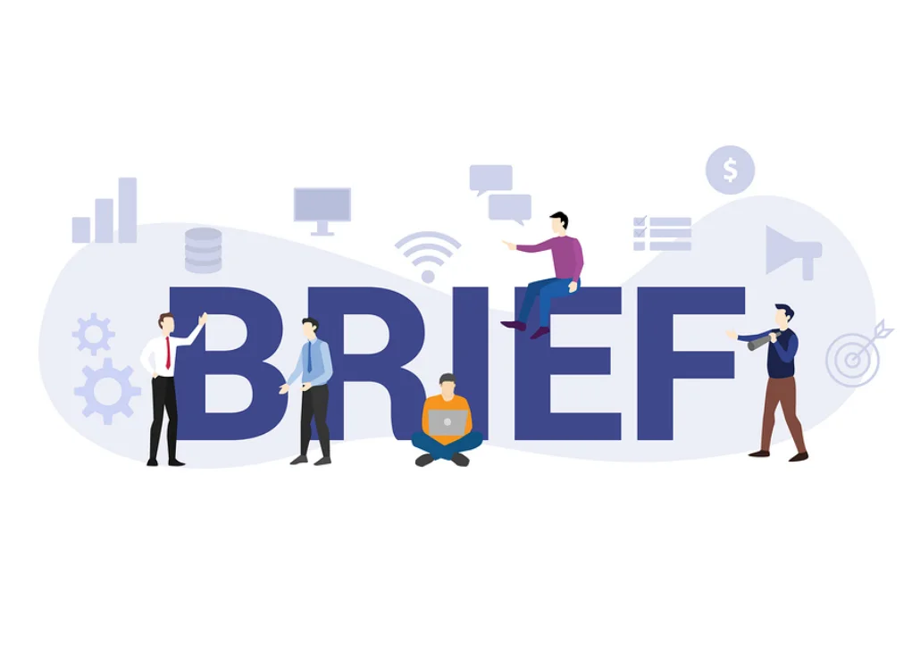
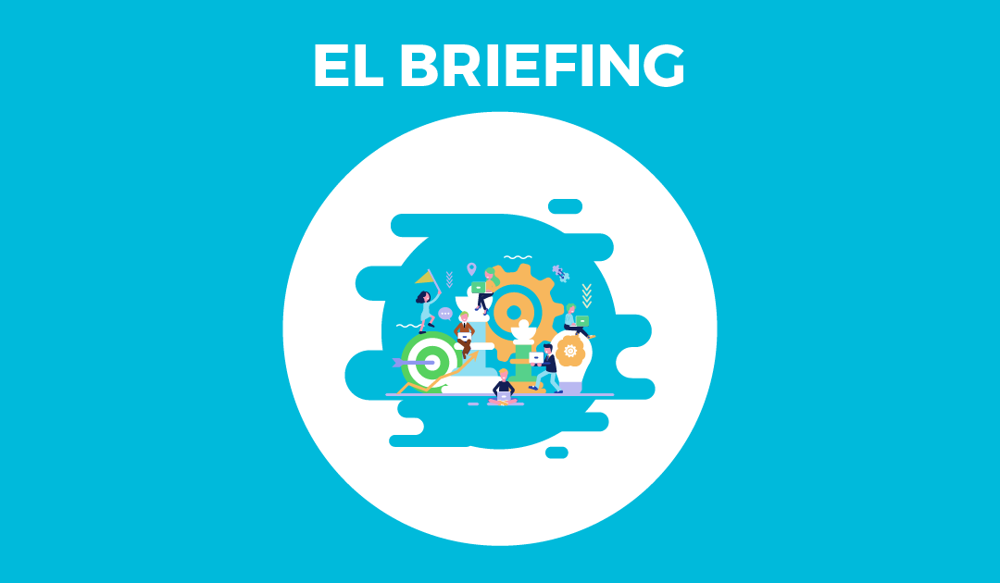
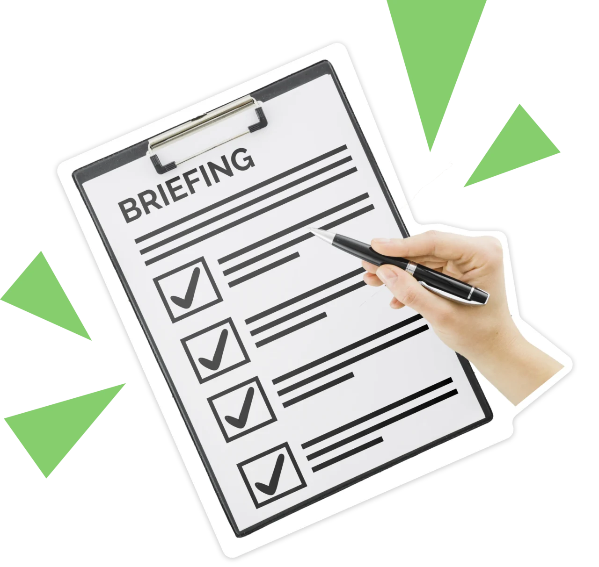
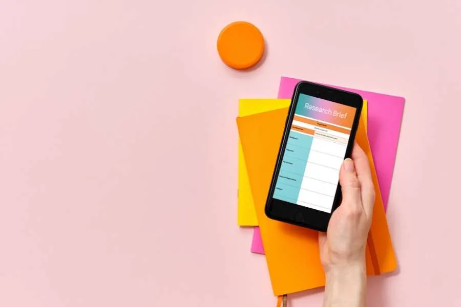
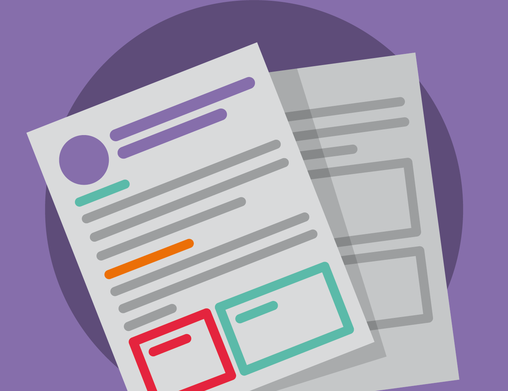
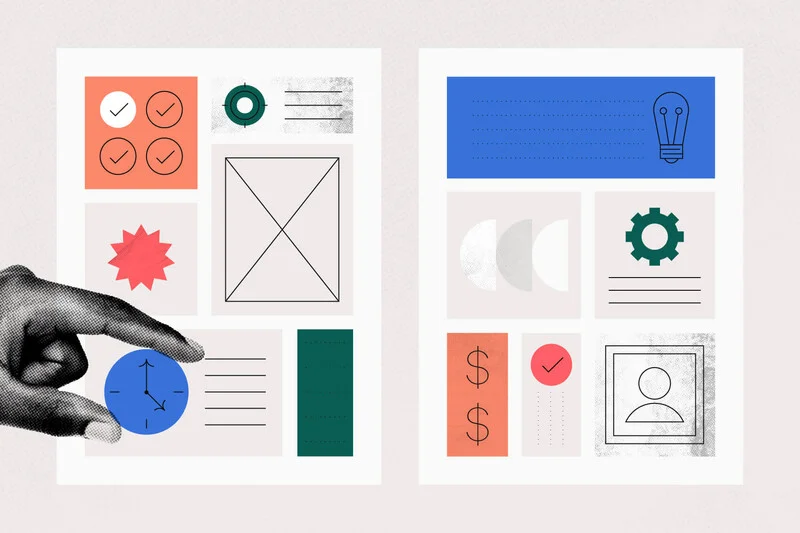
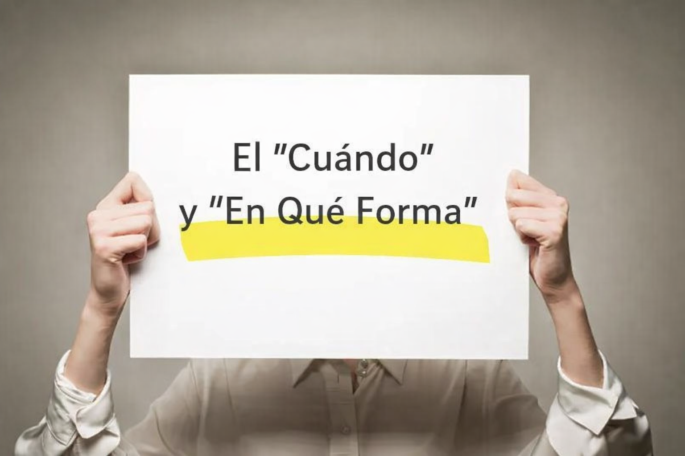
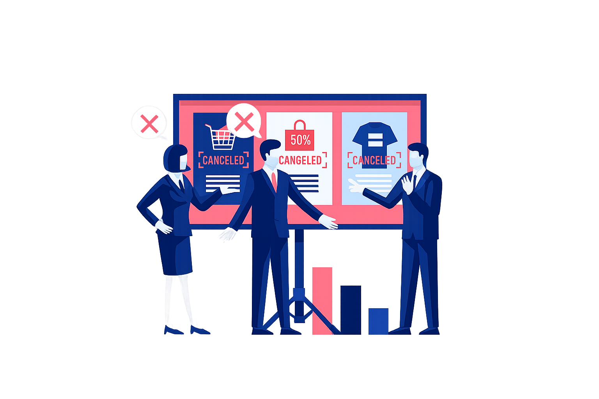

# El Brief: 

### Tu Mapa para Navegar Todo Proyecto Creativo

Bienvenido hoy vamos a dominar el **brief**: el documento que transforma una idea vaga en un proyecto tangible. Como Director de Arte, te confieso que el 90% de los problemas en un proyecto surgen de un brief mal hecho. Vamos a asegurarnos de que ese nunca sea tu caso.

El brief no es un trámite burocrático; es la **hoja de ruta**, la **constitución** y el **traductor universal** de cualquier iniciativa. Vamos a desarmarlo, entender su anatomía y aprender a construir uno a prueba de balas.

---

### ¿Qué es un Brief? Más Allá del Papel

Técnicamente, un **brief** es un documento informativo que contiene la información esencial para planificar o ejecutar un proyecto. Su objetivo es asegurar que todos los involucrados estén sincronizados.

En el mundo real, el brief es tu **kit de supervivencia**. Imagina que eres un chef: el brief no es solo la lista de ingredientes, es la receta, la foto del plato terminado, las alergias del comensal y el tiempo que tienes para cocinar. Sin él, solo estás lanzando especias al aire y esperando que salga algo bueno.

*   **Es una Herramienta:** Imprescindible en el día a día de equipos creativos, de marketing, diseño o programación.
*   **Es un Documento:** Contiene la información que evita 500 correos preguntando lo mismo.
*   **Es un Protocolo de Comunicación:** Asegura que el cliente, el diseñador, el redactor y el desarrollador estén viendo la misma película.

**La clave:** Un brief siempre genera una **danza de dos elementos**: el brief en sí (la pregunta) y la *respuesta al brief* (la solución creativa). Tu trabajo, como creador, es bailar al ritmo que marca el primero.

---

### La Anatomía de un Brief Básico: Tu Checklist Infalible

Un buen brief no nace por generación espontánea. Sigue una **lógica de lo general a lo particular** y responde preguntas fundamentales. Piensa en esto como tu lista de verificación antes de despegar:

*   **¿QUÉ?** La necesidad concreta. ¿Una nueva página web? ¿Una campaña en Instagram? ¿Un logotipo? Sé específico.
    *   *En confianza:* "Necesito que me ayudes a vender más" no es un "QUÉ". "Necesito un banner que destaque el 50% de descuento en alimento para perros grandes" sí lo es.

*   **¿PARA QUÉ? (Objetivos):** El propósito estratégico. ¿Aumentar ventas? ¿Mejorar el reconocimiento de marca? ¿Generar leads?
    *   *En confianza:* Aquí defines el **"para qué"** real. ¿Es solo vender o es posicionarte como la marca más confiable para mascotas? El objetivo es tu estrella polar.

*   **¿PARA QUIÉN? (Audiencia):** El retrato robot de tu cliente ideal. Edad, intereses, dolores, aspiraciones.
    *   *En confianza:* No digas "mujeres de 25 a 45 años". Di "Laura, 32 años, dueña de un golden retriever, compra online por comodidad y le preocupa la calidad de los ingredientes". Dale un nombre y una historia.

*   **¿CON QUÉ? (Presupuesto y Medios):** Los recursos reales. Dinero disponible, canales (redes sociales, e-commerce), assets existentes (logos, fotos).
    *   *En confianza:* Conocer el presupuesto te dice si estás diseñando un yate o una canoa. Ambos flotan, pero el proceso es radicalmente distinto.

*   **¿CUÁNDO? (Plazos y Entregables):** El cronograma y el formato final. Fechas clave y qué se espera recibir (un archivo .jpg, un sitio web funcional, una presentación).
    *   *En confianza:* El *deadline* es sagrado. Y "un diseño" no es un entregable. "Tres opciones de afiche en formato A3, a 300dpi, con archivos editables" sí lo es.

---

### Los 6 Pasos del Ritual: Del Brief al Resultado

El proceso no termina al entregar el brief. Es un ciclo iterativo donde la comunicación es la protagonista:

1.  **Creación del Brief:** Lo hace el cliente (o quien tenga la necesidad). Vierte su mundo en el documento.
2.  **Sesión de Briefing:** La reunión donde el cliente presenta el brief al equipo creativo. Aquí se aclaran dudas **inmediatamente**.
3.  **Pre-trabajo:** El equipo creativo analiza, investiga y da sus primeros pasos internos sobre cómo responder.
4.  **Contra-Briefing o *Tissue Session*:** ¡El paso más subestimado! El equipo creativo devuelve el brief *reformulado* para confirmar que entendió perfectamente el problema. Es tu oportunidad de decir: "Escuché A, pero creo que el problema real es B".
5.  **Presentación de la Respuesta & Feedback:** Se muestra el trabajo (el diseño, la campaña, el prototipo) y el cliente da su primera retroalimentación.
6.  **Ajustes e Iteraciones:** Se refina la solución basándose en el *feedback*, hasta alcanzar el resultado deseado.

**La clave:** Este proceso evita el famoso "no es lo que yo imaginaba". Si en el paso 4 alineaste la visión, el paso 5 será una celebración, no una corrección.

---

### La Familia de los Briefs: Eligiendo al Especialista Correcto

No todos los briefs son iguales. Cada disciplina tiene su variante, como un médico tiene sus especialidades. Conócelas:

| Tipo de Brief | Se Usa Para... | En Confianza (El "Para Dummies") |
| :--- | :--- | :--- |
| **Brief Creativo/Publicitario** | Desarrollar campañas, anuncios, piezas de alto impacto visual/conceptual. | Es el brief para hacer magia. Busca el *insight* (esa verdad humana) que hará llorar o reír a tu audiencia. |
| **Brief de Marketing** | Lanzar un producto, planificar una acción comercial concreta (Black Friday). | Es el brief del estratega. Menos poesía, más números y canales. |
| **Brief de Diseño** | Crear elementos visuales: sitio web, identidad, piezas para redes. | Es el brief del *pixel perfect*. Incluye paletas de color, tipografías y especificaciones técnicas hasta el último milímetro. |
| **Brief de Programación** | Desarrollar una app, un sitio web, una herramienta digital. | Aquí se separa el **Front-end** (lo que el usuario ve y toca, tu terreno) del **Back-end** (la magia oculta del código). |
| **Brief de Comunicación** | Gestionar relaciones públicas, eventos, trabajo con *influencers*. | Es el brief del relacionista público. Se trata de *historias* y *conversaciones*, no solo de anuncios. |

---

### 🚀 Tu Reto de Comunicación Estratégica

Te toca dejar el rol de alumno y ponerte en los zapatos de un **estratega**. Usa el caso ficticio **"Hey Snoopy!"** (venta online de alimento para mascotas) y construye el esqueleto de un **Brief de Diseño** para ellos.

**Tu misión:** Completa estas oraciones con la mayor precisión y detalle posible, como si tuvieras que entregárselo a un diseñador mañana:

1.  **¿QUÉ?** "Necesitamos que diseñes..."
2.  **¿PARA QUÉ? (Objetivo)** "Para lograr que..."
3.  **¿PARA QUIÉN? (Audiencia)** "Nuestro cliente ideal es alguien que..."
4.  **¿CON QUÉ? (Recursos)** "Contamos con..."
5.  **¿CUÁNDO? (Plazos/Entregable)** "Necesitamos para [fecha] un entregable que sea..."

**No inventes recursos imposibles.** Sé realista y estratégico. Guarda tus respuestas. Máss adelante veremos cómo este brief se transforma en moodboards, paletas de color y las primeras líneas de un diseño que no solo es bonito, sino que **resuelve un problema real**.

Recuerda: un gran diseñador no solo ejecuta, **interpreta**. Y el brief es la partitura.

---

## Los Cimientos del Brief: Los Elementos que lo Hacen a Prueba de Errores

Anteriormente desentrañamos qué es un brief y por qué es tu hoja de ruta. Hoy vamos a lo concreto: **los elementos no negociables** que lo convierten de un simple documento en un faro que guía cada decisión creativa.

Si el brief es el mapa, estos elementos son la brújula, la escala, los puntos de referencia y la leyenda. Omitir uno es like intentar construir una casa sin cimientos: se verá bien por un momento, pero al primer viento se desmoronará.

Vamos a destripar la anatomía de un brief poderoso.

---

### Contexto: El "Quién" y el "Qué" (Los Pilares)

Antes de pedir cualquier cosa, hay que presentarse. Esta sección evita que el equipo creativo trabaje a ciegas.

*   **La Empresa o Marca:**
    *   **Definición Técnica:** Una descripción clara de la identidad, valores, misión y posicionamiento en el mercado.
    *   **En Confianza:** Es presentar a tu "cliente" al equipo. ¿Es una startup rebelde o una corporación centenaria? El tono, la paleta de colores y hasta la tipografía que elijas dependerán de esto. **No puedes diseñar para alguien a quien no conoces.**

*   **El Producto o Servicio:**
    *   **Definición Técnica:** Explicación detallada de lo que se ofrece, sus características clave, beneficios y diferenciales.
    *   **En Confianza:** No se trata solo de listar especificaciones. Es contar **por qué** ese producto merece existir. ¿Estás diseñando la caja para el "mejor alimento orgánico para perros" o para el "alimento más barato del mercado"? El diseño nacerá de esa verdad.

---

### Estrategia: El "Para Qué" y "Para Quién" (El Cerebro)

Aquí es donde la magia estratégica sucede. Responder esto separa un *diseño bonito* de un **diseño efectivo.**

*   **Los Objetivos (El Para Qué):**
    *   **Definición Técnica:** Metas claras, medibles, alcanzables, relevantes y con un tiempo definido (SMART).
    *   **En Confianza:** ¿Qué quieres que **pase** en el mundo real? "Que sea bonito" no es un objetivo. "Aumentar los clics en el botón de 'Comprar' en un 15% en tres meses" sí lo es. Tu diseño será un éxito o un fracaso en función de este número.

*   **La Audiencia (El Para Quién):**
    *   **Definición Técnica:** Descripción demográfica, psicográfica y de comportamiento del grupo objetivo.
    *   **En Confianza:** Deja de pensar en "hombres, 25-40 años". Crea a **"Carlos, 32 años, arquitecto, tiene un perro salchicha, compra online por comodidad y lee reseñas antes de decidir."** Diseñas para Carlos, no para una estadística. Cada color, cada palabra y cada imagen debe hablarle directamente a él.

---

### Limitantes y Parámetros: Los Límites que Liberan la Creatividad

Esto puede sonar contradictorio, pero los mejores diseños florecen dentro de un marco definido. Estos elementos no son obstáculos, son **el desafío que agudiza tu ingenio.**

*   **El Presupuesto:**
    *   **Definición Técnica:** La asignación financiera disponible para el proyecto.
    *   **En Confianza:** Saber si tienes $500 o $50,000 te dice si puedes filmar con un drone en Islandia o hacer una animación ilustrada. **La creatividad más brillante a menudo nace de la restricción.** Un presupuesto ajustado te fuerza a ser más inteligente, no más pobre en ideas.

*   **La Geolocalización y Aspectos Legales/Sociales:**
    *   **Definición Técnica:** Contexto geográfico, regulaciones locales y consideraciones culturales.
    *   **En Confianza:** ¿Tu diseño se verá en México, España o Japón? Los colores y símbolos tienen significados distintos. ¿Es para un sector regulado como la salud o las finanzas? Hay logotipos y frases que no puedes usar. **Investigar esto te salva de un error catastrófico.**

*   **Las Métricas de Éxito:**
    *   **Definición Técnica:** Los KPIs (Indicadores Clave de Rendimiento) que medirán el impacto.
    *   **En Confianza:** ¿Cómo sabremos que ganamos? ¿Por ventas, por alcance, por engagement? Si tu objetivo es "aumentar la confianza", la métrica podría ser "aumentar en un 20% las menciones positivas en redes". Esto le da un **propósito medible** a cada elemento visual que crees.

---

### Ejecución: El "Cuándo" y "En Qué Forma" (El Plan de Ataque)

La estrategia sin un plan táctico claro es solo una buena intención. Aquí se define la realidad operativa.

*   **Los Plazos:**
    *   **Definición Técnica:** Cronograma con hitos claros: briefing, presentación de avances, revisiones, entrega final.
    *   **En Confianza:** Un deadline realista es tu mejor amigo. Un deadline imposible es la receta para un trabajo mediocre y noches sin dormir. Sé claro con los tiempos desde el día uno y **defiende el tiempo que la calidad requiere.**

*   **Los Entregables:**
    *   **Definición Técnica:** Descripción exacta de lo que se entregará al finalizar el proyecto, incluyendo formatos, dimensiones y especificaciones técnicas.
    *   **En Confianza:** Esto evita el "¡Pero yo esperaba un video animado, no unas imágenes estáticas!". Sé hiperespecífico: "Se entregarán 3 opciones de afiche en formato .PDF para impresión (A3, 300dpi) y .JPG para web, junto con una guía de aplicaciones de la marca." **La claridad aquí es un acto de profesionalismo.**

---

### El Contra-Briefing: El Paso del Sabio

Este es el **elemento secreto** que separa a los novatos de los profesionales.

*   **Definición Técnica:** Proceso donde el equipo creativo reformula el brief con sus propias palabras y se lo devuelve al cliente para confirmar comprensión.
*   **En Confianza:** Es tu **seguro de vida**. En vez de correr a hacer el trabajo, tomas el brief del cliente y dices: *"Déjame ver si entendí. Tú necesitas X, para lograr Y, hablandole a Z, con este presupuesto y este tiempo. ¿Es correcto?"*
*   **La clave:** Aquí descubres malentendidos ocultos. El cliente pide "un logo moderno", pero en su cabeza "moderno" significa negro y gris, y en la tuya significa gradientes de colores neon. **Alinear esto al inicio ahorra semanas de trabajo descartado.**

---

### 🚀 Tu Reto: Construye los Cimientos de tu Propio Brief

Es hora de aplicar el conocimiento. **No inventes un caso nuevo.** Toma el **Brief de Diseño** que empezaste a esbozar en el reto anterior para **"Hey Snoopy!"** y **amplíalo con los elementos esenciales que aprendimos hoy.**

**Tu misión es completar esta tabla:** Para cada elemento, escribe **una sola oración o lista clara** que sería parte del brief definitivo.

| Elemento del Brief | Tu Definición para "Hey Snoopy!" (Sé específico y conciso) |
| :--- | :--- |
| **Descripción de la Marca** | Ej: "Marca joven y dinámica de venta online de alimento premium para perros y gatos, que prioriza ingredientes naturales y la comodidad de entrega a domicilio." |
| **El Producto/Servicio** | *(Describe el producto clave para este proyecto)* |
| **Objetivos (SMART)** | *(Ej: "Aumentar el reconocimiento de marca un 25% entre dueños de mascotas en la ciudad en 6 meses")* |
| **Audiencia** | *(Crea un mini "persona" con 3-4 características clave)* |
| **Presupuesto** | *(Sé realista. Ej: "Presupuesto total de diseño: $1,500 USD")* |
| **Contexto (Geográfico/Legal)** | *(Ej: "Campaña dirigida inicialmente a capital, respetando normas de publicidad de alimentos para mascotas.")* |
| **Métrica de Éxito Principal** | *(¿Qué número demostrará que el diseño funcionó?)* |
| **Entregable Concreto** | *(Ej: "Sistema de identidad visual básico que incluya: logotipo, paleta de color, tipografía principal y aplicaciones en perfil de Instagram y header de e-commerce.")* |
| **Pregunta para el Contra-Briefing**| *(Formula UNA pregunta crítica que le harías al cliente de "Hey Snoopy!" para confirmar tu entendimiento)* |

Llena esta tabla. Este ejercicio no es un trámite; es la **base sobre la que construirás todo tu proyecto creativo.** Guárdala, porque más adelante convertiremos estos cimientos en **moodboards y conceptos visuales tangibles.**

Recuerda: Un maestro no teme a los límites, los usa como la estructura sobre la cual levanta su obra maestra.