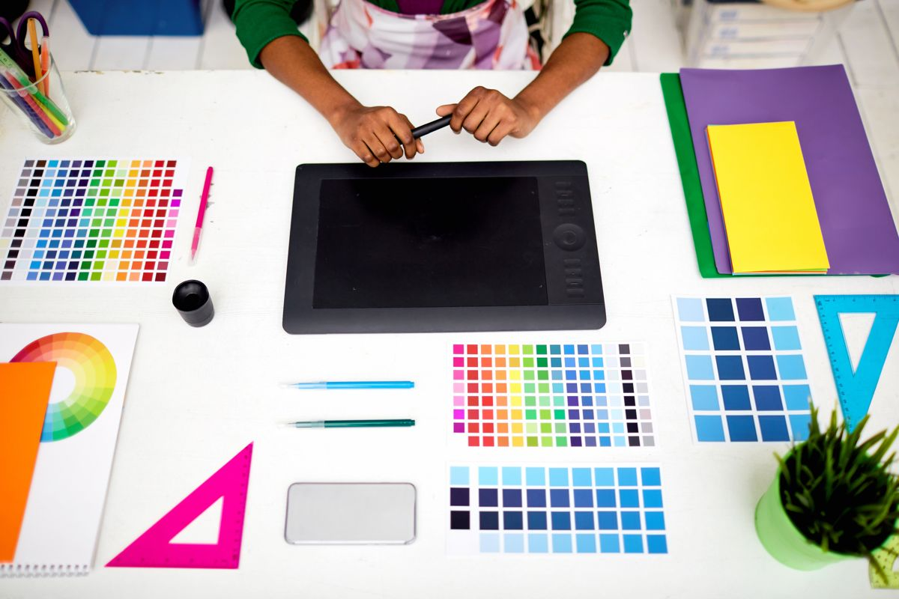
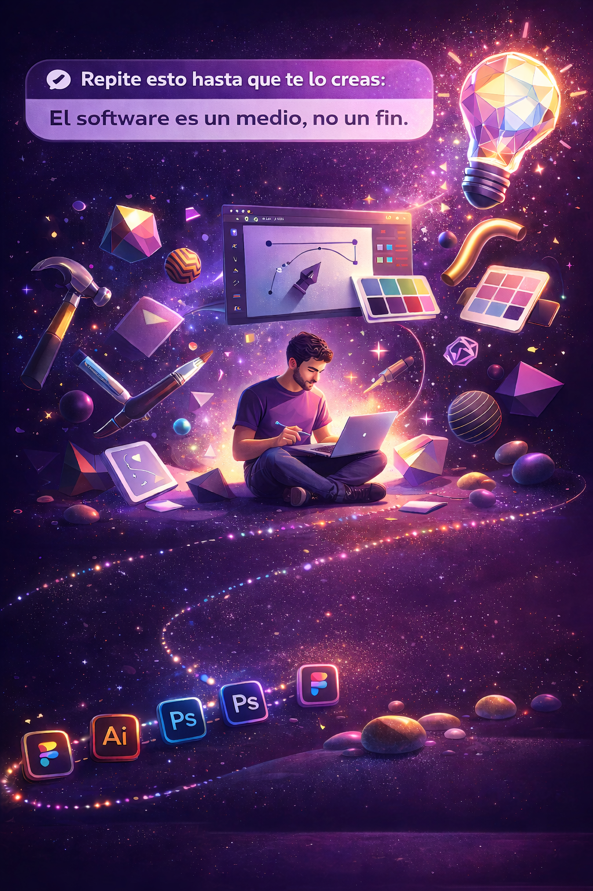
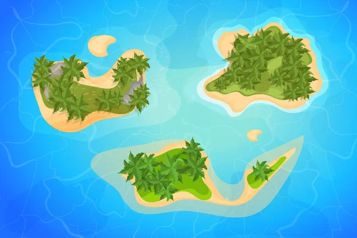

## De la Estrategia a la Materia Prima: El Taller del Diseñador

Has cruzado el puente. 

Ya no eres el que solo colocaba elementos bonitos en un lienzo. Ahora sabes que antes de mover un píxel hay que preguntar, investigar, cuestionar. El brief te ha dado una brújula. El proyecto final te ha dado un destino.

**Pero aún falta algo.**

Entre la idea y la ejecución hay un abismo. Y ese abismo se cruza con **las manos**. Con el oficio. Con la herramienta que transforma el concepto en materia tangible.

Hoy entramos al taller.

---

## 🧰 El Diseño no Vive en el Software, Vive en Ti

Repite esto hasta que te lo creas:

> El software es un medio, no un fin.

He visto portfolios memorables hechos con programas gratuitos. He visto trabajos olvidables hechos con las suscripciones más caras del mercado. **La diferencia siempre fue la misma:** el criterio, la mirada, la capacidad de resolver problemas.

Dicho esto: **necesitas herramientas**. No puedes esculpir sin un cincel. No puedes pintar sin un pincel. Y en el diseño digital, tus cinceles y pinceles tienen nombres propios.

Pero aquí viene mi primera advertencia:

**No necesitas todas las herramientas. Necesitas las correctas para ti.**

Vamos a conocer el mapa completo. Luego eliges tu camino.

---

## 🗺️ El Archipiélago del Diseño: ¿En Qué Isla Vas a Vivir?

El diseño gráfico no es una sola disciplina. Es un **archipiélago**. Cada isla tiene su lenguaje, sus reglas y sus herramientas. Conócelas antes de decidir dónde plantar tu bandera.

| Territorio | Qué es | Para qué sirve | Herramientas principales |
|:---|:---|:---|:---|
| **Branding e Identidad** | Crear la personalidad visual de una marca. | Logotipos, paletas, sistemas visuales, papelería. | Illustrator, Inkscape, Figma |
| **Diseño Editorial** | Arquitectura de la página. | Revistas, libros, catálogos, informes. | InDesign, Scribus, Affinity Publisher |
| **Retoque y Fotocomposición** | Manipulación de imagen digital. | Edición de fotos, montajes, corrección de color. | Photoshop, GIMP, Affinity Photo |
| **Ilustración Digital** | Lenguaje visual propio. | Ilustraciones, iconos, personajes. | Illustrator, Procreate, Krita |
| **Diseño de Interfaces (UI/UX)** | Pantallas que las personas usan. | Apps, webs, software. | Figma, Penpot, Sketch, Adobe XD |
| **Motion Graphics** | Diseño que se mueve. | Animación, piezas audiovisuales, títulos. | After Effects, DaVinci Resolve, Blender |
| **Visualización de Datos** | Convertir números en narrativa visual. | Infografías, reportes, dashboards. | Illustrator, Tableau, Flourish |

**La trampa del novato:**  
Querer dominar todas las islas a la vez. No puedes. Elige una o dos para profundizar. Las demás, conócelas lo suficiente para colaborar con quien las domine.

El diseñador sabio es un **especialista con visión de generalista**.

---

## 🎯 El Tridente de Adobe: El Idioma Común de la Industria

Hablemos sin filtros. En la mayoría de estudios, agencias y departamentos de diseño, **Adobe es el estándar**. No es el único, no siempre es el mejor para cada tarea, pero es el que encontrarás cuando te sientes en una mesa con otros profesionales.

**Los tres que cambian el juego:**

### 1. Adobe Illustrator: El Lápiz Definitivo
**Territorio:** Vector, forma, icono, logotipo, ilustración.

Illustrator no es un programa. Es **una extensión de la mano del diseñador**. Todo lo que dibujas en él puede crecer al tamaño de un edificio sin perder nitidez. Si solo pudieras aprender una herramienta profesional, que sea esta.

**La filosofía:**  
En Illustrator, no pintas. **Construyes.** Con nodos, curvas Bézier y trazados. Es lento al principio, pero cuando lo dominas, puedes dibujar cualquier cosa que imagines.

### 2. Adobe Photoshop: El Laboratorio de Píxeles
**Territorio:** Fotografía, textura, retoque, composición compleja.

Photoshop es el gran manipulador de realidad. Puedes cambiar el clima de una foto, borrar montañas, envejecer rostros o rejuvenecerlos. No es para dibujar desde cero (aunque se puede). Es para **transformar lo que ya existe**.

**La clave:**  
Photoshop trabaja con píxeles. Amplía demasiado una imagen y verás los cuadritos. Eso no es un error; es su naturaleza. Úsalo cuando necesites **textura, atmósfera, realismo**.

### 3. Adobe InDesign: El Arquitecto de Páginas
**Territorio:** Múltiples páginas, libros, revistas, informes.

InDesign no es para hacer una página bonita. Es para hacer **50 páginas coherentes**. Maneja flujos de texto, estilos en cadena, numeración automática. Es el héroe invisible del diseño editorial.

**La ventaja del ecosistema:**  
Estos tres programas **hablan entre sí**. Copias un trazado de Illustrator, lo pegas en Photoshop como forma. Maquetas en InDesign, pero editas las imágenes en Photoshop y los vectores en Illustrator. Esa interconexión no es comodidad; es **eficiencia profesional**.

---

## 🌍 El Universo Paralelo: Herramientas Libres que Rompen el Molde

Aquí viene lo que pocos mentores te cuentan: **no necesitas una suscripción a Adobe para ser diseñador.**

Existe un ecosistema completo de herramientas gratuitas, de código abierto, sostenidas por comunidades apasionadas. Son tan poderosas como sus equivalentes comerciales. Solo requieren una cosa: **que aprendas a usarlas con la misma dedicación**.

### Vector: Inkscape (el heredero de Illustrator)
**Qué es:** El taller de carpintería fina del vector. Gratuito, con más de 20 años de desarrollo.

**Qué puedes hacer:** Logotipos, ilustraciones, iconos, diagramas. Todo lo que harías en Illustrator, pero sin pagar un euro.

**La verdad:** La interfaz es menos pulida. Los atajos son distintos. Pero **los principios vectoriales son idénticos**. Si entiendes cómo funciona un nodo, Inkscape es solo cuestión de práctica.

### Píxel: GIMP (el heredero de Photoshop)
**Qué es:** El gran veterano. Durante años fue "casi Photoshop". Hoy es Photoshop con otra personalidad.

**Qué puedes hacer:** Retoque fotográfico profesional, composiciones, montajes, máscaras, capas.

**La adaptación:** Los atajos cambian. La gestión de capas tiene matices. Pero las herramientas de selección, clonado y corrección de color están todas ahí. La versión más reciente abre archivos PSD con buena fidelidad.

**Alternativa exprés:** **Photopea**. Gratuito, en el navegador. Para abrir un archivo de Photoshop sin instalar nada, es tu salvavidas.

### Maquetación: Scribus (el heredero de InDesign)
**Qué es:** El gran desconocido. La herramienta profesional libre para diseño editorial.

**Qué puedes hacer:** Revistas, libros, catálogos, folletos, PDF interactivos.

**La verdad incómoda:** No es tan intuitivo como InDesign. La gestión tipográfica requiere paciencia. Pero **para flujos editoriales con presupuesto cero, no hay competencia**. Aprender Scribus es entender la maquetación desde sus cimientos.

### Ilustración Digital: Krita (el heredero de Procreate)
**Qué es:** Nacido para ilustradores y concept artists. Una bestia pintora.

**Qué puedes hacer:** Ilustración digital, cómic, texturas, pinceles personalizados, animación cuadro por cuadro.

**El detalle:** Está optimizado para **tabletas gráficas**. La sensibilidad a la presión y la biblioteca de pinceles rivalizan con software de pago. Si dibujas, este es tu hogar.

### Motion y Video: DaVinci Resolve + Blender
**DaVinci Resolve (gratuito):** Edición de video profesional, corrección de color de nivel Hollywood, motion graphics básicos. La industria del cine lo usa. Punto.

**Blender (gratuito):** 3D, pero también animación 2D con Grease Pencil. Es un universo entero por explorar.

### Prototipado: Penpot (el heredero libre de Figma)
**Qué es:** Figma, pero de código abierto. Colaboración en tiempo real, componentes, sistemas de diseño.

**Qué puedes hacer:** Wireframes, prototipos interactivos, bibliotecas de componentes. Y todo respetando tu privacidad.

---

## ⚖️ La Gran Pregunta: ¿Adobe o Herramientas Libres?

No hay respuesta única. Hay **respuesta para ti**.

**Elige Adobe si:**
- Vas a trabajar en agencias o estudios donde es el estándar.
- Valoras la integración perfecta entre programas.
- Puedes permitirte la suscripción (o tu empleador la paga).

**Elige herramientas libres si:**
- Estás empezando y no quieres gastar.
- Valorar la soberanía digital y la privacidad.
- Quieres demostrarte que el diseño no vive en el software, vive en ti.
- Te atrae la filosofía del código abierto y las comunidades colaborativas.

**La estrategia inteligente:**
Aprende **los principios**, no los botones. Si entiendes cómo funciona el vector, pasar de Illustrator a Inkscape es cuestión de días. Si entiendes capas y máscaras, Photoshop y GIMP son dialectos del mismo idioma.

El software se actualiza, cambia, muere. **Tu criterio, no.**

---

## 🧠 Las Habilidades que el Software No te Enseña

Puedes dominar Illustrator, Photoshop, Figma y After Effects. Puedes recitar la teoría del color de memoria. Puedes construir cuadrículas perfectas.

Y aún así, **fracasar como diseñador** si te faltan estas habilidades:

**Saber dirigir y ser dirigido:** En un equipo, no importa solo tu ego creativo. Importa la solución. Aprende a recibir crítica sin ponerte a la defensiva. Aprende a darla sin destruir.

**Hablar el idioma del cliente:** El cliente no sabe qué es "kerning" ni "espacio negativo". Habla de "separación entre letras" y "aire para que respire". Traduce tu conocimiento a su lenguaje.

**Gestionar tu tiempo:** Un diseño perfecto que llega tarde es un diseño inútil. Aprende a soltar, a priorizar, a decir "esto está suficientemente bueno para el objetivo".

**Practicar con conciencia:** No basta con repetir. Hay que repetir **con intención**. Proyectos personales. Falla rápido. Aprende más rápido.

---

## 🛠️ Tu Reto: La Primera Pieza con Conciencia de Herramienta

Este ejercicio tiene un objetivo: **que dejes de pensar en el software y empieces a sentir la herramienta como una extensión de tu mano**.

**Tu misión (elige UNA):**

**Opción A (Exploración Estratégica):**
1.  Vuelve a la tabla del archipiélago del diseño. Elige **dos áreas** que te llamen la atención.
2.  Para cada área, investiga:
    - Un **proyecto de referencia** (en Behance, en la calle, en tu memoria) que te parezca excelente.
    - La **herramienta principal** que se usa en esa área (tanto comercial como libre).
    - Una **tarea concreta** que podrías practicar para iniciarte (ej: "rediseñar un logotipo existente" para branding, "maquetar una receta de cocina" para editorial).
3.  Escribe un párrafo para cada área explicando **por qué te atrae** y **qué necesitarías aprender para dar tu primer paso real**.

**Opción B (Acción Táctil):**
1.  Elige **una herramienta** de las mencionadas que no domines. Si solo has usado Adobe, prueba una libre. Si solo has usado gratis, prueba el trial de Adobe.
2.  Dedica **2 horas** a hacer un tutorial básico. No necesitas convertirte en experto; solo **sentir la lógica** del programa.
3.  Crea algo, por pequeño que sea. Un icono en Inkscape. Un retoque en GIMP. Una pantalla en Penpot. Una página en Scribus. Una ilustración en Krita.
4.  Documenta el resultado. No importa si es feo. Importa que **lo hiciste tú, con esa herramienta, entendiendo por qué la elegiste**.

**Nivel ninja:**
Si eliges herramienta libre, publica tu pieza en Behance o en tu portfolio con una línea que diga: *"Realizado íntegramente con herramientas de código abierto"*. Ayudas a desmontar el mito de que solo se puede hacer diseño profesional con suscripciones.

**Comparte tu descubrimiento.** Porque el diseño no se aprende en la teoría; se aprende **con las manos en el teclado y el ojo en la pantalla**.

---

## 🌅 Cierre: El Taller Está Abierto

Has llegado lejos. Muy lejos.

Empezaste aprendiendo a mirar. Luego aprendiste a preguntar. Ahora estás aprendiendo a **hacer**.

El taller está montado. Las herramientas, calibradas. El lienzo, en blanco.

No necesitas permiso de nadie para empezar. No necesitas una suscripción cara. No necesitas esperar a "saber más".

**Necesitas sentarte, abrir el programa y comenzar.**

El mundo del diseño es tuyo. Entra y constrúyelo.

—  
**Tu Director de Arte y Mentor.**