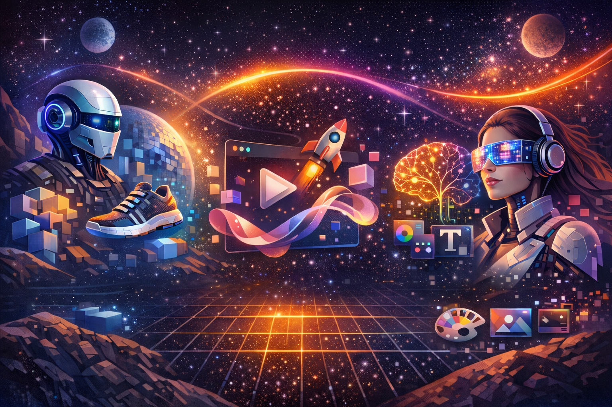

# Fundamentos del diseño gráfico

## El Viaje Comienza

Has llegado al punto de partida. Sí, leíste bien: **el punto de partida**. Durante estas sesiones, hemos desempacado y ensamblado juntos la caja de herramientas esencial del diseñador. Ahora, con los fundamentos firmes en tus manos y la mentalidad correcta en tu cabeza, es momento de mirar el mapa completo y trazar tu ruta. Esta no es una despedida, es un briefing para la misión más importante: **tu carrera**.

El diseño profesional no es un destino; es un viaje de aprendizaje constante, experimentación y comunicación audaz. Vamos a conectar todos los puntos y ver el panorama completo.

---

### Tus Fundamentos: La Caja de Herramientas que Nunca Envejece

Todo lo que has explorado —desde el boceto hasta la Gestalt, desde la teoría del color hasta la psicología de la UX— no son temas aislados. Son un **sistema interconectado**. Piensa en ellos como tu kit de supervivencia en cualquier proyecto:

*   **Composición y Diagramación:** Es la **arquitectura** de tu mensaje. Ahora sabes que cada elemento en la página tiene un peso, un propósito y un lugar. No es intuición; es estrategia visual.
*   **Teoría del Color:** Es el **lenguaje emocional** más directo. Ya no eliges colores porque "quedan bonitos"; los eliges porque transmiten una sensación específica y guían la atención con intención.
*   **Tipografía:** Es la **voz** de tu diseño. La elección de una fuente es una decisión de carácter, tono y legibilidad. Ya conoces la diferencia entre gritar y susurrar con letras.

Estos fundamentos son **tu superpoder**. Las tendencias pasan, los software se actualizan, pero estos principios son eternos. Son lo que separa a un aficionado de un profesional.

---

### Tu Taller Digital: Dominando el Oficio

Conocer la teoría sin saber ejecutarla es como un arquitecto que no sabe usar una regla. Has explorado el panorama de herramientas:

*   **Software Profesional (Figma, Adobe XD, Sketch):** Son tu **taller de precisión**. Aquí es donde los conceptos toman forma, donde se construyen las interfaces, se afinan los píxeles y se crean sistemas escalables. Dominar al menos una no es una opción; es un requisito del oficio.
*   **Herramientas Virtuales y Colaborativas (Miro, Mural):** Son tu **sala de brainstorming y de presentación**. El diseño moderno es colaborativo. Estas plataformas son donde nacen las ideas en equipo, se estructuran los flujos y se comunica la visión a clientes y colegas.

No te cases con una sola herramienta; **cásate con el problema que necesitas resolver**. La herramienta adecuada será la que te permita resolverlo de la manera más eficiente y efectiva.

---

### Las Nuevas Fronteras: Donde la Creatividad se Expande

El diseño no se detiene en lo estático. El mundo exige experiencias más ricas y dinámicas. Estas son las fronteras que puedes empezar a explorar:

*   **Diseño 3D:** Ya no es solo para videojuegos. Es para **productos, visualizaciones, logotipos y experiencias inmersivas**. Añade profundidad, realismo y una capa de asombro a tu trabajo. Herramientas como Blender (gratuita) o Spline están democratizando este espacio.
*   **Animación y Motion Design:** Es el arte de **darle alma y narrativa** a lo estático. Un icono que rebota, una transición suave, un logo que cobra vida. La animación guía, sorprende y explica. Principios básicos de timing y easing son tu próximo paso lógico.
*   **Inteligencia Artificial (IA):** No es tu reemplazo; es tu **asistente más potente**. Desde generar paletas de color y variaciones tipográficas, hasta extender imágenes o ayudar con copy, la IA está revolucionando el flujo de trabajo. Úsala para iterar más rápido y eliminar tareas repetitivas, no para generar ideas desde cero. La intención humana sigue siendo la reina.

---

### El Proceso Creativo Profesional: De la Chispa al Impacto

Ahora, ¿cómo unes todo esto para crear piezas que no solo se vean bien, sino que *funcionen*?

1.  **Desarrollo del Concepto:** Todo comienza con una **idea clara**. Usa las técnicas de creatividad (SCAMPER, 6 Sombreros) para destilar el mensaje central. ¿Qué debes comunicar? ¿A quién? ¿Qué acción debe provocar?
2.  **Aplicación de Técnicas Visuales:** Aquí es donde tus fundamentos brillan. Aplica los principios de composición, jerarquía y color para dar forma visual a ese concepto. Cada elección debe estar justificada por el objetivo.
3.  **Integración de Herramientas:** Boceta en papel, estructura en un *wireframe*, diseña en tu software profesional, prototipa para probar la interacción, presenta en una pizarra colaborativa. **Usa la herramienta correcta en cada fase del proceso.**
4.  **Iteración y Refinamiento:** El primer draft nunca es el final. Critica tu trabajo con dureza (Sombrero Negro) y permítete explorar alternativas (Sombrero Verde). La excelencia está en los detalles.

---

### 🧭 Tu Futuro en el Diseño

El futuro del diseño no lo escriben las herramientas, lo escriben **los diseñadores con criterio, curiosidad y capacidad de adaptación**. Tienes ahora:

*   **Los cimientos** para que tu trabajo sea sólido.
*   **El taller** para construirlo.
*   **El mapa** de las nuevas tierras por explorar.

El siguiente paso es **aplicarlo**. Crea un proyecto personal. Rediseña una app que odies. Construye el portafolio de tus sueños. Equivócate, aprende, itera.

**El diseño es un verbo, no un sustantivo.** Es la acción constante de resolver, comunicar y mejorar el mundo que nos rodea.

---

