# Fundamentos del diseño gráfico

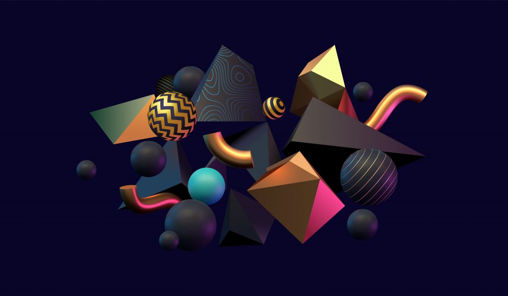

## El Viaje Comienza

Has llegado al punto de partida. Sí, leíste bien: **el punto de partida**. Durante estas sesiones, hemos desempacado y ensamblado juntos la caja de herramientas esencial del diseñador. Ahora, con los fundamentos firmes en tus manos y la mentalidad correcta en tu cabeza, es momento de mirar el mapa completo y trazar tu ruta. Esta no es una despedida, es un briefing para la misión más importante: **tu carrera**.

El diseño profesional no es un destino; es un viaje de aprendizaje constante, experimentación y comunicación audaz. Vamos a conectar todos los puntos y ver el panorama completo.

---

### Tus Fundamentos: La Caja de Herramientas que Nunca Envejece

Todo lo que has explorado —desde el boceto hasta la Gestalt, desde la teoría del color hasta la psicología de la UX— no son temas aislados. Son un **sistema interconectado**. Piensa en ellos como tu kit de supervivencia en cualquier proyecto:

*   **Composición y Diagramación:** Es la **arquitectura** de tu mensaje. Ahora sabes que cada elemento en la página tiene un peso, un propósito y un lugar. No es intuición; es estrategia visual.
*   **Teoría del Color:** Es el **lenguaje emocional** más directo. Ya no eliges colores porque "quedan bonitos"; los eliges porque transmiten una sensación específica y guían la atención con intención.
*   **Tipografía:** Es la **voz** de tu diseño. La elección de una fuente es una decisión de carácter, tono y legibilidad. Ya conoces la diferencia entre gritar y susurrar con letras.

Estos fundamentos son **tu superpoder**. Las tendencias pasan, los software se actualizan, pero estos principios son eternos. Son lo que separa a un aficionado de un profesional.

---

### Tu Taller Digital: Dominando el Oficio

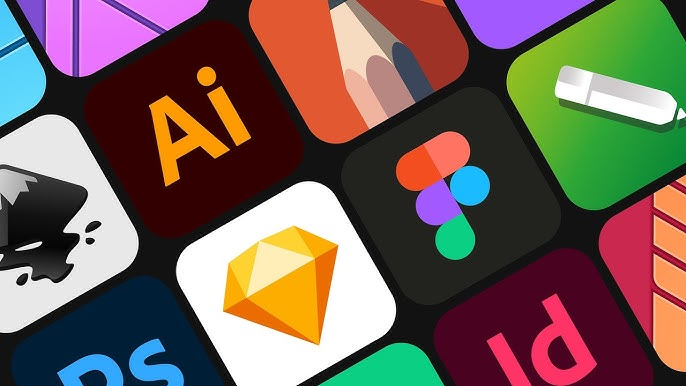

Conocer la teoría sin saber ejecutarla es como un arquitecto que no sabe usar una regla. Has explorado el panorama de herramientas:

*   **Software Profesional (Figma, Adobe XD, Sketch):** Son tu **taller de precisión**. Aquí es donde los conceptos toman forma, donde se construyen las interfaces, se afinan los píxeles y se crean sistemas escalables. Dominar al menos una no es una opción; es un requisito del oficio.
*   **Herramientas Virtuales y Colaborativas (Miro, Mural):** Son tu **sala de brainstorming y de presentación**. El diseño moderno es colaborativo. Estas plataformas son donde nacen las ideas en equipo, se estructuran los flujos y se comunica la visión a clientes y colegas.

No te cases con una sola herramienta; **cásate con el problema que necesitas resolver**. La herramienta adecuada será la que te permita resolverlo de la manera más eficiente y efectiva.

---

### Las Nuevas Fronteras: Donde la Creatividad se Expande

El diseño no se detiene en lo estático. El mundo exige experiencias más ricas y dinámicas. Estas son las fronteras que puedes empezar a explorar:

*   **Diseño 3D:** Ya no es solo para videojuegos. Es para **productos, visualizaciones, logotipos y experiencias inmersivas**. Añade profundidad, realismo y una capa de asombro a tu trabajo. Herramientas como Blender (gratuita) o Spline están democratizando este espacio.
*   **Animación y Motion Design:** Es el arte de **darle alma y narrativa** a lo estático. Un icono que rebota, una transición suave, un logo que cobra vida. La animación guía, sorprende y explica. Principios básicos de timing y easing son tu próximo paso lógico.
*   **Inteligencia Artificial (IA):** No es tu reemplazo; es tu **asistente más potente**. Desde generar paletas de color y variaciones tipográficas, hasta extender imágenes o ayudar con copy, la IA está revolucionando el flujo de trabajo. Úsala para iterar más rápido y eliminar tareas repetitivas, no para generar ideas desde cero. La intención humana sigue siendo la reina.

---

### El Proceso Creativo Profesional: De la Chispa al Impacto

Ahora, ¿cómo unes todo esto para crear piezas que no solo se vean bien, sino que *funcionen*?

1.  **Desarrollo del Concepto:** Todo comienza con una **idea clara**. Usa las técnicas de creatividad (SCAMPER, 6 Sombreros) para destilar el mensaje central. ¿Qué debes comunicar? ¿A quién? ¿Qué acción debe provocar?
2.  **Aplicación de Técnicas Visuales:** Aquí es donde tus fundamentos brillan. Aplica los principios de composición, jerarquía y color para dar forma visual a ese concepto. Cada elección debe estar justificada por el objetivo.
3.  **Integración de Herramientas:** Boceta en papel, estructura en un *wireframe*, diseña en tu software profesional, prototipa para probar la interacción, presenta en una pizarra colaborativa. **Usa la herramienta correcta en cada fase del proceso.**
4.  **Iteración y Refinamiento:** El primer draft nunca es el final. Critica tu trabajo con dureza (Sombrero Negro) y permítete explorar alternativas (Sombrero Verde). La excelencia está en los detalles.

---

### 🧭 Tu Futuro en el Diseño

El futuro del diseño no lo escriben las herramientas, lo escriben **los diseñadores con criterio, curiosidad y capacidad de adaptación**. Tienes ahora:

*   **Los cimientos** para que tu trabajo sea sólido.
*   **El taller** para construirlo.
*   **El mapa** de las nuevas tierras por explorar.

El siguiente paso es **aplicarlo**. Crea un proyecto personal. Rediseña una app que odies. Construye el portafolio de tus sueños. Equivócate, aprende, itera.

**El diseño es un verbo, no un sustantivo.** Es la acción constante de resolver, comunicar y mejorar el mundo que nos rodea.

---

## Arte vs. Diseño: La Línea que Separa la Pregunta de la Respuesta

Has llegado a una encrucijada fundamental. En nuestro viaje hemos hablado de *cómo* diseñar. Hoy debemos hablar del *por qué* y del *para qué*. Para ello, necesitamos una claridad brutal: **el diseño no es arte.** Y entender esta diferencia no es un ejercicio académico; es lo que define tu rol, tu impacto y tu responsabilidad en cada proyecto que toques.

Esta distinción es el cimiento sobre el que se construye una carrera profesional. Vamos a desentrañarla.

---

### El Propósito Esencial: ¿Resolver o Preguntar?

*   **El Diseño es un verbo de solución.** Es un **área del conocimiento humano** dedicada a identificar problemas y crear soluciones innovadoras que mejoren nuestra calidad de vida. Su brújula siempre apunta hacia afuera: hacia el usuario, el contexto, la necesidad concreta.
*   **El Arte es un verbo de cuestionamiento.** Se centra en plantear preguntas, explorar emociones y expresar perspectivas subjetivas. Su brújula apunta hacia adentro: hacia el artista, su visión y su mundo interior.

**La analogía clave:**
Imagina un charco en la acera.
*   El **artista** podría pintar un reflejo increíble en ese charco, invitándote a contemplar la belleza oculta en lo mundano.
*   El **diseñador** construiría un drenaje para que el charco desaparezca, resolviendo el problema de mojarse los pies.

Ambos son valiosos. Pero **no son lo mismo**.

---

### El Caso Práctico: La Felicidad

*   **Como Artista,** expresarías felicidad en un lienzo con tus colores, tus pinceladas, tu historia personal. La obra podría ser caótica, melancólica o abstracta. El espectador debe *interpretar* y *reflexionar*. La felicidad es un **diálogo interno** que tú iniciaste.
*   **Como Diseñador,** tu objetivo sería **generar** felicidad en el usuario de manera directa. Diseñarías la interfaz de una app que le permite a un padre ver la primera sonrisa de su bebé en tiempo real mientras está lejos. Cada elección —el sonido de notificación, el color del botón de "play", la velocidad de carga— está **ingenierizada** para producir una emoción específica: alegría instantánea, sin necesidad de introspección.

El arte explora la emoción. El diseño la **provoca por diseño**.

---

### El Árbol del Diseño: Ramas que Solucionan Mundos

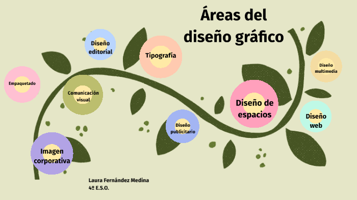

El diseño gráfico es solo una rama de un árbol enorme. Todas comparten el ADN de la **solución funcional**:

| Rama del Diseño | ¿Qué Problema Resuelve? | Ejemplo en tu Vida |
| :--- | :--- | :--- |
| **Arquitectónico** | Crear espacios habitables, eficientes y que influyan en nuestro bienestar. | La iluminación y circulación en tu casa que te hacen sentir en paz o estresado. |
| **Editorial** | Organizar información (texto, imágenes) para hacerla legible, clara y atractiva. | La comodidad con la que lees tu novela favorita gracias a su tipografía, márgenes e interlineado. |
| **Publicitario** | Captar atención en un mundo sobresaturado y comunicar un mensaje persuasivo de forma memorable. | El anuncio que recordaste y que te hizo clicar para comprar algo. |
| **De Producto** | Mejorar la interacción física con los objetos. | El mango de un destornillador que no te lastima la mano después de usarlo. |
| **De Interacción (UX/UI)** | Hacer las tecnologías digitales intuitivas y usables. | Que puedas usar una app bancaria compleja sin leer un manual. |

---

### El Kit de Habilidades del Diseñador (No Solo del Artista)

Un gran artista puede guiarse por la intuición. Un gran diseñador **combina** intuición con un método riguroso. Tus habilidades esenciales son:

1.  **Observación Aguda:** Ver más allá de lo obvio. No solo ver que la gente tropieza, sino **entender por qué** (la luz es mala, el escalón está mal señalizado). Es detective work.
2.  **Análisis Crítico:** Generar múltiples ideas (brainstorming) y luego **evaluarlas con frialdad**. ¿Cuál es la más viable, efectiva y elegante? Aquí es donde el "Sombrero Negro" de la crítica es tu aliado.
3.  **Planificación Metódica:** Mapear el camino desde el problema hasta la solución. Un brief, un calendario, unos hitos. El caos creativo ocurre **dentro** de un proceso ordenado.
4.  **Ejecución Impecable:** La capacidad de **materializar** la solución. Aquí es donde tu dominio del software, la tipografía, el color y la composición se ponen al servicio de la idea. La forma sigue a la función, pero debe ser una forma perfectamente ejecutada.

---

### El Pilar Innegociable: La Funcionalidad

Puedes hacer el logo más hermoso del mundo. Pero si es ilegible cuando se imprime pequeño en un bolígrafo, **has fallado como diseñador**. Has creado arte, no diseño.

La funcionalidad es la piedra de toque. Es la pregunta que debes hacerte en cada decisión: **¿Esto hace que el producto/service/experiencia funcione MEJOR para el usuario?**

Un diseño sin funcionalidad es un adorno. Un diseño *con* funcionalidad es una **herramienta para mejorar vidas**.

---

### 🧠 Tu Nuevo Mandato

Hoy tu rol se ha redefinido. Ya no eres un "creativo" en abstracto. Eres un **solucionador de problemas con herramientas visuales**.
1.  Tu punto de partida no es la inspiración, es la **necesidad**.
2.  Tu éxito no se mide por la belleza, sino por la **eficacia**.
3.  Tu lenguaje no es la expresión personal, es la **comunicación estratégica**.

Abraza esta diferencia. Te dará claridad, propósito y un argumento irrefutable para defender tus decisiones de diseño.

---

## 🔍 Tu Reto: El Detective de la Intención

Te propongo un ejercicio de observación crítica que entrenará tu ojo para ver esta diferencia en el mundo real.

**Durante los próximos dos días, busca y documenta:**
1.  **Un objeto/interfaz/cartel que sea "arte".** Algo que priorice la expresión, la provocación o la pregunta sobre la función práctica. (Ej: Una escultura pública abstracta, un póster de cine más experimental que informativo).
2.  **Un objeto/interfaz/cartel que sea "diseño" puro.** Algo cuya belleza esté 100% al servicio de una función clara y resuelva un problema tangible. (Ej: La señalética de un aeropuerto, el menú de una app de delivery, el empaque de un medicamento).

**Para cada uno, toma una foto y anota:**
*   ¿Cuál es su objetivo principal?
*   ¿Cómo te hace sentir o qué te hace *hacer*?
*   ¿Dónde crees que está su mayor valor: en lo que dice o en lo que *hace*?

Este ejercicio agudizará tu criterio fundamental. Empezarás a ver el mundo no como un museo, sino como un campo lleno de problemas esperando por soluciones elegantes. Y tú, ahora, tienes las herramientas para crearlas.

---

## Diseño Universal: El Idioma Visual que Todos Hablamos

Hasta ahora hemos hablado de diseñar para usuarios, para mercados, para problemas específicos. Hoy damos un paso más grande: vamos a hablar de diseñar para **la humanidad**. Del diseño que trasciende idiomas, culturas, habilidades y tiempo. Bienvenido a los principios del **diseño universal** y **atemporal**—donde la simplicidad deja de ser un estilo y se convierte en una responsabilidad ética y profesional.

Piensa en la última señal de baño que viste en un aeropuerto. No necesitabas saber el idioma local para entenderla. *Eso* es diseño universal en acción: comunicación pura, sin ruido.

---

### Diseño Universal: El Lenguaje Visual Sin Fronteras

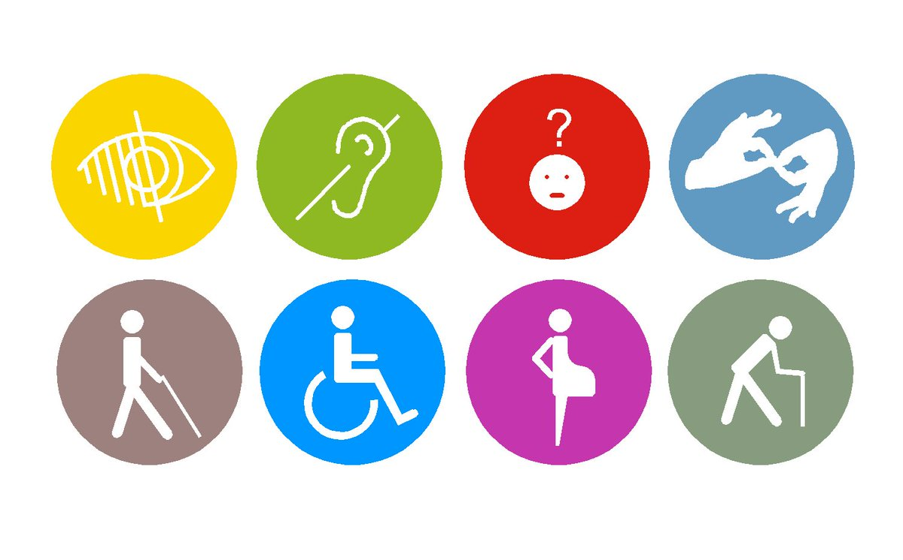

**Definición:**  
Es el diseño que puede ser **entendido, interpretado y utilizado** por la mayor diversidad de personas posible, independientemente de su edad, cultura, idioma, educación o capacidad física o cognitiva.

**En cristiano:**  
Es el arte de **crear claridad absoluta**. Es el "esperanto" visual. No es un estilo, es una **mentalidad de inclusión**.

**¿Por qué es tu nueva obsesión?**
*   **Rompe barreras:** Un ícono bien diseñado es más rápido que una traducción. Piensa en el símbolo de "Wi-Fi" o de "Encendido". Son globales.
*   **Es eficiente:** Comunica mensajes complejos (direcciones, advertencias, funciones) en milisegundos.
*   **Es duradero:** Un símbolo universal trasciende las modas. La señal de "Pare" (STOP) lleva décadas siendo la misma en medio planeta.

**Ejemplos en tu día a día:**
*   La **señalética** de un hospital o aeropuerto.
*   Los **pictogramas** en tu app favorita (la lupa para buscar, el corazón para "favorito").
*   El **swoosh de Nike** o la **manzana de Apple**. Logotipos tan depurados que funcionan sin texto.

---

### Diseño Atemporal: Cuando tu Diseño Sobrevive a las Modas

**Definición:**  
Es el diseño que **mantiene su relevancia, funcionalidad y fuerza visual** a lo largo de décadas, resistiendo los ciclos efímeros de las tendencias.

**En cristiano:**  
Es el diseño que no se avergüenza de sí mismo en 10 años. No es "vintage" porque nunca pasó de moda.

**Cómo se logra (la tríada sagrada):**

1.  **Simplicidad Radical:** Elimina todo lo que no sea absolutamente esencial. La complejidad es la primera en envejecer.
2.  **Consistencia Inquebrantable:** Mantén un núcleo duro de elementos (una forma, una proporción, un concepto) a través del tiempo y las aplicaciones.
3.  **Adaptabilidad Inteligente:** Permite evoluciones, no revoluciones. El logo de Apple pasó del arcoíris al monocromo, pero la *forma de la manzana* y el *mordisco* siguen intactos. Eso es adaptabilidad sin perder identidad.

**Ejemplo maestro:** El mapa del metro de Londres (el diagrama de Harry Beck). Esquemático, no geográficamente preciso, pero tan intuitivo y claro que se convirtió en el estándar mundial. Es atemporal porque resuelve un problema eterno (cómo navegar un sistema complejo) de la manera más simple.

---

### La Simplicidad: No es un Estilo, es la Meta

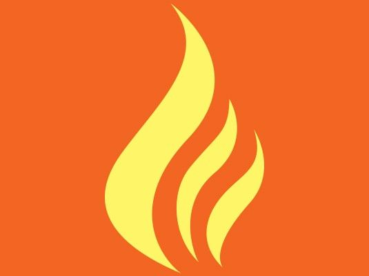

Este es el corazón de todo. La simplicidad no es "hacerlo minimalista porque está de moda". Es un **proceso de destilación** hasta llegar a la esencia pura del mensaje.

**La simplicidad efectiva logra:**
*   **Memorabilidad instantánea:** Un diseño simple se graba en la mente. Piensa en el objetivo de una cámara de Instagram.
*   **Accesibilidad ampliada:** Cuanto más simple, más personas pueden entenderlo, incluyendo aquellas con dificultades cognitivas o de aprendizaje.
*   **Comunicación a velocidad de rayo:** En un mundo con sobrecarga de información, la simplicidad es un acto de respeto al tiempo y atención del usuario.

**La paradoja:** Lograr simplicidad es **complejo**. Requiere horas de bocetos, eliminación, debate y refinamiento para que el resultado final parezca *obvio*.

---

### Cultura vs. Universalidad: El Equilibrio

¿Un diseño puede ser realmente universal en un mundo tan culturalmente diverso? La respuesta es sí, pero con matices.

*   **Los principios son universales:** La necesidad de seguridad, orientación, amor, conexión. Un corazón significa "amor" en casi todas partes. Un rayo significa "peligro eléctrico".
*   **Los símbolos pueden ser culturales:** El color blanco significa pureza en unas culturas y luto en otras. Un pulgar arriba es positivo en Occidente, pero ofensivo en partes de Medio Oriente.

**Tu trabajo como diseñador:**  
Investiga. **Contexto es todo**. Si diseñas para un mercado global, usa símbolos probados universalmente y evita metáforas culturalmente específicas. Si diseñas para una cultura local, puedes abrazar sus símbolos, pero mantén la **claridad** como principio rector.

---

### 🧠 Diseñar para el Futuro

Hoy has aprendido a elevar tu mirada:
1.  **El diseño universal es empatía a escala global.** Es diseñar con la profunda convicción de que la buena comunicación es un derecho, no un privilegio.
2.  **El diseño atemporal es humildad profesional.** Es reconocer que tu trabajo puede (y debe) aspirar a durar más que la última tendencia de Instagram.
3.  **La simplicidad es la sofisticación definitiva.** Es la marca del dominio, no de la falta de ideas.
4.  **Tu responsabilidad es doble:** Crear piezas que funcionen hoy para todos y que sigan funcionando mañana.

Estos principios son el estándar más alto al que puedes aspirar. Conviértelos en tu filtro para cada proyecto.

---

### 🌍 Tu Reto: Claridad Universal

Es hora de entrenar tu ojo para detectar el diseño universal y atemporal en la jungla visual cotidiana.

**Tu misión es triple:**
1.  **Encuentra un ejemplo BRILLANTE de diseño universal.** Fotografía una señal, un pictograma o un icono de interfaz que creas que cualquier persona en el mundo entendería al instante. **Analiza:** ¿Qué lo hace tan claro? ¿Qué elementos eliminó el diseñador para lograrlo?
2.  **Encuentra un ejemplo PODEROSO de diseño atemporal.** Puede ser un logotipo con décadas de vida (Coca-Cola, Mercedes-Benz), un cartel clásico o un objeto de uso diario (la tetera de Micheal Graves). **Analiza:** ¿Qué ha permitido que sobreviva a las modas? ¿Simplicidad? ¿Consistencia? ¿Adaptabilidad?
3.  **Propón una mejora.** Encuentra un diseño en tu ciudad o en una app que sea **confuso, culturalmente específico o demasiado complejo**. Haz un boceto rápido (aunque sea en una servilleta) de cómo lo simplificarías y universalizarías.

**Documenta tus hallazgos.** Este ejercicio no es sobre estética; es sobre **semántica visual pura**. Te entrenará para buscar la esencia y desechar el ruido, la habilidad más valiosa que puedes cultivar.

Al dominar estos principios, tu trabajo dejará de ser "bonito" para convertirse en **útil, claro y duradero**. Y en un mundo lleno de ruido, eso es un superpoder.

---

## Inspiración Creativa: De la Chispa de Da Vinci a Tu Tablero Digital

En la última sesión hablamos de principios universales y atemporales. Hoy vamos a lo concreto: **¿de dónde diablos sacas las ideas?** La inspiración no es un rayo que cae del cielo; es un músculo que se entrena y un recurso que se cultiva. Como diseñador, tu banco de ideas no puede estar vacío. Vamos a llenarlo con método y curiosidad.

Piensa en la inspiración como el oxígeno para tu creatividad. Sin ella, el fuego se apaga. Hoy te voy a mostrar cómo respirar.

---

### El Boceto: El Gesto que Cambia el Mundo

Todo comienza con un trazo. Un garabato. Una idea cruda.

**El caso Da Vinci:**  
Hace más de 500 años, Leonardo dibujó en un cuaderno un artefacto con un tornillo aéreo. No tenía motores, ni materiales ligeros, ni siquiera la física completamente clara. Era solo un **boceto**. Esa idea, ese *"¿y si...?"* visual, fue la semilla del helicóptero moderno.

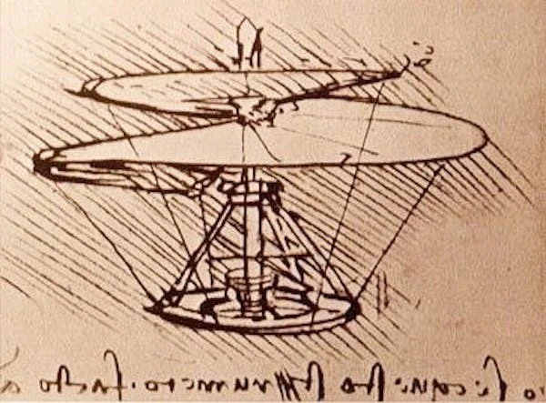

**La lección para ti:**  
Tu boceto de hoy, esa interfaz que dibujas en una servilleta o ese logotipo que garabateas en el margen de una libreta, **puede ser el precursor de algo grande**. No subestimes el poder de plasmar una idea, por simple que sea. El boceto no es el final; es el **primer sí** a una posibilidad.

---

### La Evolución: Cómo una Idea Creció

La idea de Da Vinci no despegó de la noche a la mañana. Durmiente durante siglos, fue despertada por:

*   **La tecnología:** Motores de combustión, aleaciones ligeras, sistemas de control.
*   **La necesidad:** Guerra, rescate, transporte rápido.
*   **El diseño iterativo:** Miles de mentes añadiendo, quitando y mejorando el concepto original.

**En tu trabajo:**  
Tu primer concepto nunca es el definitivo. Evolucionará con **los feedbacks, las limitaciones técnicas, las necesidades del usuario y las tendencias culturales**. No te aferres a la primera versión. Abraza la evolución.

---

### Tus Dos Fuentes de Oxígeno Digital: Behance vs. Pinterest

Necesitas alimentar tu cerebro con lo mejor. Estas dos plataformas son tus bibliotecas visuales principales, pero cada una tiene una personalidad distinta.

| Plataforma | El Ambiente | Para Qué la Usas | La Mentalidad |
| :--- | :--- | :--- | :--- |
| **Behance** | La **galería de arte profesional**. Pulido, curado, con casos de estudio completos. | Para **profundizar**. Ver cómo otros resolvieron problemas complejos, entender procesos, ver trabajos de alta gama de agencias y estudios. | "Necesito ver estándares profesionales y best practices." |
| **Pinterest** | El **mercado de las pulgas visual**. Caótico, diverso, lleno de ideas crudas, tendencias emergentes y conexiones inesperadas. | Para **expandirte**. Encontrar inspiración fuera de tu burbuja, hacer lluvia de ideas, coleccionar colores, texturas, estilos. | "Necesito estimularme y encontrar algo que no sabía que buscaba." |

**Regla de oro:** No copies. **Analiza.** En Behance, pregúntate: *¿Cómo llegaron a esta solución?* En Pinterest, pregúntate: *¿Qué emoción o asociación me provoca esta imagen?*

---

### Dominando Pinterest: Tu Mapa del Tesoro Visual

Pinterest es más que una red social; es una **herramienta de investigación visual**. Así se usa como un profesional:

1.  **Crea Tableros con Propósito:** No tengas un tablero gigante llamado "Inspiración". Sé específico: "Interfaces de Apps de Música", "Paletas de Color Otoñales", "Tipografía Brutalista", "Packaging Sustentable".
2.  **Busca con Intención:** Usa palabras clave concretas. En vez de "diseño bonito", busca **"diseño de identidad para cafeterías artesanales"** o **"landing page SaaS minimalista"**.
3.  **Profundiza en los "Pines Similares":** Cuando encuentres una imagen que resuene, haz clic en ella y explora las recomendaciones. Es como seguir el hilo de una madeja; te lleva a tesoros que la búsqueda directa no muestra.
4.  **Organiza y Poda:** Revisa tus tableros cada mes. ¿Esa imagen todavía te inspira? Si no, elimínala. Tu biblioteca debe estar viva y relevante.

---

### El Salto a la Innovación: No Inventes, Recombina

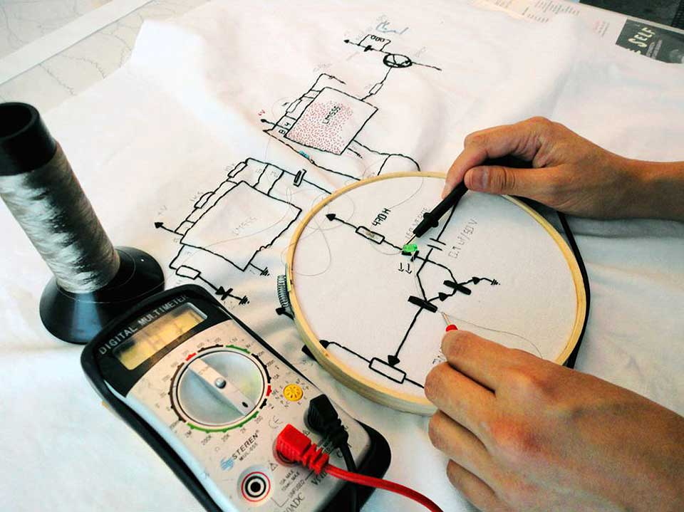

La innovación rara vez es crear de la nada. Es **conectar puntos que nadie había unido**.

**Tu proceso de 3 pasos:**

1.  **Investiga el Pasado:** ¿Cómo se ha solucionado esto antes? (Como estudiar el boceto de Da Vinci).
2.  **Satúrate del Presente:** Usa Behance y Pinterest para ver **cómo lo están resolviendo todos los demás**. Identifica patrones y clichés.
3.  **Experimenta con la Recombinación:** Aquí viene la magia. ¿Qué pasa si tomas la **estética** de un estilo (ej., vintage sci-fi) y la aplicas a un **problema** moderno (ej., una app de banca)? ¿Si combinas la **paleta de colores** de una pintura impresionista con la **interfaz** de una herramienta de productividad?
    *   **Juega. Mezcla. Forcejea.** La idea innovadora suele estar en la intersección.

---

### 🧠 Eres un Curador de Posibilidades

Hoy has aprendido que la inspiración es un flujo que puedes gestionar:
1.  **Honra el boceto.** Es el sagrado primer paso.
2.  **Alimenta tu banco visual** con disciplina, usando **Behance para el oficio** y **Pinterest para la chispa**.
3.  **Innovar es recombinar con sentido.** Conecta lo antiguo con lo nuevo, lo de una disciplina con lo de otra.

No esperes a que te llegue la inspiración. **Sal a cazarla.**

---

### 🎨 Tu Reto: La Caza del Tesoro

Te propongo un ejercicio práctico que pondrá en marcha tu motor de inspiración.

**Brief:** *"Diseña la interfaz de una app para aprender sobre astronomía para niños de 8 a 12 años."*

**Tu misión:**

1.  **Fase Investigación (15 mins):**
    *   Ve a **Pinterest**. Busca: "space ui design", "kids app interface", "educational game graphics", "dark mode galaxy".
    *   Crea un tablero secreto llamado *"Reto Astronomía Kids"* y guarda al menos 15 imágenes que te llamen la atención (colores, iconos, ilustraciones, sensaciones).
2.  **Fase Profundización (15 mins):**
    *   Ve a **Behance**. Busca: "children's app UI/UX case study", "educational platform design".
    *   Encuentra 2 proyectos completos. No copies, pero anota: ¿Cómo estructuran la información? ¿Qué tipo de interacciones usan?
3.  **Fase Síntesis (30 mins):**
    *   Con lo recolectado, haz **3 bocetos rápidos** (en papel o digital) de la pantalla principal de esta app.
    *   **Oblígate a mezclar:** ¿Y si los colores son de una de tus imágenes de Pinterest, pero la estructura de navegación se inspira en un caso de Behance?

**El objetivo no es un diseño final.** El objetivo es **ejercitar el proceso** de buscar, curar y recombinar. Al final, tendrás un pequeño banco de inspiración específico y tres puntos de partida viables para un proyecto.

Guarda este proceso. Repítelo para cada nuevo proyecto. Pronto, la "falta de ideas" será cosa del pasado.

---

## Behance

### Tu Vitrina Profesional en el Mundo Creativo

Anteriormente hablamos de buscar inspiración en Pinterest y de admirar el trabajo terminado en Behance. Hoy vamos a dar un giro crucial: pasar de ser **espectador** a ser **expositor**. Behance no es solo una galería para mirar; es el escenario donde **construyes tu reputación, tu carrera y tu red profesional**. Si Pinterest es tu cuaderno de apuntes privado, Behance es tu **tesis profesional publicada para el mundo**.

Piensa en Behance como tu **portfolio digital vivo**, tu tarjeta de presentación global y tu conexión directa con las mejores oportunidades. Vamos a dominarlo.

---

### Behance vs. El Resto: La Diferencia que Importa

**Behance no es una red social cualquiera.** Es una **plataforma de *casos de estudio* visuales**.

*   **Pinterest / Instagram:** Son para **imágenes sueltas**. Una foto, un logo, un mood. Es sobre el *destello* de una idea.
*   **Behance:** Es para **proyectos completos**. Múltiples imágenes, procesos, explicaciones, contextos. Es sobre el *viaje completo* de una idea, desde el problema hasta la solución final.

**La analogía perfecta:**
*   **Pinterest** es como hojear un libro de recortes lleno de postales hermosas de todo el mundo.
*   **Behance** es como visitar una exposición de arquitectura donde ves las maquetas, los planos estructurales, las fotos del edificio terminado *y* la explicación del arquitecto sobre cómo resolvió cada desafío.

---

### El Arte de Publicar: No Subas Imágenes, Cuenta Historias

Publicar en Behance no es subir una imagen y ponerle "Hecho". Es **narrar tu proceso**. Así se hace:

**Los 4 Pilares de un Proyecto que Impacta:**

1.  **El Contexto (El "Por Qué"):** Empieza con el brief. ¿Cuál era el problema del cliente? ¿El objetivo? Una o dos líneas que pongan al espectador en situación. *"Rediseño de marca para una cafetería local que buscaba transmitir artesanía y sostenibilidad."*
2.  **El Viaje Visual (El "Cómo"):** Aquí es donde brillas. Sube **múltiples imágenes** que muestren:
    *   Los primeros **bocetos** y *moodboards*.
    *   La **exploración** de conceptos (varias opciones de logo, paletas de color).
    *   La **aplicación** del diseño (cómo se ve la marca en tazas, uniformes, redes sociales).
    *   **Detalles** y acercamientos (el kerning perfecto de la tipografía, el patrón de textura).
3.  **La Explicación Clara (El "Qué"):** Usa texto breve entre imágenes para guiar. Explica *tus decisiones de diseño*. ¿Por qué ese color? ¿Por qué esa tipografía? Esto demuestra **pensamiento estratégico**, no solo habilidad técnica.
4.  **Las Etiquetas Inteligentes:** Usa categorías y tags relevantes (#BrandIdentity, #EditorialDesign, #UXCaseStudy). Es como poner tu trabajo en los estantes correctos de la biblioteca global para que te encuentren.

---

### Behance como Motor de Tu Carrera: Más que "Me Gusta"

Esta plataforma es tu **asesor de carrera, tu cazatalentos y tu red de contactos**, todo en uno.

*   **Tu Carta de Presentación 24/7:** Agencias de todo el mundo *escanean* Behance en busca de talento. Un perfil sólido es tu mejor currículum. Las **vistas y los "appreciations" (likes)** son tu métrica de impacto inicial.
*   **La Puerta a Oportunidades Reales:** Muchos trabajos freelance y ofertas de empleo surgen porque alguien vio un proyecto tuyo aquí. Es común recibir mensajes directos de clientes potenciales.
*   **Tu Red de Colegas y Mentores:** Seguir a artistas que admiras, comentar con sustancia en proyectos (más allá de "¡genial!"), y hasta colaborar en proyectos publicados, te conecta con la comunidad profesional global.

---

### La Estrategia: Cómo Gestionar un Portafolio que Atrape

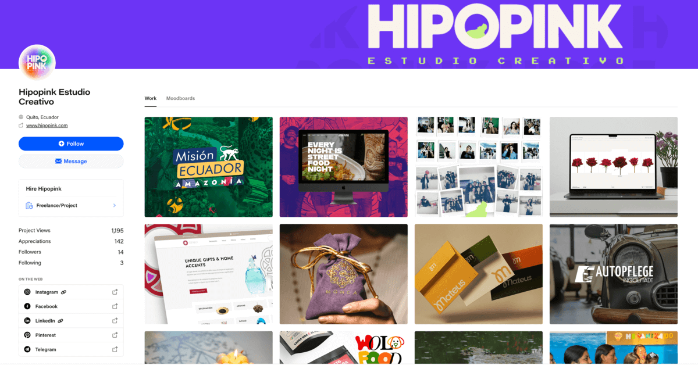

Un perfil descuidado hace más daño que no tenerlo. Sigue esta disciplina:

*   **Calidad sobre Cantidad, Siempre.** Es mejor tener **5 proyectos increíblemente bien presentados** que 20 mediocres. Tu portafolio es tan fuerte como tu proyecto más débil.
*   **Curada Constante:** Revisa tu perfil cada 6 meses. ¿Ese trabajo de hace 3 años representa aún tu nivel y estilo? Si no, **archívalo** (Behance permite ocultar proyectos sin borrarlos).
*   **Pide y Da Feedback de Valor:** Comenta en otros trabajos con preguntas o observaciones específicas ("Me encanta cómo solucionaste la navegación en móvil aquí"). La comunidad responde a la generosidad.
*   **Coherencia Visual en tu Perfil:** Tu foto, tu biografía y la disposición de tus proyectos deben reflejar **tu marca personal**. Que tu perfil en sí mismo sea un ejemplo de buen diseño.

---

### 🧠 Tu Dirección Profesional en Línea

Behance es la herramienta más poderosa que tienes para **controlar tu narrativa profesional**.
1.  No es un álbum de fotos, es una **sala de exposiciones de casos de estudio**.
2.  No publiques resultados, publica **procesos y decisiones**.
3.  No busques solo likes, busca **visibilidad estratégica y conexiones de calidad**.
4.  **Se proactivo.** La plataforma no funciona si solo consumes. Publica, interactúa, pertenece.

Es el paso inevitable de aprender a **ser visto**.

---

### 🚀 Tu Reto: Operación "Primera Impresión en Behance"

Es hora de pasar a la acción. Este reto tiene dos caminos; elige el que se ajuste a ti:

**Opción A (Si ya tienes perfil): La Gran Revisión.**
1.  Revisa tus **3 proyectos más recientes** en Behance.
2.  Aplícales el **filtro de los 4 Pilares** (¿Tienen contexto? ¿Muestran proceso? ¿Explican decisiones? ¿Están bien etiquetados?).
3.  Elige **UNO** y re-edítalo completamente para cumplir con todos los pilares. Actualízalo.

**Opción B (Si no tienes perfil o es nuevo): El Proyecto Fundacional.**
1.  **Crea o mejora** tu perfil: una foto profesional, una bio clara que diga quién eres y qué te interesa diseñar.
2.  **Toma UN proyecto tuyo** (puede ser de este curso, un trabajo personal, un rediseño de algo que te guste).
3.  **Sigue los 4 Pilares** y súbelo como tu primer caso de estudio formal.
4.  **Interactúa:** Busca 3 proyectos de diseñadores que admires y déjales un comentario sustancial (menciona algo específico que te haya gustado o una pregunta genuina).

**Comparte el link** a tu perfil o proyecto actualizado. Este no es un ejercicio de ego; es el primer paso para construir tu presencia profesional en el ecosistema creativo global.

En la próxima sesión, cerraremos este módulo hablando de **cómo traducir todo este aprendizaje en un portafolio físico/digital cohesivo y en la mentalidad para conseguir tus primeros clientes o empleo**. De la teoría a la práctica real.

---

## Composición Visual: El Ojo Entrenado del Director de Arte

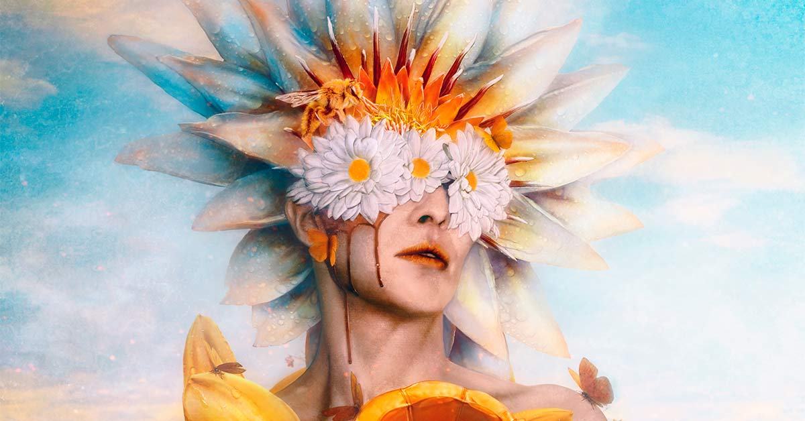

Has aprendido a manejar el color, la tipografía y la estructura. Has explorado la psicología de la Gestalt y la diferencia entre arte y diseño. Pero hay una habilidad que lo reúne todo, que separa al aficionado del profesional: **la capacidad de mirar una imagen y entender por qué funciona o por qué falla.**

Hoy no hablamos de herramientas ni de procesos. Hablamos de **educar tu ojo**. La composición visual no es una fórmula matemática; es un **lenguaje silencioso** que tu cerebro ya conoce instintivamente. Mi trabajo es hacerte consciente de él para que puedas usarlo con intención.

---

### Los Tres Pilares de la Mirada Profesional

Cuando observas una imagen bien compuesta, tu ojo no se desplaza al azar. Sigue una **coreografía invisible** diseñada por el creador. Esa coreografía se construye sobre tres pilares fundamentales:

#### a) El Equilibrio: No es Simetría, es Peso

**Definición técnica:**  
La distribución del **peso visual** de los elementos en el espacio. No se trata de que todo sea perfectamente simétrico, sino de que **nada "pese" demasiado** en un solo lado.

**En cristiano:**  
Tu cerebro tiene un sensor de gravedad incorporado. Si una imagen se siente inclinada, torcida o a punto de caerse, algo falla. El equilibrio visual es engañoso: un elemento pequeño pero muy oscuro puede "pesar" lo mismo que uno grande pero muy claro. Tu trabajo es **contrapesar**.

*   **Ejemplo cotidiano:** Piensa en un móvil colgado sobre una cuna. Las piezas no son iguales, pero el sistema entero flota en armonía. **Eso** es equilibrio.

#### b) La Alineación: El Esqueleto Invisible

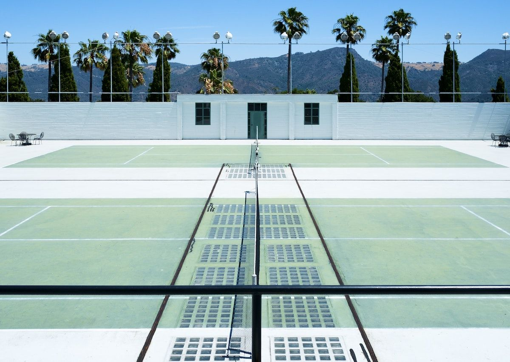

**Definición técnica:**  
La disposición de los elementos respecto a **líneas guía** implícitas o explícitas que crean orden y conexión.

**En cristiano:**  
Es como cuando ordenas los libros en una estantería. Si están todos torcidos, no sabes por dónde empezar a mirar. Si están alineados, tu ojo **respira** y encuentra lo que busca. La alineación le dice al espectador: "Aquí hay orden. Esto es confiable".

#### c) La Disposición: El Director de Escena

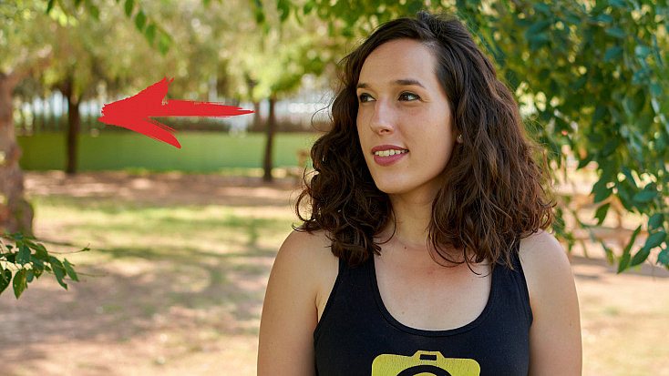

**Definición técnica:**  
La ubicación estratégica de los elementos para **guiar la mirada** y crear una narrativa visual.

**En cristiano:**  
No todo tiene que estar en el centro. De hecho, el centro suele ser el lugar más aburrido. Colocar a tu sujeto a un lado, dejando espacio hacia donde mira, crea **tensión narrativa**. Es como en el cine: si un actor mira hacia la izquierda, el director de fotografía deja aire a la izquierda. No es casualidad; es **dirección de mirada**.

**La Ley de la Mirada:** Si tu sujeto mira hacia la derecha, debe haber más espacio a la derecha. Si miras una foto y sientes que el sujeto está "encajonado", es porque esta ley se ha violado.

---

### Los Maestros: Lecciones de Composición desde el Museo

La teoría es útil, pero la práctica de los grandes es sagrada. Analicemos cómo los maestros aplican estos principios.

#### 🎨 Picasso: El Equilibrio en el Caos

**"Guernica"** es un lienzo de 3,5 metros de horror y fragmentación. Y sin embargo, **está perfectamente equilibrado**.

*   **¿Qué hace?** Las figuras no están simétricas, pero el peso visual de la izquierda (el toro, la madre con el niño muerto) se contrapesa con el de la derecha (la figura que clama al cielo, la luz).
*   **Lección:** Incluso en el caos aparente, el ojo necesita un ancla. Picasso distribuye las masas de luz y sombra como un maestro de ajedrez. El desorden emocional está **organizado estéticamente**.

#### 🟨 Mondrian: La Geometría como Lenguaje Universal

Piet Mondrian redujo el universo a **líneas negras, rectángulos y colores primarios**. Podría ser frío, pero es puro ritmo visual.

*   **¿Qué hace?** Sus composiciones parecen simples, pero la ubicación de cada rectángulo rojo, azul o amarillo está **milimétricamente calibrada**. Si movieras un solo cuadrado, todo el cuadro se desmoronaría.
*   **Lección:** La alineación y el equilibrio no necesitan complejidad. Unas pocas formas, bien colocadas, generan una fuerza visual inolvidable.

#### 👩‍🎤 Warhol: La Repetición que Crea Armonía

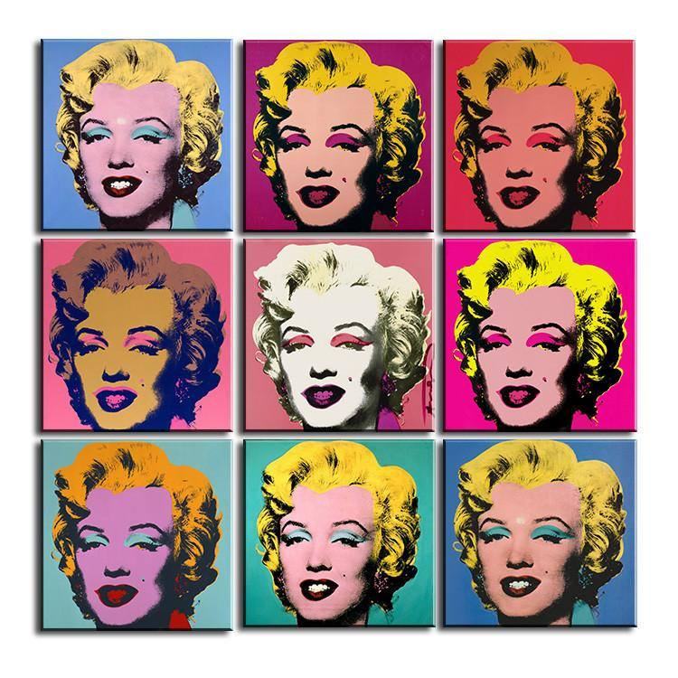

**"Marilyn Monroe"** no es un retrato, es un **patrón**.

*   **¿Qué hace?** Warhol repite el mismo rostro una y otra vez. La composición se sostiene por la **uniformidad de la retícula**. Pero introduce pequeñas variaciones de color que rompen la monotonía y crean ritmo.
*   **Lección:** La repetición genera equilibrio. Las variaciones controladas generan interés. Es la base del diseño de sistemas y de la identidad de marca.

#### 🏢 Sagmeister & Walsh: El Espacio Negativo como Protagonista

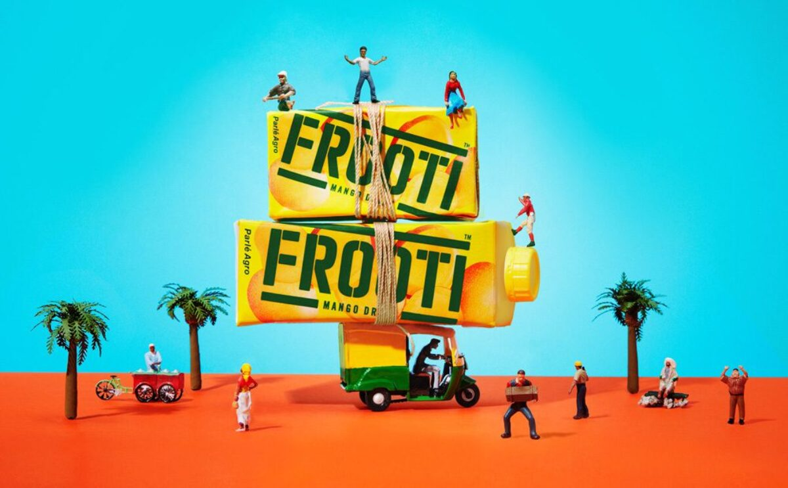

Este estudio neoyorquino es famoso por su **atrevimiento visual**, pero nunca a costa de la claridad.

*   **¿Qué hacen?** Usan el **espacio negativo** (el vacío) para que el mensaje respire. Sus piezas son limpias, pero no aburridas. El producto o el mensaje principal siempre está **aislado y destacado**.
*   **Lección:** No tengas miedo al vacío. El blanco no es un error; es el silencio que hace que la música se escuche.

#### 💳 Mastercard: La Síntesis Suprema

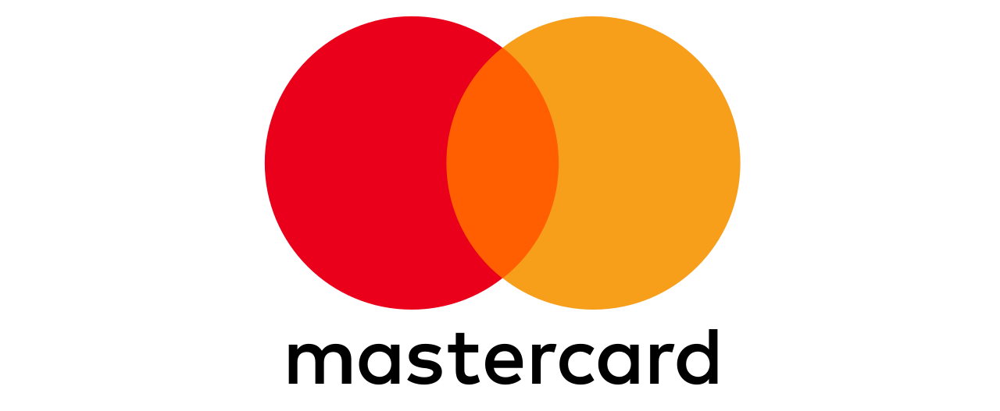

Dos círculos que se intersectan. Rojo y amarillo. Eso es todo.

*   **¿Qué hace?** El logo de Mastercard es un **milagro de composición**. Es simétrico, sí, pero lo importante es la **intersección**: ese espacio donde los colores se mezclan simboliza conexión, unión, transacción. En un solo gesto, comunica equilibrio y movimiento.
*   **Lección:** Cuando llegues a la esencia, el diseño se vuelve eterno. No necesitas más elementos; necesitas **los elementos correctos, en el lugar correcto**.

---

### 🧠 Tu Ojo es tu Herramienta Más Afilada

Hoy has aprendido a **ver con intención**:
1.  **El equilibrio** no es simetría; es peso visual consciente.
2.  **La alineación** es el orden silencioso que genera confianza.
3.  **La disposición** es la coreografía que guía la narrativa.
4.  **Los maestros** no son inalcanzables; son estudios de caso. Analízalos. Descompón sus reglas. Aplícalas.

Estos principios no son solo para el arte. Son para el cartel que diseñas, la interfaz que prototipas, el logo que bosquejas. La composición es el **idioma base** de toda comunicación visual.

---

## 🔍 Tu Reto: El Detective de la Composición

Es hora de entrenar tu mirada con rigor profesional.

**Tu misión tiene tres fases:**

1.  **Fase 1: La Caza.** Encuentra **una imagen publicitaria** (puede ser un cartel en la calle, un anuncio en Instagram, una valla publicitaria) que, a primera vista, te parezca **visualmente poderosa o extraña**.
2.  **Fase 2: El Análisis Quirúrgico.** Dibuja (mentalmente o con un editor de imágenes) **líneas de alineación** sobre ella. Pregúntate:
    *   ¿Dónde está el **equilibrio**? ¿Hay más peso a un lado?
    *   ¿Qué **líneas guía** existen (implícitas o explícitas)?
    *   ¿Se aplica la **Ley de la Mirada**? ¿Hay espacio hacia donde miran los sujetos?
    *   ¿Cómo se usa el **espacio negativo**?
3.  **Fase 3: La Intervención.** **Rediseña un detalle** de esa imagen para mejorar su composición. No necesitas hacer un nuevo cartel entero. Basta con mover un elemento, ajustar un margen, recortar la imagen de forma diferente. **Una sola decisión compositiva.** Compara el antes y el después.

**Comparte tu hallazgo.** No se trata de demostrar que eres mejor que el diseñador original; se trata de demostrarte a ti mismo que **ya puedes identificar y aplicar principios de composición**.

Este es el momento en que dejas de "sentir" si algo funciona y empiezas a **saber por qué**. Y ese conocimiento es irremplazable.

---

## Gestalt Aplicada: Cuando la Psicología se Convierte en Firma Visual

Hemos hablado de las leyes de la Gestalt antes. Las definimos, las clasificamos, entendimos su origen en la psicología de la percepción. Pero hoy vamos a hacer algo distinto: **vamos a verlas sangrar en el mundo real.** Porque una cosa es saber qué es la ley de cierre, y otra muy distinta es reconocerla en el logo que ves cada día en tu nevera o en el camión que te adelanta en la autopista.

Hoy no aprendemos nuevas leyes. **Aprendemos a reconocer el genio cuando lo tenemos delante.**

---

### Ley de Proximidad: Unilever y la Magia de la "U"

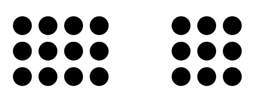

**Definición rápida:**  
El cerebro agrupa automáticamente los elementos que están cerca entre sí. La distancia es el pegamento visual.

**El caso de culto: El logo de Unilever.**

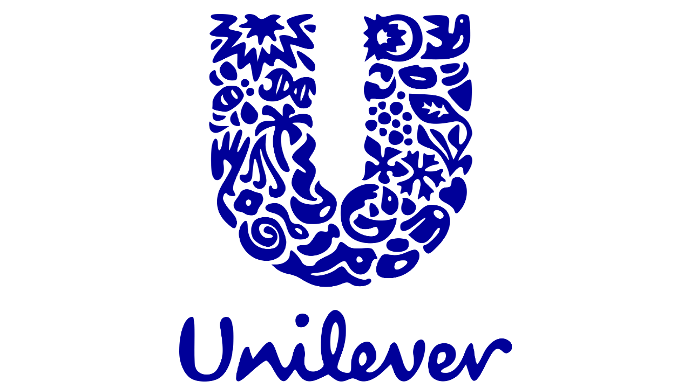

A simple vista, ves una gran "U" formada por decenas de iconos diminutos. Una gota de agua, una flor, un pájaro, un corazón. Cada icono es independiente, pero están tan **cerca unos de otros** que tu cerebro los fusiona en una sola entidad: el logotipo de la compañía.

**Por qué es brillante:**
-   **Comunicación doble:** De cerca, descubres la diversidad de la marca (sostenibilidad, cuidado, alimentos, hogar). De lejos, solo ves la "U" poderosa e inconfundible.
-   **La distancia como variable de diseño:** Unilever no diseñó un logo; diseñó un **sistema de percepción** que cambia según te acerques o alejes.

**Tu aprendizaje:**  
No necesitas encerrar todo en un círculo para que sea "un logo". A veces, solo necesitas **apretar los elementos** hasta que el espacio entre ellos desaparezca y el grupo hable más fuerte que las partes.

---

### Ley de Dirección: FedEx y la Flecha que Nunca Viste (Hasta Ahora)

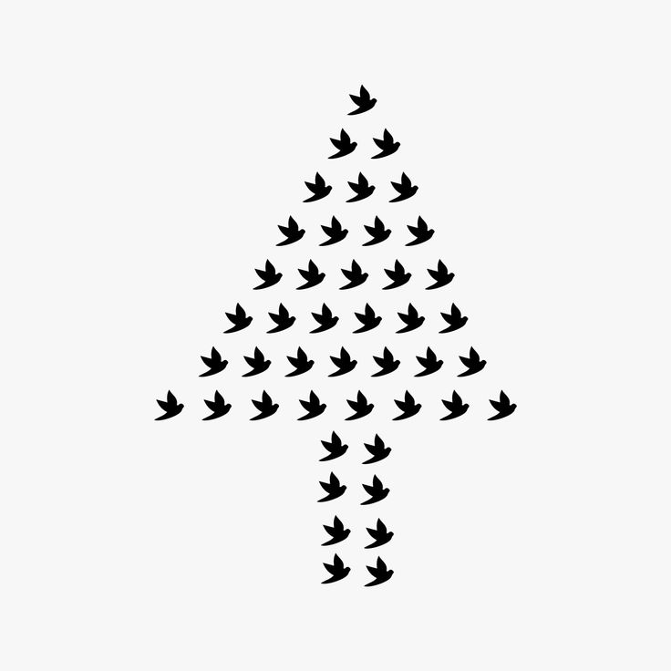

**Definición rápida:**  
Los elementos dispuestos en una dirección crean un camino visual que el ojo sigue de forma natural.

**El caso de culto: El logo de FedEx.**

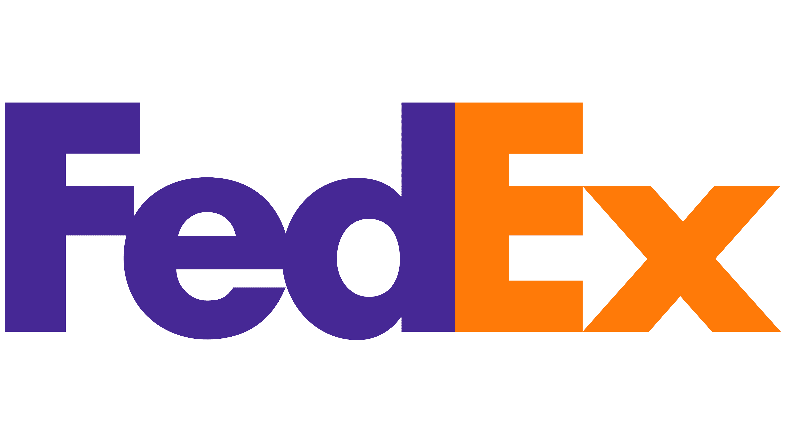

Es probable que lo hayas visto miles de veces. Pero permíteme adivinar: **¿hoy es el día en que ves la flecha por primera vez?**

Entre la "E" y la "X", el espacio negativo forma una flecha perfecta, nítida, hacia la derecha.

**Por qué es brillante:**
-   **No grita, susurra:** La flecha no está pintada; está **implícita**. Tu cerebro la descubre y se siente inteligente. Es un pequeño premio cognitivo cada vez que lo ves.
-   **Significado puro:** FedEx es una empresa de logística. La flecha significa movimiento, dirección, velocidad, entrega. No es decoración; es **el mensaje incrustado en la forma**.

**Tu aprendizaje:**  
Las mejores soluciones no se ven a la primera. Juega con el espacio negativo. A veces, lo que **no** dibujas comunica más que lo que sí.

---

### Ley del Cierre: La Bombilla que tu Cerebro Enciende Solo

**Definición rápida:**  
El cerebro completa figuras incompletas. Prefiere un todo coherente a un montón de fragmentos.

**El caso de culto: El icono de la bombilla.**

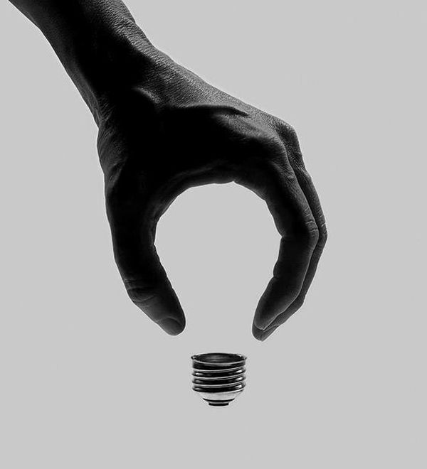

Un cartel que solo muestra la base roscada de una bombilla y unas pocas líneas curvas insinuando el vidrio. No ves la bombilla entera, pero **tu cerebro la dibuja**.

**Por qué es brillante:**
-   **Eficiencia pura:** Menos tinta, más impacto. El espectador no es pasivo; **completa la obra**.
-   **Memorabilidad:** Lo que tu cerebro construye, lo recuerda mejor. Un diseño que exige un microsegundo de participación se graba más hondo.

**Ejemplo clásico:** El logo de la **WWF (Fondo Mundial para la Naturaleza)** . El panda no está delineado por completo. Tu cerebro cierra los espacios negros y ve la forma completa del oso. Es un icono inolvidable porque **tú lo terminaste**.

**Tu aprendizaje:**  
No subestimes la inteligencia de tu audiencia. No necesitas dibujar todo. A veces, **insinuar es más poderoso que mostrar**.

---

### Ley de la Semejanza: El Ejército de Triángulos y la Protección Dental

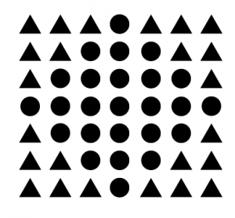

**Definición rápida:**  
Elementos que comparten color, forma o textura se perciben como parte de la misma familia.

**El caso icónico: Sensodyne y la sonrisa protegida con cascos de construcción.**

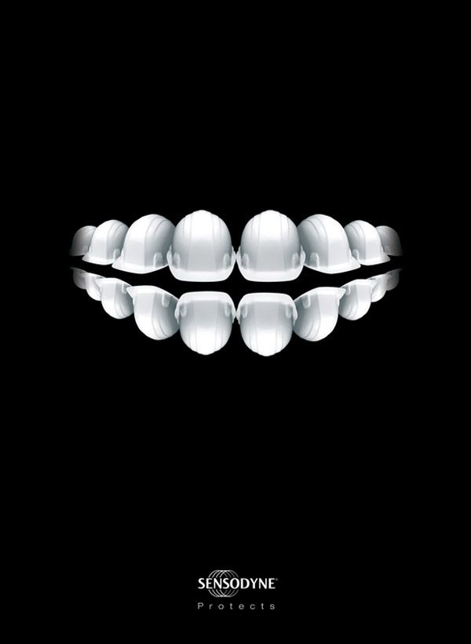 

Un anuncio: una fila de cascos blancos perfectamente alineados. Por su forma y disposición, tu cerebro no ve cascos… ve dientes. No hay encías. No hay boca. No hay contexto clínico. Aun así, lo entiendes al instante: protección dental.

No necesitas leer el texto. La imagen ya hizo el trabajo.

**Por qué es brillante:**

* **Ley de Semejanza:** Todos los elementos (cascos) comparten forma, color y tamaño. El cerebro los agrupa automáticamente como un solo conjunto: una dentadura.
* **Ley de Cierre:** Aunque no hay boca dibujada, tu mente completa la forma. Percibes una sonrisa donde solo hay objetos repetidos.
* **Analogía visual poderosa:** Casco = protección. Diente = sensibilidad. La unión de ambos conceptos comunica el beneficio del producto sin explicaciones.
* **Figura y fondo:** El contraste extremo entre el blanco y el negro dirige toda la atención al mensaje visual.

**Comunicación sin idioma:**
Funciona en cualquier parte del mundo. No depende de texto, cultura o traducción. Es diseño universal.

---

**Tu aprendizaje:**
Crea patrones visuales claros que el cerebro pueda agrupar fácilmente. Usa la semejanza para construir significado… y luego introduce una metáfora visual que conecte directamente con la promesa del producto.

Cuando el concepto es fuerte, la imagen habla antes que las palabras.

**El caso minimalista: Un rostro invisible construido con sombrero y gafas**

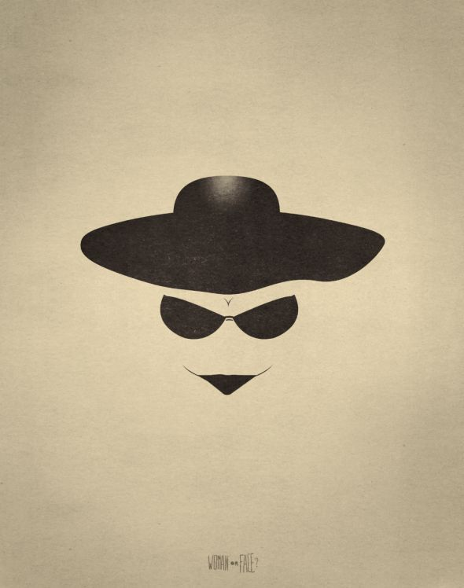

Un anuncio: un sombrero negro de ala ancha. Debajo, unas gafas oscuras. Más abajo, apenas una insinuación de boca. No hay ojos. No hay nariz. No hay rostro completo.

Y aun así… ves una persona.

No necesitas más información. Tu mente completa lo que falta.

**Por qué es brillante:**

* **Ley de Cierre:** Aunque el rostro no está dibujado por completo, tu cerebro rellena los vacíos. Construye una cara a partir de fragmentos.
* **Ley de Pregnancia (Buena Forma):** El diseño reduce el rostro a sus elementos esenciales. El cerebro prefiere interpretaciones simples y estables, así que organiza las formas en una figura reconocible.
* **Uso del espacio negativo:** El fondo no es vacío; es parte activa de la composición. El “rostro” existe gracias a lo que no está dibujado.
* **Economía visual extrema:** Con muy pocos elementos se construye identidad, misterio y narrativa.

**Comunicación sin exceso:**
No hay detalles, no hay textura compleja, no hay explicaciones. Solo las formas necesarias para que tu mente haga el resto.

---

**Tu aprendizaje:**
No siempre necesitas mostrarlo todo. A veces, sugerir es más poderoso que describir.

Elimina lo innecesario. Confía en que el cerebro del espectador completará la historia.

En diseño, lo que omites puede ser tan importante como lo que decides mostrar.

---

### Ley de Figura y Fondo: El Jarrón que es Dos Caras

**Definición rápida:**  
El cerebro no puede interpretar un elemento como figura y fondo al mismo tiempo. Pero puede **alternar** entre ambas lecturas.

**El caso de culto: El jarrón de Rubin (o las caras de perfil).**

¿Ves un jarrón blanco? ¿O ves dos rostros negros mirándose? Depende de a dónde dirijas tu atención.

**Por qué es brillante:**
-   **Diseño lúdico:** Invita al juego, a la doble lectura. No es para todo proyecto, pero cuando encaja, es inolvidable.
-   **Eficiencia espacial:** Dos mensajes en el mismo espacio. Un solo diseño, dos interpretaciones.

**Ejemplo contemporáneo:** El logo de la **Biblioteca Pública de San Francisco**. Las columnas de un edificio forman, al mismo tiempo, las páginas de un libro abierto.

**Tu aprendizaje:**  
La ambigüedad puede ser tu aliada, pero úsala con cautela. Si necesitas comunicación instantánea y clara (una señal de tráfico), evita el juego figura-fondo. Si buscas asombro y contemplación, **adelante**.

---

### Ley de Simetría y Asimetría: "El orden calma; el desorden, acelera"

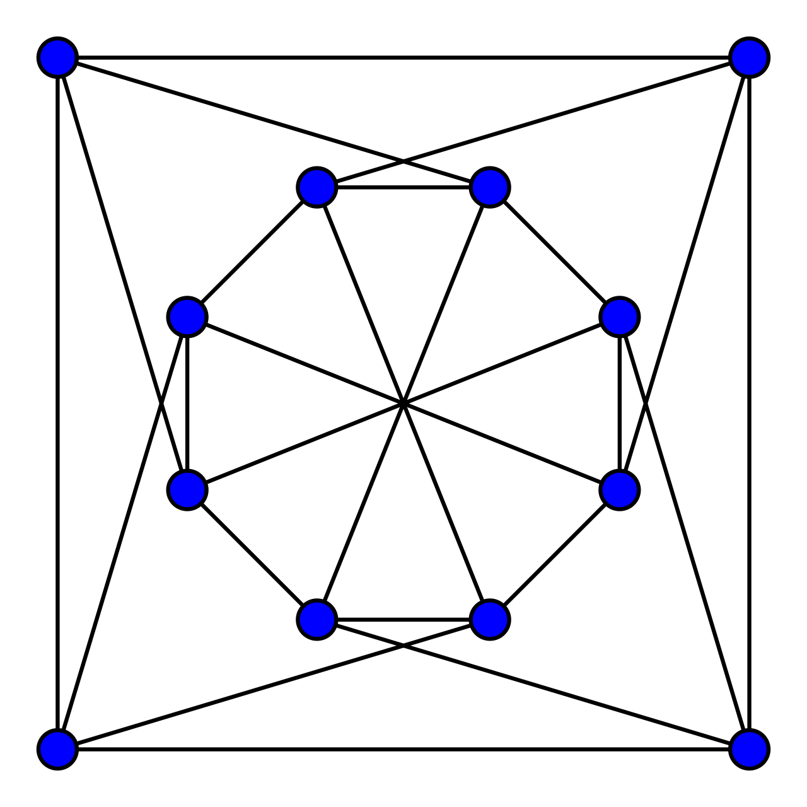

**Definición técnica:**  
El cerebro percibe los elementos simétricos como parte de un grupo estable y armónico. La asimetría, bien utilizada, genera tensión, dinamismo y dirección.

**En cristiano:**  
La simetría es un traje clásico. La asimetría es una chaqueta con un solo botón. Ambas funcionan, pero dicen cosas distintas.

**El caso visual: Los rostros y la mariposa.**

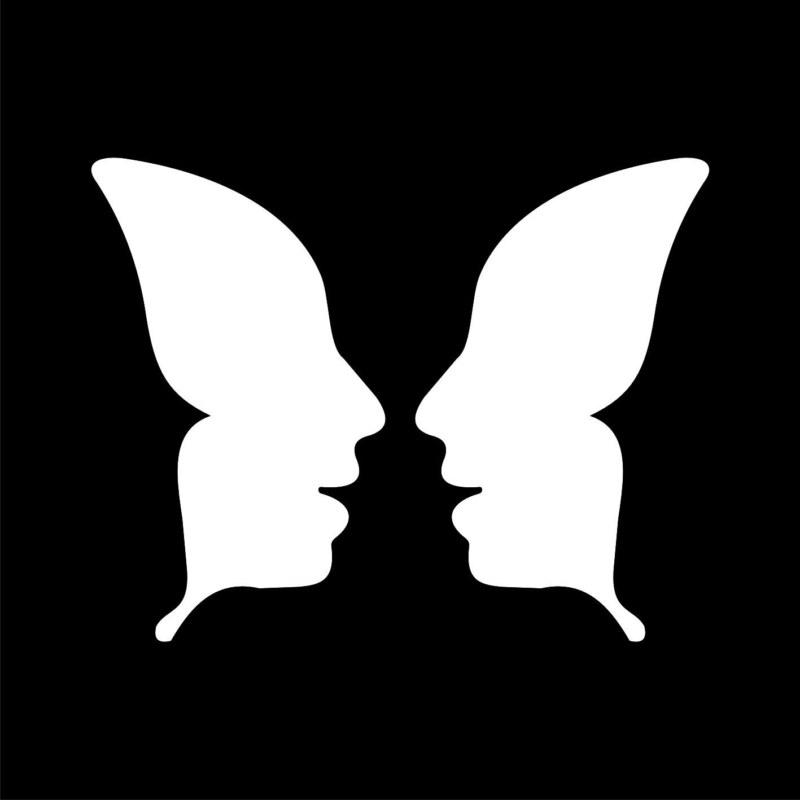

Dos rostros de perfil, enfrentados en simetría. El espacio negativo entre ellos dibuja una mariposa con las alas abiertas. Equilibrio. Belleza. Transformación. No necesitas explicación; lo ves y lo sientes.

---

### 🧠 Las Leyes no son Teoría, son Herramientas de Firma

Los casos que has visto hoy (Unilever, FedEx, WWF, la publicidad dental) comparten algo crucial: **no aplicaron las leyes de la Gestalt como un ejercicio académico**. Las aplicaron porque resolvían un problema real de comunicación de la manera más elegante posible.

1.  **Proximidad:** Para crear unidad a partir de la diversidad.
2.  **Dirección:** Para incrustar significado en el espacio negativo.
3.  **Cierre:** Para invitar al espectador a completar la imagen.
4.  **Semejanza:** Para establecer patrones y luego romperlos con intención.
5.  **Figura y Fondo:** Para contar dos historias en un mismo espacio.

No memorices las leyes. **Domínalas hasta que sean instinto.** Hasta que, frente a un brief, tu cerebro diga: "Aquí no necesito dibujar el contorno completo. El cierre hará el trabajo".

---

### 🔍 Tu Reto: El Detective de la Gestalt (Versión Maestra)

Ya hiciste un primer acercamiento a las leyes. Ahora es momento de **profundizar hasta el nivel de obsesión**.

**Tu misión:**
1.  **Encuentra UN logotipo o pieza publicitaria** que utilice **al menos dos leyes de Gestalt de forma simultánea**. No vale un logo que solo use proximidad. Busca la combinación. (Ejemplo: Unilever usa **proximidad** + **cierre** para formar la U).
2.  **Descompón el diseño en capas.** Crea un breve análisis visual donde expliques:
    -   **Ley 1:** ¿Dónde está y cómo funciona?
    -   **Ley 2:** ¿Dónde está y cómo se complementa con la primera?
    -   **¿Por qué esta combinación es efectiva para esta marca/mensaje?**
3.  **Bonus (opcional pero recomendado):** Haz un **boceto de una variante** de ese logo donde elimines una de las leyes. Demuestra visualmente por qué la versión original es superior.

**Comparte tu hallazgo.** Este ejercicio no es solo para que aprendas; es para que **construyas tu propio archivo mental de referencias analizadas**. Cuando tengas 50, 100 casos desmenuzados así, ninguna ley de la Gestalt volverá a ser un concepto abstracto. Serán **tus lentes para ver el mundo**.

---

## Jerarquía, Contraste y Espacio en Blanco: La Santísima Trinidad del Diseño Eficaz

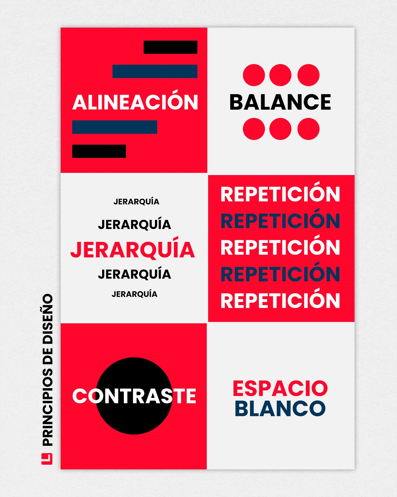

Has aprendido a manejar el color, la tipografía y la composición. Has interiorizado las leyes de la Gestalt y entiendes cómo el cerebro agrupa, completa y dirige la mirada. Pero aún falta un escalón crucial: **la capacidad de decidir qué grita, qué susurra y qué calla en tu diseño**.

Hoy hablamos de **jerarquía, contraste y espacio en blanco**. Tres principios que trabajan en equipo. Ninguno funciona sin los otros. Y cuando los tres se alinean, ocurre la magia: el espectador **no necesita pensar** para entender qué es importante. Simplemente *lo sabe*.

---

### Jerarquía: El Orden del Discurso Visual

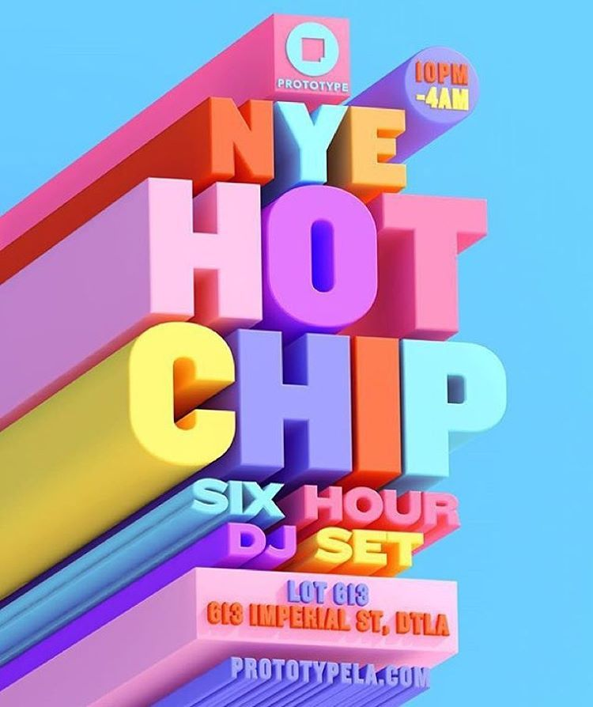

**Definición técnica:**  
La jerarquía visual es la **organización deliberada** de los elementos para indicar su orden de importancia. El ojo debe encontrar primero lo principal, luego lo secundario y, al final, los detalles.

**En cristiano:**  
Es como el guion de una película. Primero conoces al protagonista, luego entiendes el conflicto y al final descubres el desenlace. No puedes poner todo al mismo volumen porque entonces **nada se escucha**.

**Ejemplo clásico: El cartel cinematográfico de “Django Unchained”.**

Antes de leer nada, tu ojo ya tomó decisiones. Primero ves el gran retrato dominante en la parte superior. Luego el título en tipografía masiva y contundente. Después reconoces los rostros secundarios. Al final, casi sin darte cuenta, lees los créditos.

No es casualidad. Es jerarquía.

El diseñador construyó un recorrido visual claro:
Primero, el impacto emocional.
Segundo, el nombre de la película.
Tercero, las estrellas.
Cuarto, la información legal.

Tu mirada no se pierde porque alguien diseñó el camino.

---

### Cómo se construye en este cartel:

* **Tamaño:** El rostro superior es enorme; impone presencia. El título ocupa gran parte del espacio inferior. Los créditos, en cambio, son pequeños y discretos.
* **Peso tipográfico:** “DJANGO” está en una tipografía gruesa, sólida, casi agresiva. Los nombres del elenco usan mayúsculas fuertes para reforzar estatus.
* **Color:** El rojo intenso domina el fondo central. Es dramático, violento, imposible de ignorar. El contraste con el beige envejecido refuerza el tono western.
* **Posición:** La imagen principal está arriba, marcando la entrada visual. El título está centrado abajo, funcionando como ancla. Los créditos se relegan al margen inferior.
* **Superposición y escala:** Las figuras secundarias son más pequeñas y se organizan alrededor del protagonista, dejando claro quién lidera la narrativa.

---

**La regla de oro:**
Si todos los actores tuvieran el mismo tamaño… el cartel perdería fuerza.
Si el título fuera del mismo tamaño que los créditos… no sabrías qué mirar primero.

Si todo grita, nada se escucha.

Jerarquizar es decidir quién manda en la composición.

---

### Contraste: El Cuchillo que Corta la Mirada

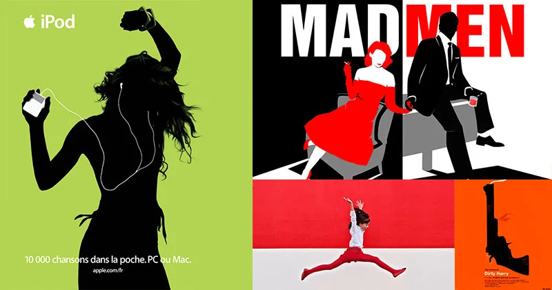

**Definición técnica:**  
El contraste es la **diferencia notable** entre dos o más elementos. Puede ser de color, tamaño, forma, textura, dirección o tipografía.

**En cristiano:**  
Es el "¡MIRA AQUÍ!" del diseño. Sin contraste, todo es plano, aburrido, olvidable. El contraste crea **tensión visual**, y la tensión captura la atención.

**El caso icónico: Los arcos dorados de McDonald's.**

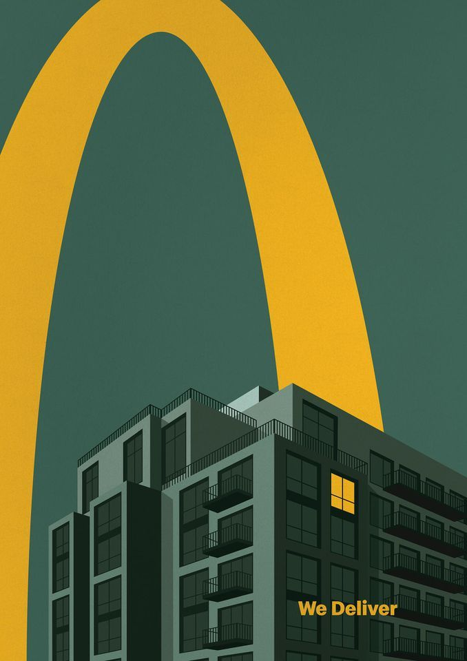

Sobre un fondo rojo intenso, el amarillo del arco dorado **explota**. No puedes evitarlo. Tus ojos van directo a él. Ese contraste no es casualidad; es estrategia pura. La marca no necesita que leas su nombre; necesita que **veas el arco**.

Aquí tienes el texto adaptado específicamente a la imagen de **NIVEA Night**:

---

**Otro ejemplo: NIVEA Night y el poder del azul profundo.**

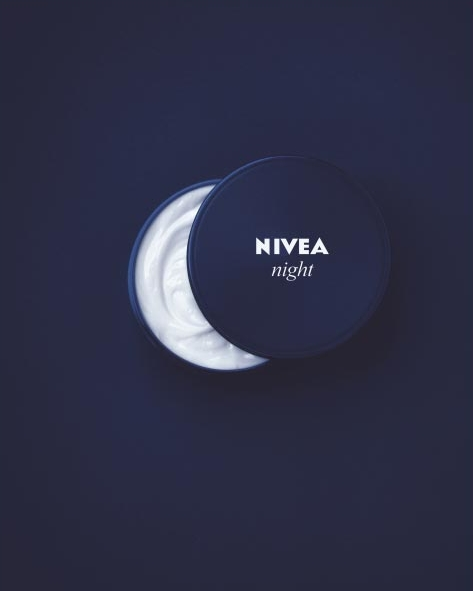

Un envase azul marino casi se funde con el fondo. Pero no desaparece. Al contrario: destaca con elegancia. La tipografía blanca brilla con nitidez. Y la crema, blanca y suave, asoma como luz en medio de la noche.

No hay colores estridentes. No hay efectos dramáticos. Solo contraste inteligente.

El producto no compite con el fondo: dialoga con él.

El azul oscuro construye el concepto de “noche”.
El blanco comunica pureza y cuidado.
La diferencia de valor hace que el contenido resalte sin esfuerzo.

Minimalismo + contraste = sofisticación.

---

### Cómo se aplica en esta pieza:

* **Contraste de valor:** Blanco sobre azul profundo. La crema y el logotipo se convierten en puntos de máxima atención.
* **Contraste conceptual:** Oscuridad (noche) vs. luz (cuidado, hidratación).
* **Contraste de textura:** Fondo mate y uniforme frente a la suavidad cremosa del producto.
* **Contraste tipográfico:** “NIVEA” en mayúsculas sólidas y firmes; “night” en minúscula más delicada y ligera.

---

**El detalle inteligente:**
El contraste aquí no grita. Susurra.

No es agresivo como un rojo sobre negro. Es sutil, coherente con la promesa de descanso y cuidado nocturno.

---

**El error novato:**
Pensar que contraste significa saturación extrema.

El verdadero contraste no es solo intensidad; es intención.

Aquí tienes el ejemplo adaptado a esta imagen:

---

**Otro ejemplo: La jarra de cerveza construida con bolas de billar.**

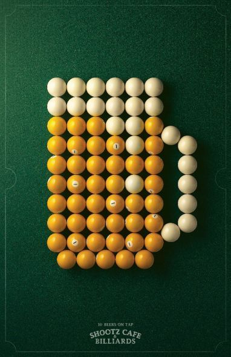

A primera vista, ves una composición ordenada de bolas sobre una mesa verde. Pero algo sucede: las bolas amarillas y blancas se organizan hasta formar la silueta de una jarra de cerveza.

No hay ilustración dibujada. No hay líquido real. Solo contraste.

El amarillo intenso contra el verde oscuro crea el cuerpo de la cerveza.
Las bolas blancas delinean la espuma y el borde del vaso.
El fondo verde profundo hace que la figura emerja con claridad inmediata.

Tu cerebro separa figura y fondo en segundos.

Eso es contraste trabajando junto a la percepción.

---

### Cómo se aplica en esta pieza:

* **Contraste de color:** Amarillo cálido contra verde frío. La “cerveza” salta visualmente.
* **Contraste de valor:** Las bolas claras destacan sobre el fondo oscuro.
* **Contraste de forma implícita:** Elementos circulares repetidos construyen una silueta reconocible.
* **Contraste conceptual:** Billar (juego) + cerveza (bar) → mensaje directo sin palabras.

---

La imagen funciona porque el contraste no solo diferencia colores: construye significado.

---

**El error común:**
Pensar que contraste es solo poner colores opuestos.

Aquí el contraste organiza, separa y revela una forma que no está dibujada… pero que todos vemos.

---

### Espacio en Blanco: El Silencio que Hace Música

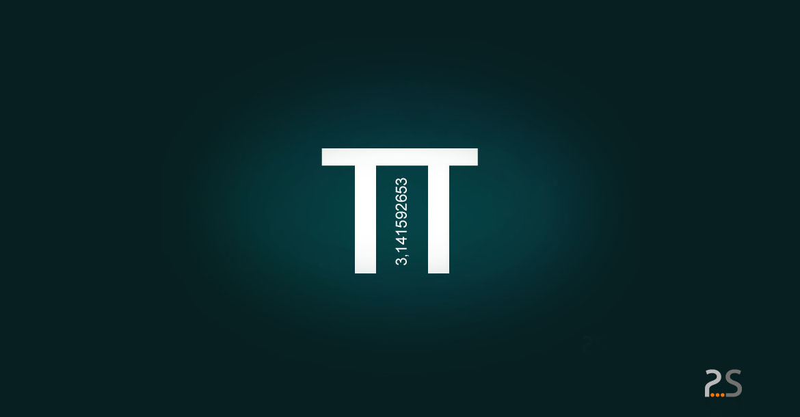

**Definición técnica:**  
El espacio en blanco (o espacio negativo) es el área **no ocupada** de una composición. No tiene por qué ser blanco; puede ser negro, azul, texturizado o incluso una fotografía. Es simplemente **el espacio que rodea a los elementos**.

**En cristiano:**  
Es el silencio entre las notas. Sin silencio, la música es ruido. Sin espacio en blanco, el diseño es ruido visual.

**El caso magistral: LEGO y la sombra del avión.**

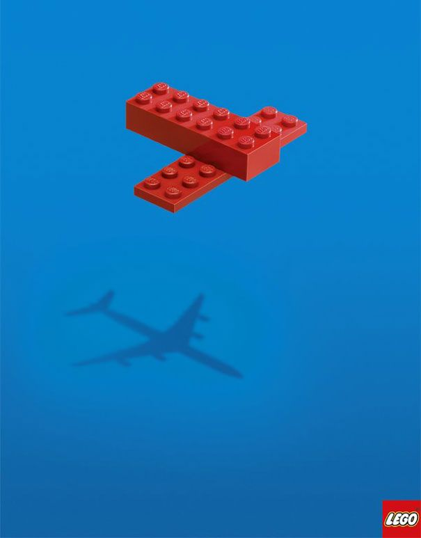

Un anuncio de LEGO muestra una sola pieza azul sobre un fondo blanco inmaculado. A su lado, su sombra. La sombra no es la de una pieza de plástico; es la silueta de un avión. El espacio en blanco no es "vacío": es el **escenario** donde ocurre la magia. No necesitas ver miles de piezas para entender que LEGO es creatividad. Lo entiendes en un instante, porque el diseño **respira**.

**Qué hace el espacio en blanco:**
- **Aísla:** Un elemento solo, rodeado de vacío, es automáticamente importante.
- **Ordena:** Separa secciones sin necesidad de líneas ni recuadros.
- **Elige:** El espacio en blanco es el resultado de decidir **qué no poner**.

**La analogía del armario:**  
Un armario abarrotado no te deja ver la ropa que importa. Un armario con perchas separadas, aire entre las prendas y una buena iluminación te permite **elegir rápido**. El espacio en blanco es esa respiración que permite al espectador decidir dónde mirar.

Aquí tienes el ejemplo adaptado a esta imagen sobre **espacio en blanco**:

---

**Otro ejemplo: El lujo del vacío en la campaña de Westin.**

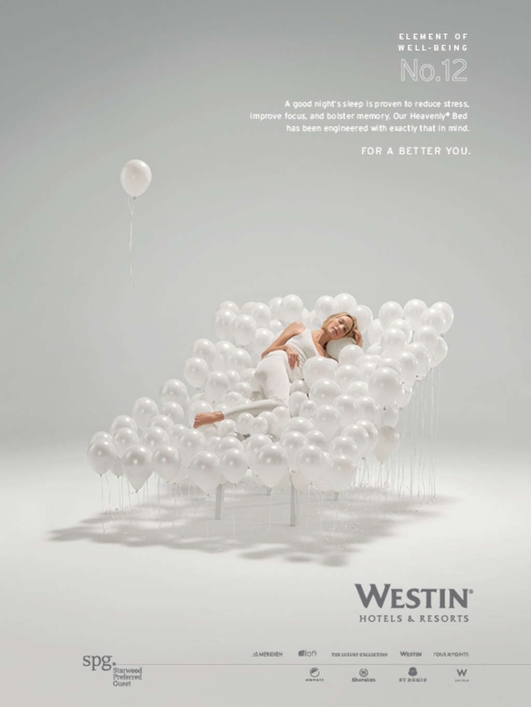

Una mujer descansa sobre una cama construida con globos blancos. Todo es claro. Todo es ligero. Y alrededor… casi nada.

No hay fondos recargados.
No hay texturas invasivas.
No hay ruido visual.

Hay aire.

El enorme espacio vacío que rodea la escena no es ausencia: es estrategia. Ese vacío amplifica la sensación de descanso, silencio y bienestar. El mensaje no solo se lee; se respira.

El espacio en blanco aquí comunica lo que las palabras prometen: tranquilidad.

---

### Cómo se aplica en esta pieza:

* **Aislamiento del sujeto:** La figura central está rodeada de vacío, lo que dirige la atención sin competencia.
* **Sensación emocional:** El espacio libre transmite calma, lujo y exclusividad.
* **Jerarquía natural:** Primero ves la escena central. Luego el texto. Finalmente, la marca.
* **Minimalismo coherente:** El fondo neutro refuerza el concepto de descanso profundo.

---

El espacio en blanco no es “espacio desperdiciado”.
Es una pausa visual.

En diseño, dejar respirar una composición puede ser más poderoso que llenarla.

---

**El error común:**
Tener miedo al vacío y llenarlo por inseguridad.

El espacio en blanco no debilita un diseño.
Le da poder.

Aquí tienes el ejemplo adaptado a esta imagen sobre **espacio en blanco**:

---

**Otro ejemplo: Sony y el silencio que enmarca a Mozart.**

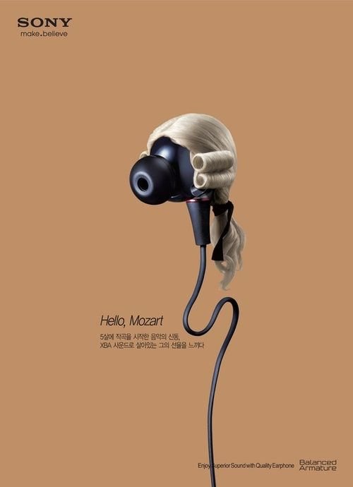

Un fondo completamente liso, cálido, uniforme.
En el centro, un audífono intervenido visualmente para parecer la cabeza de Mozart. Nada más.

No hay escenario.
No hay instrumentos.
No hay elementos decorativos.

Solo producto y concepto.

El enorme espacio vacío alrededor del audífono no está ahí por casualidad. Ese vacío funciona como un escenario invisible que magnifica la idea: escuchar música clásica con una calidad casi histórica.

El silencio visual refuerza la experiencia sonora.

---

### Cómo se aplica en esta pieza:

* **Aislamiento total:** El producto está rodeado de espacio negativo, lo que lo convierte en protagonista absoluto.
* **Dirección de atención:** Sin elementos secundarios, la mirada va directa al concepto visual.
* **Refuerzo del mensaje:** El vacío evoca silencio, y el silencio es el punto de partida del sonido de calidad.
* **Elegancia minimalista:** Menos elementos = más sofisticación.

---

Aquí el espacio en blanco no solo ordena la composición.
Construye significado.

El vacío no distrae. Amplifica.

---

**El error común:**
Creer que un fondo simple es un fondo pobre.

En realidad, el espacio en blanco es una herramienta narrativa.
Cuando eliminas el ruido, el concepto habla más fuerte.

---

### La Trinidad en Acción: Cuando los Tres se Sincronizan

Ninguno de estos principios opera solo. Son un **sistema**.

1.  **La jerarquía** decide qué es importante.
2.  **El contraste** lo hace destacar.
3.  **El espacio en blanco** lo rodea y lo protege del ruido.

**Ejemplo sintético:**
Imagina un cartel con un titular enorme en negro sobre fondo blanco. Eso es **contraste** (negro/blanco) y **jerarquía** (el titular es lo más grande). Ahora imagina ese mismo titular apretado entre párrafos de texto, rodeado de imágenes y gráficos. Sigue siendo grande y negro, pero **no respira**. El espacio en blanco lo libera. Lo convierte en **el protagonista absoluto**.

---

### 🧠 El Diseñador como Director de Orquesta

Tu trabajo no es llenar espacios. Tu trabajo es **orquestar silencios y estruendos**.

1.  **Jerarquía:** Elige qué va primero, qué después, qué al final.
2.  **Contraste:** Haz que lo importante sea **inconfundible**.
3.  **Espacio en blanco:** Protege a tus elementos del ruido. Dales aire. Dales dignidad.

El mal diseñador teme al vacío. El buen diseñador **lo cultiva**.

---

### 🔬 Tu Reto: El Análisis de la Trinidad Visual

Este ejercicio tiene un solo objetivo: que empieces a **ver la jerarquía, el contraste y el espacio en blanco como un sistema integrado**, no como conceptos aislados.

**Tu misión:**

1.  **Encuentra UNA pieza gráfica** que te parezca especialmente efectiva. Puede ser:
    *   Un cartel publicitario.
    *   La portada de un libro.
    *   Una interfaz de app.
    *   Un anuncio en revista o redes sociales.
2.  **Disecciona sus tres principios:**
    *   **Jerarquía:** ¿Qué es lo primero que ves? ¿Cómo lo logró el diseñador? ¿Tamaño? ¿Color? ¿Posición?
    *   **Contraste:** ¿Dónde está el punto de mayor tensión visual? ¿Es de color, de tamaño, de forma?
    *   **Espacio en blanco:** ¿Dónde respira el diseño? ¿Qué elementos están aislados? ¿Qué decisiones de "no poner" crees que tomó el diseñador?
3.  **Documenta tu análisis.** No necesitas un ensayo. Unas pocas líneas por cada principio, acompañadas de la imagen.

**Nivel ninja:**
Encuentra **una pieza que FALLE** en alguno de estos principios. Identifica cuál es el problema: ¿demasiados elementos compitiendo por la jerarquía? ¿contrato insuficiente? ¿ausencia de espacio en blanco? Propón **una corrección rápida y concreta**.

**Comparte tus hallazgos.** Porque cuando verbalizas lo que ves, dejas de ser espectador y te conviertes en **analista**. Y un diseñador que analiza es un diseñador que **domina**.

---

## Del Encaje al Propósito: Cuando tu Composición Necesita un Alma

Has entrenado el ojo. 

Ya no miras una imagen sin descomponerla en tercios, diagonales y espirales. Sabes cuándo una cuadrícula sostiene el caos y cuándo una proporción áurea susurra *armonía* al oído del espectador.

Pero permíteme una pregunta incómoda:

**¿De qué sirve un encuadre perfecto si dentro no hay nada que merezca la pena ser mirado?**

Las reglas de composición son el **alfabeto visual**. Te permiten construir frases equilibradas, dinámicas, elegantes. Pero aún no sabes **qué historia quieres contar**.

Aquí es donde el 90% de los diseñadores se detienen. 
Y aquí es donde **tú vas a seguir avanzando**.

---

### 🎭 El Salto: De Operador de Cámara a Director de Cine

Mira esta tabla. Reconócete en el primer escalón. Y decide, ahora, ocupar el segundo.

| El que sabe componer | El que sabe dirigir |
|:---|:---|
| Pregunta "¿dónde pongo esto?" | Pregunta "¿qué problema resuelve esto?" |
| Espera un encargo | Investiga antes del encargo |
| Coloca elementos con criterio estético | Coloca elementos con **intención estratégica** |
| Entrega lo que le piden | Entrega lo que **el proyecto necesita** |
| Es un excelente artesano | Es un **Director de Arte** |

Las reglas de composición te enseñaron **dónde** mirar. 
El brief te enseñará **qué** merece ser mirado y **por qué**.

Son el **yin y el yang** de tu formación:
- **Composición:** la sintaxis visual.
- **Brief:** la semántica del problema.

Uno sin el otro es ruido. Juntos, son **comunicación pura**.

---

### 📦 El Brief: El Mapa que tu Composición Estaba Esperando

Vas a diseñar una portada de revista. Aplicas la ley de tercios: el rostro en la intersección superior izquierda, el título en la franja inferior. La tipografía tiene jerarquía, los márgenes respiran.

**Es una pieza impecable.** Técnicamente perfecta.

Pero el cliente frunce el ceño: *"No sé... no me transmite nada."*

**¿Qué falló?**

Falló que tu composición nació del vacío. No preguntaste:
- ¿Para qué existe esta revista?
- ¿Quién la va a leer?
- ¿Qué tiene que sentir al mirarla?
- ¿Cuánto tiempo tiene el lector para entenderla?
- ¿Dónde va a verla? ¿En un quiosco, en una tablet, en una pantalla de metro?

**Eso** es el brief.

No es un formulario aburrido. Es la **investigación forense** que convierte una composición bonita en una composición **inevitable**.

---

### 🧭 La Anatomía del Mapa (Lo que Necesitas Saber Ahora Mismo)

Un brief no es un documento único. Es una **familia de herramientas**, como tus reglas de composición. Para cada problema, una herramienta.

Pero todas comparten un **esqueleto universal**. Memorízalo. Te salvará cientos de veces:

| Pregunta | Traducción al mundo real |
|:---|:---|
| **¿QUÉ?** | El encargo concreto. No "ayúdame", sino "un cartel para el lanzamiento de X". |
| **¿PARA QUÉ?** | El objetivo medible. No "que sea bonito", sino "aumentar un 15% las visitas a la web". |
| **¿PARA QUIÉN?** | La persona, no el dato. No "mujeres 25-40", sino "Laura, abogada, madre primeriza, compra online por falta de tiempo". |
| **¿CON QUÉ?** | El presupuesto y los recursos. Tu límite y tu libertad. |
| **¿CUÁNDO?** | El plazo y el entregable concreto. El latido del proyecto. |

Estas cinco preguntas son la **ley de tercios del pensamiento estratégico**. Cuando no sepas por dónde empezar, vuelve a ellas.

---

## Tu Proyecto Final: Donde la Pasión se Encuentra con la Profesión

Has llegado al momento culminante. No es un examen; es tu **primer gran brief profesional**. Todo lo que has aprendido—desde el primer boceto hasta las leyes de Gestalt, desde la teoría del color hasta la narrativa de Behance—converge aquí. Este proyecto no es el final de tu aprendizaje; es la **puesta en escena** de todo lo que ya sabes.

Definir tu proyecto final es el acto más importante. No se trata de hacer "algo bonito". Se trata de **aplicar con propósito** el verdadero significado del diseño: comunicar mucho con poco, ser universal y centrarse absolutamente en el usuario.

---

### Elige tu Campo de Juego: La Pasión como Cimiento

**Definición técnica:**  
Seleccionar un tema con el que tengas una afinidad personal y una conexión emocional genuina.

**En cristiano:**  
Tienes que **querer pasar horas** pensando en esto. Tu motivación será tu combustible cuando llegues al bloqueo creativo.

**Cómo hacerlo bien:**

*   **Escucha tu curiosidad:** ¿Qué te hace detenerte a mirar? ¿Logotipos de equipos deportivos? ¿El packaging en la tienda de cosméticos? ¿Las interfaces de apps de música? **Eso** es tu pista.
*   **Ejemplo:** La **NBA**. Es un tema perfecto: tiene una paleta de colores vibrante, una tipografía con carácter, fotografía en acción y una narrativa de innovación, fuerza y comunidad. Es un **ecosistema visual rico**.
*   **Tu misión:** Encuentra **tu NBA**. Podría ser un equipo de fútbol, una banda de música, una causa social, una marca de café local, un videojuego, un movimiento artístico. Algo que **te haga sentir algo**.

---

### La Fase de Investigación: Tu Banco de Combustible Visual

Con el tema elegido, es hora de alimentar tu cerebro. No empieces a diseñar desde el vacío. **Satura tu mente con referencias.**

**Tu Kit de Herramientas de Investigación:**

*   **Pinterest: El Cazador de Sensaciones.**
    *   **Crea tableros *hiper-específicos*:** No solo "Diseño Deportivo". Mejor: "Paletas NBA años 90", "Tipografía agresiva baloncesto", "Fotografía de acción congelada", "Merchandising deportivo retro".
    *   **Recolecta sin juzgar:** Guarda todo lo que genere un destello, aunque no sepas por qué. Más tarde encontrarás el patrón.
*   **Behance: El Analista de Estrategias.**
    *   **Busca proyectos de *identidad* y *campaigns*:** Analiza **cómo** otros diseñadores han abordado temas similares. ¿Cómo estructuraron el proyecto? ¿Qué aplicaciones mostraron?
    *   **Toma notas sobre el *proceso*:** No copies el estilo; aprende de la metodología. ¿Cómo pasaron del concepto a las aplicaciones finales?

**El objetivo no es plagiar. Es entender el lenguaje visual de tu tema para luego poder hablar en él con tu propio acento.**

---

### Escribe tu Brief Creativo

Antes de un solo trazo, define las reglas del juego. Este es tu brief personal. Responde estas preguntas:

1.  **¿Cuál es el PROBLEMA o OPORTUNIDAD?** (Ej: "La identidad visual del equipo X es genérica y no refleja la energía de su afición").
2.  **¿Quién es el USUARIO / PÚBLICO?** (Ej: "Jóvenes entre 18-35 años, aficionados apasionados que consumen contenido en redes sociales").
3.  **¿Cuál es el OBJETIVO PRINCIPAL?** (Ej: "Crear una identidad moderna y atemporal que genere un sentido de comunidad y sea icónica en merchandising").
4.  **¿Cuál es el CONCEPTO CENTRAL?** (Una palabra o frase guía. Ej: "Legado en Movimiento").
5.  **¿Qué PIEZAS VAS A CREAR?** (Sé específico: 1 logotipo principal + 2 variantes, paleta de color, sistema tipográfico, aplicación en camiseta y app móvil).

**Este documento de una página será tu GPS. Te evitará perderte en la belleza de detalles sin sentido.**

---

### Aplicar los Fundamentos: Donde la Magia Ocurre

Con el tema, la investigación y el brief listos, es cuando aplicas tu conocimiento con poder.

*   **Composición y Leyes de Gestalt:** Usa la **proximidad** para agrupar información relacionada. Usa el **contraste** para que el elemento más importante (el logo, el nombre) destaque. Usa la **simetría u orden** para dar una sensación de equilibrio y profesionalismo.
*   **Teoría del Color:** Selecciona una paleta que **evoque la emoción correcta**. ¿Es un equipo de fútbol? Quizás colores **análogos** para armonía, o **complementarios** para máximo contraste y energía. Justifica cada elección.
*   **Tipografía:** Combina fuentes que **cuenten la historia**. Una **Display** fuerte y angular para el nombre del equipo, una **Sans Serif** legible para la información. Que haya contraste visual y jerarquía.
*   **Simplicidad y Universalidad:** Pregúntate en cada paso: ¿Puede entenderse esto de un vistazo? ¿Funcionaría en grande y en pequeño? **Elimina lo innecesario.**

---

### 🧠 Este Proyecto Eres Tú

Este proyecto final es mucho más que una tarea. Es:
1.  La **prueba de fuego** de que puedes guiar un proceso de diseño de principio a fin.
2.  La **piedra angular** de tu portafolio profesional.
3.  La **declaración personal** de tu mirada y tus intereses como diseñador.

No busques la perfección. Busca la **coherencia, la intención y el aprendizaje**. Un proyecto con errores pero bien fundamentado y apasionado, vale más que uno perfecto pero vacío.

---

### 🚀 Tu Reto: El Brief de tu Pasión

Es hora de materializarlo. Este es tu primer entregable.

**Tu misión en esta fase:**
1.  **Elige TU TEMA** (tu "NBA personal"). Escríbelo en grande.
2.  **Realiza tu INVESTIGACIÓN** en Pinterest y Behance. Crea al menos un tablero de Pinterest con 20-30 referencias y encuentra 2 proyectos en Behance para analizar.
3.  **Redacta tu BRIEF CREATIVO** personal de una página, respondiendo a las 5 preguntas clave de la sección 3.

**No diseñes nada todavía.** Esta fase de definición es la más importante. Un gran proyecto nace de una base sólida.

Comparte tu tema y una idea de tu concepto central. A veces, solo verbalizarlo da claridad.

Más adelante hablaremos de **cómo presentar este proyecto (y todo tu trabajo) de manera profesional, construir tu portafolio definitivo y dar los primeros pasos hacia clientes o tu primer trabajo en diseño.** Estás a punto de cruzar el umbral de estudiante a practicante.

---

### 🧠 Tu Tarea Mientras Cruzas el Puente

Antes de sumergirte en el brief, quiero que hagas algo.

**Agarra un cuaderno. O una nota en el móvil. O abre un documento.**

Escribe:

> **Mi Proyecto Final tratará sobre...**

Y completa la frase. Sin filtros. Sin miedo a equivocarte.

No necesitas saber aún cómo lo vas a hacer. 
Solo necesitas **elegir un tema que te importe**.

Porque cuando las noches se hagan largas, cuando el bloqueo creativo toque a tu puerta, cuando tengas que iterar una y otra vez...

**La pasión es el único combustible que no se agota.**

---

## 📂 Tu Próxima Inmersión: El Manifiesto del Brief

No voy a explicarte aquí todo lo que necesitas saber sobre el brief. 
Sería como querer resumir la teoría del color en un párrafo.

He preparado una **clase completa**, densa, práctica, llena de casos reales y ejercicios. 
Allí encontrarás:

- **Los 6 pasos del ritual creativo** (desde el brief hasta la entrega).
- **Frameworks de agencia** (cómo piensan en DDB, Ogilvy, Wunderman).
- **El contra-briefing:** la herramienta que separa a los novatos de los profesionales.
- **El caso LEGO Navideño:** analizamos un brief real y lo convertimos en instrucciones visuales.
- **Tres retos estratégicos** donde tú serás el Director de Arte.

Esta no es una lectura superficial. 
Es tu **entrenamiento de fondo**.

👉 **[Accede aquí: El Brief — Tu Mapa para Navegar Todo Proyecto Creativo](../brief/creando_brief.md)** 👈

Tómate tu tiempo. Léelo con un cuaderno al lado. Subráyalo. 
Vuelve a él cada vez que recibas un encargo y no sepas por dónde empezar.

**Eso hacen los profesionales.**

---

### 🛠️ Y Cuando Vuelvas... Las Herramientas del Artesano

Has aprendido a pensar como diseñador. 
Has aprendido a preguntar como estratega.

Ahora necesitas **las manos del artesano**.

Porque una composición brillante, nacida de un brief impecable, sigue necesitando **alguien que sepa ejecutarla con oficio**.

Cuando regreses de tu inmersión en el brief, nos espera el territorio que más ansías:

- **Photoshop:** no como una caja de herramientas infinita, sino como tu laboratorio de luz y píxel. Aprenderás a **manipular la imagen con intención quirúrgica**, no a "tocar botones".
- **Illustrator:** el reino de la forma pura. Vector, trazado, pluma. Dibujarás no con el pulso, sino con **la cabeza**.
- **El flujo de trabajo del profesional:** cómo nombrar capas, organizar mesas, preparar archivos para impresión y digital. Las pequeñas obsesiones que separan al aficionado del maestro.

No voy a enseñarte a "usar" programas. 
Cualquier tutorial de YouTube hace eso.

**Voy a enseñarte a pensar dentro de ellos.**

*Tu mentor no te da respuestas.*
*Te enseña a hacerte las preguntas correctas.*

