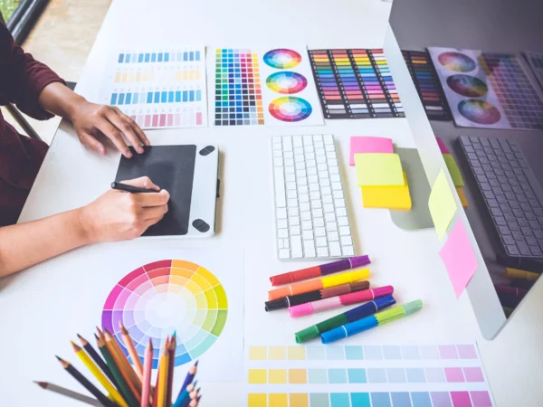
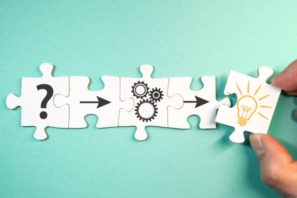
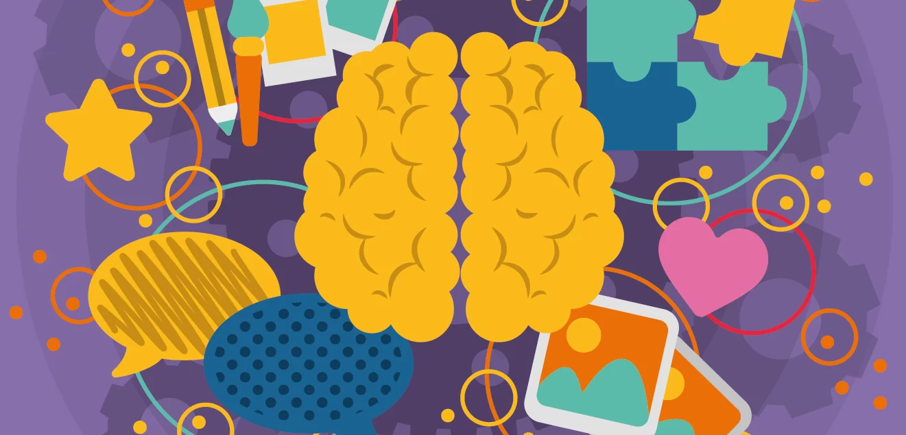
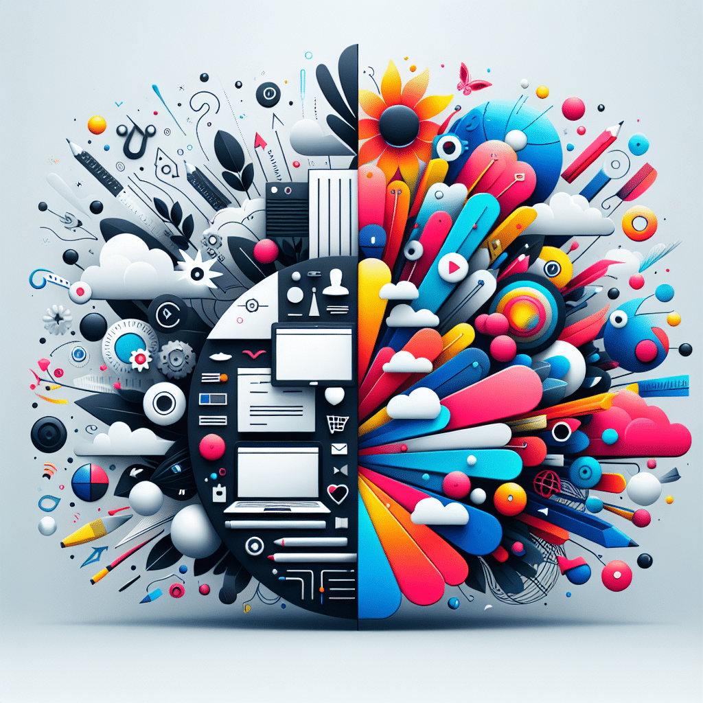
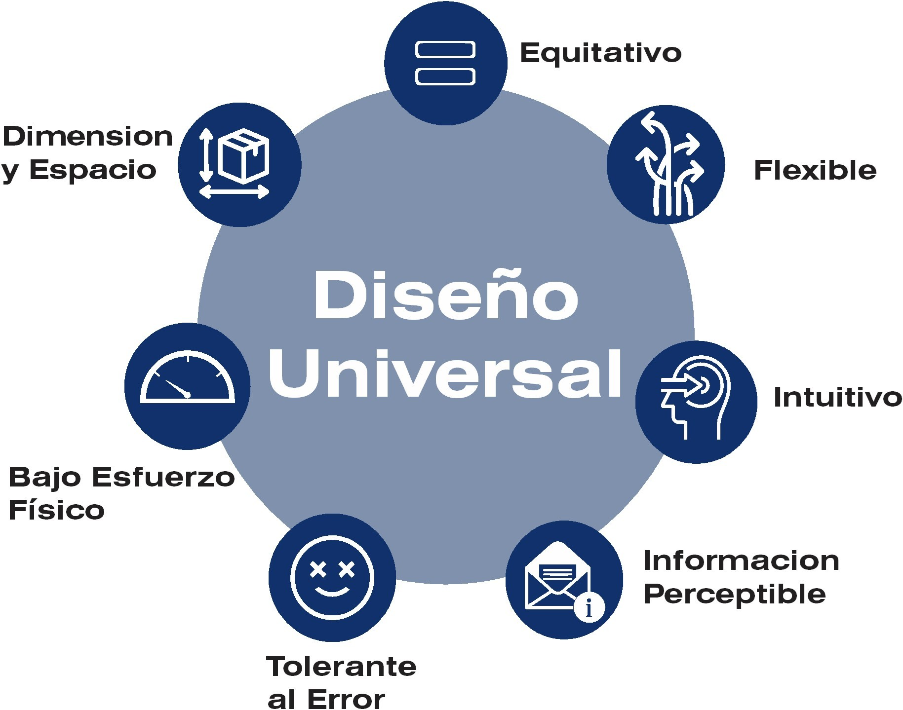

# Fundamentos del diseño gráfico

## El Viaje Comienza

Has llegado al punto de partida. Sí, leíste bien: **el punto de partida**. Durante estas sesiones, hemos desempacado y ensamblado juntos la caja de herramientas esencial del diseñador. Ahora, con los fundamentos firmes en tus manos y la mentalidad correcta en tu cabeza, es momento de mirar el mapa completo y trazar tu ruta. Esta no es una despedida, es un briefing para la misión más importante: **tu carrera**.

El diseño profesional no es un destino; es un viaje de aprendizaje constante, experimentación y comunicación audaz. Vamos a conectar todos los puntos y ver el panorama completo.

---

### Tus Fundamentos: La Caja de Herramientas que Nunca Envejece

Todo lo que has explorado —desde el boceto hasta la Gestalt, desde la teoría del color hasta la psicología de la UX— no son temas aislados. Son un **sistema interconectado**. Piensa en ellos como tu kit de supervivencia en cualquier proyecto:

*   **Composición y Diagramación:** Es la **arquitectura** de tu mensaje. Ahora sabes que cada elemento en la página tiene un peso, un propósito y un lugar. No es intuición; es estrategia visual.
*   **Teoría del Color:** Es el **lenguaje emocional** más directo. Ya no eliges colores porque "quedan bonitos"; los eliges porque transmiten una sensación específica y guían la atención con intención.
*   **Tipografía:** Es la **voz** de tu diseño. La elección de una fuente es una decisión de carácter, tono y legibilidad. Ya conoces la diferencia entre gritar y susurrar con letras.

Estos fundamentos son **tu superpoder**. Las tendencias pasan, los software se actualizan, pero estos principios son eternos. Son lo que separa a un aficionado de un profesional.

---

### Tu Taller Digital: Dominando el Oficio

Conocer la teoría sin saber ejecutarla es como un arquitecto que no sabe usar una regla. Has explorado el panorama de herramientas:

*   **Software Profesional (Figma, Adobe XD, Sketch):** Son tu **taller de precisión**. Aquí es donde los conceptos toman forma, donde se construyen las interfaces, se afinan los píxeles y se crean sistemas escalables. Dominar al menos una no es una opción; es un requisito del oficio.
*   **Herramientas Virtuales y Colaborativas (Miro, Mural):** Son tu **sala de brainstorming y de presentación**. El diseño moderno es colaborativo. Estas plataformas son donde nacen las ideas en equipo, se estructuran los flujos y se comunica la visión a clientes y colegas.

No te cases con una sola herramienta; **cásate con el problema que necesitas resolver**. La herramienta adecuada será la que te permita resolverlo de la manera más eficiente y efectiva.

---

### Las Nuevas Fronteras: Donde la Creatividad se Expande

El diseño no se detiene en lo estático. El mundo exige experiencias más ricas y dinámicas. Estas son las fronteras que puedes empezar a explorar:

*   **Diseño 3D:** Ya no es solo para videojuegos. Es para **productos, visualizaciones, logotipos y experiencias inmersivas**. Añade profundidad, realismo y una capa de asombro a tu trabajo. Herramientas como Blender (gratuita) o Spline están democratizando este espacio.
*   **Animación y Motion Design:** Es el arte de **darle alma y narrativa** a lo estático. Un icono que rebota, una transición suave, un logo que cobra vida. La animación guía, sorprende y explica. Principios básicos de timing y easing son tu próximo paso lógico.
*   **Inteligencia Artificial (IA):** No es tu reemplazo; es tu **asistente más potente**. Desde generar paletas de color y variaciones tipográficas, hasta extender imágenes o ayudar con copy, la IA está revolucionando el flujo de trabajo. Úsala para iterar más rápido y eliminar tareas repetitivas, no para generar ideas desde cero. La intención humana sigue siendo la reina.

---

### El Proceso Creativo Profesional: De la Chispa al Impacto

Ahora, ¿cómo unes todo esto para crear piezas que no solo se vean bien, sino que *funcionen*?

1.  **Desarrollo del Concepto:** Todo comienza con una **idea clara**. Usa las técnicas de creatividad (SCAMPER, 6 Sombreros) para destilar el mensaje central. ¿Qué debes comunicar? ¿A quién? ¿Qué acción debe provocar?
2.  **Aplicación de Técnicas Visuales:** Aquí es donde tus fundamentos brillan. Aplica los principios de composición, jerarquía y color para dar forma visual a ese concepto. Cada elección debe estar justificada por el objetivo.
3.  **Integración de Herramientas:** Boceta en papel, estructura en un *wireframe*, diseña en tu software profesional, prototipa para probar la interacción, presenta en una pizarra colaborativa. **Usa la herramienta correcta en cada fase del proceso.**
4.  **Iteración y Refinamiento:** El primer draft nunca es el final. Critica tu trabajo con dureza (Sombrero Negro) y permítete explorar alternativas (Sombrero Verde). La excelencia está en los detalles.

---

### 🧭 Tu Futuro en el Diseño

El futuro del diseño no lo escriben las herramientas, lo escriben **los diseñadores con criterio, curiosidad y capacidad de adaptación**. Tienes ahora:

*   **Los cimientos** para que tu trabajo sea sólido.
*   **El taller** para construirlo.
*   **El mapa** de las nuevas tierras por explorar.

El siguiente paso es **aplicarlo**. Crea un proyecto personal. Rediseña una app que odies. Construye el portafolio de tus sueños. Equivócate, aprende, itera.

**El diseño es un verbo, no un sustantivo.** Es la acción constante de resolver, comunicar y mejorar el mundo que nos rodea.

---

## Arte vs. Diseño: La Línea que Separa la Pregunta de la Respuesta

Has llegado a una encrucijada fundamental. En nuestro viaje hemos hablado de *cómo* diseñar. Hoy debemos hablar del *por qué* y del *para qué*. Para ello, necesitamos una claridad brutal: **el diseño no es arte.** Y entender esta diferencia no es un ejercicio académico; es lo que define tu rol, tu impacto y tu responsabilidad en cada proyecto que toques.

Esta distinción es el cimiento sobre el que se construye una carrera profesional. Vamos a desentrañarla.

---

### El Propósito Esencial: ¿Resolver o Preguntar?

*   **El Diseño es un verbo de solución.** Es un **área del conocimiento humano** dedicada a identificar problemas y crear soluciones innovadoras que mejoren nuestra calidad de vida. Su brújula siempre apunta hacia afuera: hacia el usuario, el contexto, la necesidad concreta.
*   **El Arte es un verbo de cuestionamiento.** Se centra en plantear preguntas, explorar emociones y expresar perspectivas subjetivas. Su brújula apunta hacia adentro: hacia el artista, su visión y su mundo interior.

**La analogía clave:**
Imagina un charco en la acera.
*   El **artista** podría pintar un reflejo increíble en ese charco, invitándote a contemplar la belleza oculta en lo mundano.
*   El **diseñador** construiría un drenaje para que el charco desaparezca, resolviendo el problema de mojarse los pies.

Ambos son valiosos. Pero **no son lo mismo**.

---

### El Caso Práctico: La Felicidad

*   **Como Artista,** expresarías felicidad en un lienzo con tus colores, tus pinceladas, tu historia personal. La obra podría ser caótica, melancólica o abstracta. El espectador debe *interpretar* y *reflexionar*. La felicidad es un **diálogo interno** que tú iniciaste.
*   **Como Diseñador,** tu objetivo sería **generar** felicidad en el usuario de manera directa. Diseñarías la interfaz de una app que le permite a un padre ver la primera sonrisa de su bebé en tiempo real mientras está lejos. Cada elección —el sonido de notificación, el color del botón de "play", la velocidad de carga— está **ingenierizada** para producir una emoción específica: alegría instantánea, sin necesidad de introspección.

El arte explora la emoción. El diseño la **provoca por diseño**.

---

### El Árbol del Diseño: Ramas que Solucionan Mundos

El diseño gráfico es solo una rama de un árbol enorme. Todas comparten el ADN de la **solución funcional**:

| Rama del Diseño | ¿Qué Problema Resuelve? | Ejemplo en tu Vida |
| :--- | :--- | :--- |
| **Arquitectónico** | Crear espacios habitables, eficientes y que influyan en nuestro bienestar. | La iluminación y circulación en tu casa que te hacen sentir en paz o estresado. |
| **Editorial** | Organizar información (texto, imágenes) para hacerla legible, clara y atractiva. | La comodidad con la que lees tu novela favorita gracias a su tipografía, márgenes e interlineado. |
| **Publicitario** | Captar atención en un mundo sobresaturado y comunicar un mensaje persuasivo de forma memorable. | El anuncio que recordaste y que te hizo clicar para comprar algo. |
| **De Producto** | Mejorar la interacción física con los objetos. | El mango de un destornillador que no te lastima la mano después de usarlo. |
| **De Interacción (UX/UI)** | Hacer las tecnologías digitales intuitivas y usables. | Que puedas usar una app bancaria compleja sin leer un manual. |

---

### El Kit de Habilidades del Diseñador (No Solo del Artista)

Un gran artista puede guiarse por la intuición. Un gran diseñador **combina** intuición con un método riguroso. Tus habilidades esenciales son:

1.  **Observación Aguda:** Ver más allá de lo obvio. No solo ver que la gente tropieza, sino **entender por qué** (la luz es mala, el escalón está mal señalizado). Es detective work.
2.  **Análisis Crítico:** Generar múltiples ideas (brainstorming) y luego **evaluarlas con frialdad**. ¿Cuál es la más viable, efectiva y elegante? Aquí es donde el "Sombrero Negro" de la crítica es tu aliado.
3.  **Planificación Metódica:** Mapear el camino desde el problema hasta la solución. Un brief, un calendario, unos hitos. El caos creativo ocurre **dentro** de un proceso ordenado.
4.  **Ejecución Impecable:** La capacidad de **materializar** la solución. Aquí es donde tu dominio del software, la tipografía, el color y la composición se ponen al servicio de la idea. La forma sigue a la función, pero debe ser una forma perfectamente ejecutada.

---

### El Pilar Innegociable: La Funcionalidad

Puedes hacer el logo más hermoso del mundo. Pero si es ilegible cuando se imprime pequeño en un bolígrafo, **has fallado como diseñador**. Has creado arte, no diseño.

La funcionalidad es la piedra de toque. Es la pregunta que debes hacerte en cada decisión: **¿Esto hace que el producto/service/experiencia funcione MEJOR para el usuario?**

Un diseño sin funcionalidad es un adorno. Un diseño *con* funcionalidad es una **herramienta para mejorar vidas**.

---

### 🧠 Tu Nuevo Mandato

Hoy tu rol se ha redefinido. Ya no eres un "creativo" en abstracto. Eres un **solucionador de problemas con herramientas visuales**.
1.  Tu punto de partida no es la inspiración, es la **necesidad**.
2.  Tu éxito no se mide por la belleza, sino por la **eficacia**.
3.  Tu lenguaje no es la expresión personal, es la **comunicación estratégica**.

Abraza esta diferencia. Te dará claridad, propósito y un argumento irrefutable para defender tus decisiones de diseño.

---

## 🔍 Tu Reto: El Detective de la Intención

Te propongo un ejercicio de observación crítica que entrenará tu ojo para ver esta diferencia en el mundo real.

**Durante los próximos dos días, busca y documenta:**
1.  **Un objeto/interfaz/cartel que sea "arte".** Algo que priorice la expresión, la provocación o la pregunta sobre la función práctica. (Ej: Una escultura pública abstracta, un póster de cine más experimental que informativo).
2.  **Un objeto/interfaz/cartel que sea "diseño" puro.** Algo cuya belleza esté 100% al servicio de una función clara y resuelva un problema tangible. (Ej: La señalética de un aeropuerto, el menú de una app de delivery, el empaque de un medicamento).

**Para cada uno, toma una foto y anota:**
*   ¿Cuál es su objetivo principal?
*   ¿Cómo te hace sentir o qué te hace *hacer*?
*   ¿Dónde crees que está su mayor valor: en lo que dice o en lo que *hace*?

Este ejercicio agudizará tu criterio fundamental. Empezarás a ver el mundo no como un museo, sino como un campo lleno de problemas esperando por soluciones elegantes. Y tú, ahora, tienes las herramientas para crearlas.

---

## Diseño Universal: El Idioma Visual que Todos Hablamos

Hasta ahora hemos hablado de diseñar para usuarios, para mercados, para problemas específicos. Hoy damos un paso más grande: vamos a hablar de diseñar para **la humanidad**. Del diseño que trasciende idiomas, culturas, habilidades y tiempo. Bienvenido a los principios del **diseño universal** y **atemporal**—donde la simplicidad deja de ser un estilo y se convierte en una responsabilidad ética y profesional.

Piensa en la última señal de baño que viste en un aeropuerto. No necesitabas saber el idioma local para entenderla. *Eso* es diseño universal en acción: comunicación pura, sin ruido.

---

### Diseño Universal: El Lenguaje Visual Sin Fronteras

**Definición:**  
Es el diseño que puede ser **entendido, interpretado y utilizado** por la mayor diversidad de personas posible, independientemente de su edad, cultura, idioma, educación o capacidad física o cognitiva.

**En cristiano:**  
Es el arte de **crear claridad absoluta**. Es el "esperanto" visual. No es un estilo, es una **mentalidad de inclusión**.

**¿Por qué es tu nueva obsesión?**
*   **Rompe barreras:** Un ícono bien diseñado es más rápido que una traducción. Piensa en el símbolo de "Wi-Fi" o de "Encendido". Son globales.
*   **Es eficiente:** Comunica mensajes complejos (direcciones, advertencias, funciones) en milisegundos.
*   **Es duradero:** Un símbolo universal trasciende las modas. La señal de "Pare" (STOP) lleva décadas siendo la misma en medio planeta.

**Ejemplos en tu día a día:**
*   La **señalética** de un hospital o aeropuerto.
*   Los **pictogramas** en tu app favorita (la lupa para buscar, el corazón para "favorito").
*   El **swoosh de Nike** o la **manzana de Apple**. Logotipos tan depurados que funcionan sin texto.

---

### Diseño Atemporal: Cuando tu Diseño Sobrevive a las Modas

**Definición:**  
Es el diseño que **mantiene su relevancia, funcionalidad y fuerza visual** a lo largo de décadas, resistiendo los ciclos efímeros de las tendencias.

**En cristiano:**  
Es el diseño que no se avergüenza de sí mismo en 10 años. No es "vintage" porque nunca pasó de moda.

**Cómo se logra (la tríada sagrada):**

1.  **Simplicidad Radical:** Elimina todo lo que no sea absolutamente esencial. La complejidad es la primera en envejecer.
2.  **Consistencia Inquebrantable:** Mantén un núcleo duro de elementos (una forma, una proporción, un concepto) a través del tiempo y las aplicaciones.
3.  **Adaptabilidad Inteligente:** Permite evoluciones, no revoluciones. El logo de Apple pasó del arcoíris al monocromo, pero la *forma de la manzana* y el *mordisco* siguen intactos. Eso es adaptabilidad sin perder identidad.

**Ejemplo maestro:** El mapa del metro de Londres (el diagrama de Harry Beck). Esquemático, no geográficamente preciso, pero tan intuitivo y claro que se convirtió en el estándar mundial. Es atemporal porque resuelve un problema eterno (cómo navegar un sistema complejo) de la manera más simple.

---

### La Simplicidad: No es un Estilo, es la Meta

Este es el corazón de todo. La simplicidad no es "hacerlo minimalista porque está de moda". Es un **proceso de destilación** hasta llegar a la esencia pura del mensaje.

**La simplicidad efectiva logra:**
*   **Memorabilidad instantánea:** Un diseño simple se graba en la mente. Piensa en el objetivo de una cámara de Instagram.
*   **Accesibilidad ampliada:** Cuanto más simple, más personas pueden entenderlo, incluyendo aquellas con dificultades cognitivas o de aprendizaje.
*   **Comunicación a velocidad de rayo:** En un mundo con sobrecarga de información, la simplicidad es un acto de respeto al tiempo y atención del usuario.

**La paradoja:** Lograr simplicidad es **complejo**. Requiere horas de bocetos, eliminación, debate y refinamiento para que el resultado final parezca *obvio*.

---

### Cultura vs. Universalidad: El Equilibrio

¿Un diseño puede ser realmente universal en un mundo tan culturalmente diverso? La respuesta es sí, pero con matices.

*   **Los principios son universales:** La necesidad de seguridad, orientación, amor, conexión. Un corazón significa "amor" en casi todas partes. Un rayo significa "peligro eléctrico".
*   **Los símbolos pueden ser culturales:** El color blanco significa pureza en unas culturas y luto en otras. Un pulgar arriba es positivo en Occidente, pero ofensivo en partes de Medio Oriente.

**Tu trabajo como diseñador:**  
Investiga. **Contexto es todo**. Si diseñas para un mercado global, usa símbolos probados universalmente y evita metáforas culturalmente específicas. Si diseñas para una cultura local, puedes abrazar sus símbolos, pero mantén la **claridad** como principio rector.

---

### 🧠 Diseñar para el Futuro

Hoy has aprendido a elevar tu mirada:
1.  **El diseño universal es empatía a escala global.** Es diseñar con la profunda convicción de que la buena comunicación es un derecho, no un privilegio.
2.  **El diseño atemporal es humildad profesional.** Es reconocer que tu trabajo puede (y debe) aspirar a durar más que la última tendencia de Instagram.
3.  **La simplicidad es la sofisticación definitiva.** Es la marca del dominio, no de la falta de ideas.
4.  **Tu responsabilidad es doble:** Crear piezas que funcionen hoy para todos y que sigan funcionando mañana.

Estos principios son el estándar más alto al que puedes aspirar. Conviértelos en tu filtro para cada proyecto.

---

### 🌍 Tu Reto: Claridad Universal

Es hora de entrenar tu ojo para detectar el diseño universal y atemporal en la jungla visual cotidiana.

**Tu misión es triple:**
1.  **Encuentra un ejemplo BRILLANTE de diseño universal.** Fotografía una señal, un pictograma o un icono de interfaz que creas que cualquier persona en el mundo entendería al instante. **Analiza:** ¿Qué lo hace tan claro? ¿Qué elementos eliminó el diseñador para lograrlo?
2.  **Encuentra un ejemplo PODEROSO de diseño atemporal.** Puede ser un logotipo con décadas de vida (Coca-Cola, Mercedes-Benz), un cartel clásico o un objeto de uso diario (la tetera de Micheal Graves). **Analiza:** ¿Qué ha permitido que sobreviva a las modas? ¿Simplicidad? ¿Consistencia? ¿Adaptabilidad?
3.  **Propón una mejora.** Encuentra un diseño en tu ciudad o en una app que sea **confuso, culturalmente específico o demasiado complejo**. Haz un boceto rápido (aunque sea en una servilleta) de cómo lo simplificarías y universalizarías.

**Documenta tus hallazgos.** Este ejercicio no es sobre estética; es sobre **semántica visual pura**. Te entrenará para buscar la esencia y desechar el ruido, la habilidad más valiosa que puedes cultivar.

Al dominar estos principios, tu trabajo dejará de ser "bonito" para convertirse en **útil, claro y duradero**. Y en un mundo lleno de ruido, eso es un superpoder.

