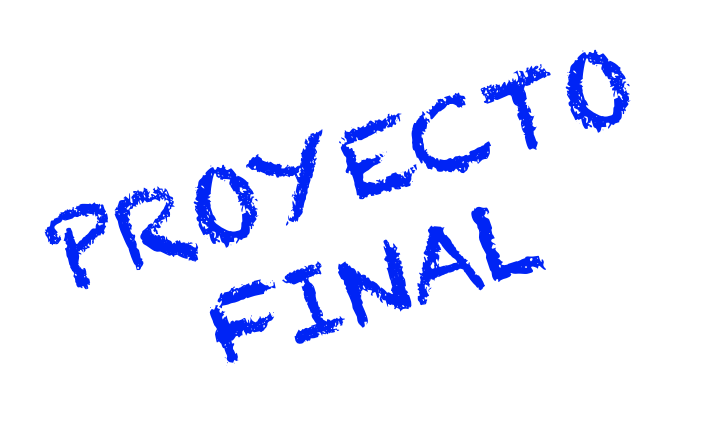
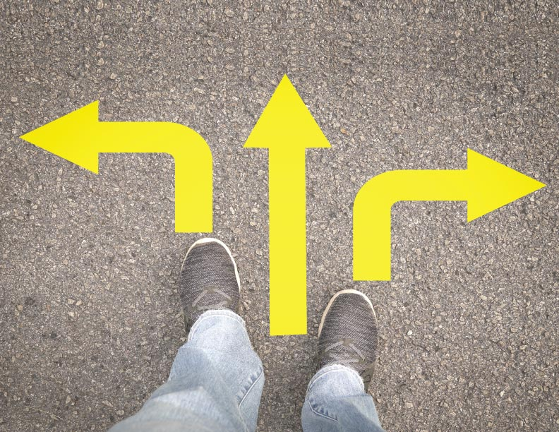
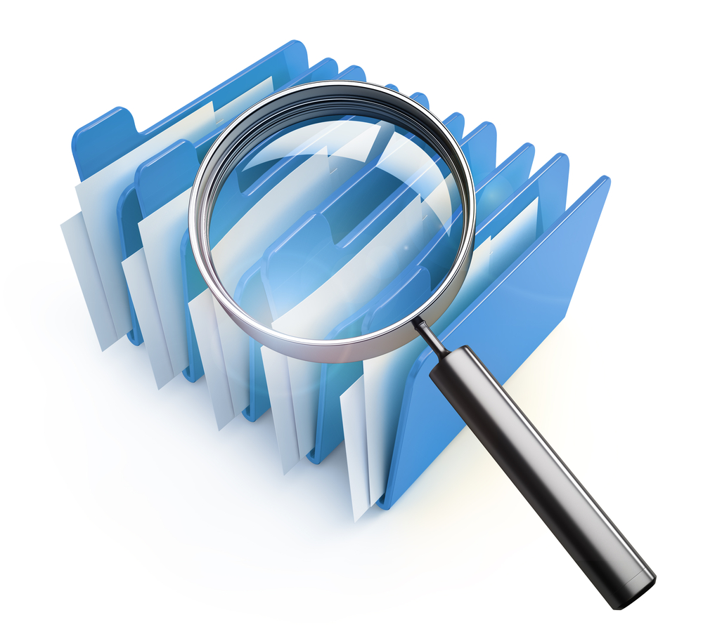
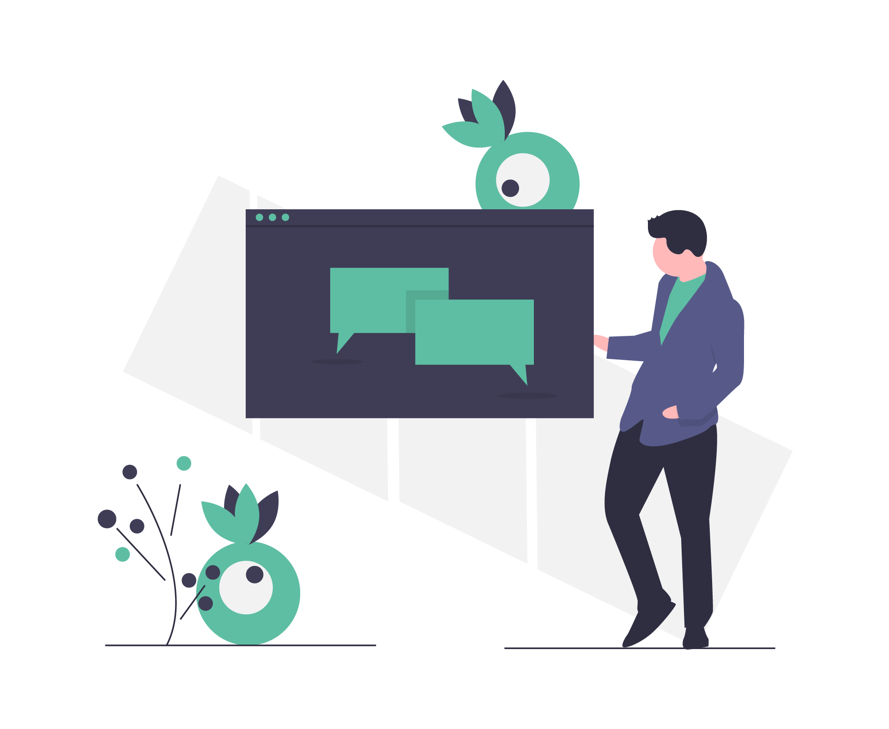

---

## Tu Proyecto Final: Donde la Pasión se Encuentra con la Profesión

Has llegado al momento culminante. No es un examen; es tu **primer gran brief profesional**. Todo lo que has aprendido—desde el primer boceto hasta las leyes de Gestalt, desde la teoría del color hasta la narrativa de Behance—converge aquí. Este proyecto no es el final de tu aprendizaje; es la **puesta en escena** de todo lo que ya sabes.

Definir tu proyecto final es el acto más importante. No se trata de hacer "algo bonito". Se trata de **aplicar con propósito** el verdadero significado del diseño: comunicar mucho con poco, ser universal y centrarse absolutamente en el usuario.

---

### Elige tu Campo de Juego: La Pasión como Cimiento

**Definición técnica:**  
Seleccionar un tema con el que tengas una afinidad personal y una conexión emocional genuina.

**En cristiano:**  
Tienes que **querer pasar horas** pensando en esto. Tu motivación será tu combustible cuando llegues al bloqueo creativo.

**Cómo hacerlo bien:**

*   **Escucha tu curiosidad:** ¿Qué te hace detenerte a mirar? ¿Logotipos de equipos deportivos? ¿El packaging en la tienda de cosméticos? ¿Las interfaces de apps de música? **Eso** es tu pista.
*   **Ejemplo:** La **NBA**. Es un tema perfecto: tiene una paleta de colores vibrante, una tipografía con carácter, fotografía en acción y una narrativa de innovación, fuerza y comunidad. Es un **ecosistema visual rico**.
*   **Tu misión:** Encuentra **tu NBA**. Podría ser un equipo de fútbol, una banda de música, una causa social, una marca de café local, un videojuego, un movimiento artístico. Algo que **te haga sentir algo**.

---

### La Fase de Investigación: Tu Banco de Combustible Visual

Con el tema elegido, es hora de alimentar tu cerebro. No empieces a diseñar desde el vacío. **Satura tu mente con referencias.**

**Tu Kit de Herramientas de Investigación:**

*   **Pinterest: El Cazador de Sensaciones.**
    *   **Crea tableros *hiper-específicos*:** No solo "Diseño Deportivo". Mejor: "Paletas NBA años 90", "Tipografía agresiva baloncesto", "Fotografía de acción congelada", "Merchandising deportivo retro".
    *   **Recolecta sin juzgar:** Guarda todo lo que genere un destello, aunque no sepas por qué. Más tarde encontrarás el patrón.
*   **Behance: El Analista de Estrategias.**
    *   **Busca proyectos de *identidad* y *campaigns*:** Analiza **cómo** otros diseñadores han abordado temas similares. ¿Cómo estructuraron el proyecto? ¿Qué aplicaciones mostraron?
    *   **Toma notas sobre el *proceso*:** No copies el estilo; aprende de la metodología. ¿Cómo pasaron del concepto a las aplicaciones finales?

**El objetivo no es plagiar. Es entender el lenguaje visual de tu tema para luego poder hablar en él con tu propio acento.**

---

### Escribe tu Brief Creativo

Antes de un solo trazo, define las reglas del juego. Este es tu brief personal. Responde estas preguntas:

1.  **¿Cuál es el PROBLEMA o OPORTUNIDAD?** (Ej: "La identidad visual del equipo X es genérica y no refleja la energía de su afición").
2.  **¿Quién es el USUARIO / PÚBLICO?** (Ej: "Jóvenes entre 18-35 años, aficionados apasionados que consumen contenido en redes sociales").
3.  **¿Cuál es el OBJETIVO PRINCIPAL?** (Ej: "Crear una identidad moderna y atemporal que genere un sentido de comunidad y sea icónica en merchandising").
4.  **¿Cuál es el CONCEPTO CENTRAL?** (Una palabra o frase guía. Ej: "Legado en Movimiento").
5.  **¿Qué PIEZAS VAS A CREAR?** (Sé específico: 1 logotipo principal + 2 variantes, paleta de color, sistema tipográfico, aplicación en camiseta y app móvil).

**Este documento de una página será tu GPS. Te evitará perderte en la belleza de detalles sin sentido.**

---

### Aplicar los Fundamentos: Donde la Magia Ocurre

Con el tema, la investigación y el brief listos, es cuando aplicas tu conocimiento con poder.

*   **Composición y Leyes de Gestalt:** Usa la **proximidad** para agrupar información relacionada. Usa el **contraste** para que el elemento más importante (el logo, el nombre) destaque. Usa la **simetría u orden** para dar una sensación de equilibrio y profesionalismo.
*   **Teoría del Color:** Selecciona una paleta que **evoque la emoción correcta**. ¿Es un equipo de fútbol? Quizás colores **análogos** para armonía, o **complementarios** para máximo contraste y energía. Justifica cada elección.
*   **Tipografía:** Combina fuentes que **cuenten la historia**. Una **Display** fuerte y angular para el nombre del equipo, una **Sans Serif** legible para la información. Que haya contraste visual y jerarquía.
*   **Simplicidad y Universalidad:** Pregúntate en cada paso: ¿Puede entenderse esto de un vistazo? ¿Funcionaría en grande y en pequeño? **Elimina lo innecesario.**

---

### 🧠 Este Proyecto Eres Tú

Este proyecto final es mucho más que una tarea. Es:
1.  La **prueba de fuego** de que puedes guiar un proceso de diseño de principio a fin.
2.  La **piedra angular** de tu portafolio profesional.
3.  La **declaración personal** de tu mirada y tus intereses como diseñador.

No busques la perfección. Busca la **coherencia, la intención y el aprendizaje**. Un proyecto con errores pero bien fundamentado y apasionado, vale más que uno perfecto pero vacío.

---

### 🚀 Tu Reto: El Brief de tu Pasión

Es hora de materializarlo. Este es tu primer entregable.

**Tu misión en esta fase:**
1.  **Elige TU TEMA** (tu "NBA personal"). Escríbelo en grande.
2.  **Realiza tu INVESTIGACIÓN** en Pinterest y Behance. Crea al menos un tablero de Pinterest con 20-30 referencias y encuentra 2 proyectos en Behance para analizar.
3.  **Redacta tu BRIEF CREATIVO** personal de una página, respondiendo a las 5 preguntas clave de la sección 3.

**No diseñes nada todavía.** Esta fase de definición es la más importante. Un gran proyecto nace de una base sólida.

Comparte tu tema y una idea de tu concepto central. A veces, solo verbalizarlo da claridad.

Más adelante hablaremos de **cómo presentar este proyecto (y todo tu trabajo) de manera profesional, construir tu portafolio definitivo y dar los primeros pasos hacia clientes o tu primer trabajo en diseño.** Estás a punto de cruzar el umbral de estudiante a practicante.

