# Introducción al diseño gráfico

Bienvenido a tu primera sesión. Si estás aquí es porque quieres dejar de "hacer dibujos" y empezar a comunicar visualmente. Como tu mentor, mi trabajo no es solo enseñarte a usar herramientas, sino a educar tu ojo clínico.

El diseño gráfico no es decoración; es un lenguaje. Vamos a desglosar los cimientos de esta disciplina para que tus ideas tengan pies, cabeza y, sobre todo, impacto.

---

### El Boceto: El Mapa de Guerrilla

Técnicamente, el **boceto** es un esquema simplificado (ya sea en papel o digital) que captura la estructura medular de una idea en cuestión de segundos o minutos. Solo debe contener los trazos esenciales para que el concepto sea comprensible.

En el mundo real, el boceto es tu "seguro de vida". Es ese dibujo rápido que haces para no perder la inspiración antes de que se te escape. No busques la perfección aquí; busca la intención. Si el boceto funciona, el diseño final tendrá una base sólida sobre la cual crecer.

---

### Los Elementos Visuales: Tu Caja de Herramientas

Aquí es donde la técnica se encuentra con la intuición. Estos elementos son los átomos de cualquier composición:

* **El Color:** Se trata de manejar el espectro visible y los neutros para establecer jerarquías y captar la atención. Técnicamente, es una herramienta para inyectar emoción en el diseño.
* *La clave:* Piensa en el color como el "clima" de tu diseño; puede hacer que un mensaje se sienta frío y profesional o cálido y acogedor.

    

* **Las Líneas:** Son el trayecto físico entre dos coordenadas. Sirven para subrayar conceptos o tejer conexiones entre distintos elementos.
* *La clave:* Son las "flechas" invisibles. Úsalas para decirle al espectador exactamente hacia dónde tiene que mirar.

    

* **El Tamaño y la Escala:** Es la dimensión de un objeto y su relación con los demás. Un objeto de mayor tamaño se percibe automáticamente como más relevante.
* *La clave:* Es el volumen de tu voz. Lo que hagas más grande es lo que estás gritando a los cuatro vientos.

    

* **La Tipografía:** No es solo elegir una letra bonita; es gestionar la disposición y estética de las fuentes para asegurar la legibilidad y transmitir sentimientos.
* *La clave:* Es la "voz" que lee tu texto. Una fuente puede sonar como un abogado serio o como un amigo contándote un chiste.

    

---

### El Orden del Diseño: Alineación y Jerarquía

Un diseño sin orden es solo ruido visual. Aquí aplicamos la lógica estructural:

* **Alineación:** Es la disposición técnica de los elementos en el canvas. Si algo no está alineado, el ojo lo detecta como un error molesto. Es lo que separa a un profesional de un aficionado.
* **Contraste:** Se genera al enfrentar elementos opuestos, como colores claros contra oscuros o texturas lisas contra rugosas.
* **Jerarquía:** Es el sistema de prioridades que guía al público, mostrándole primero lo más importante mediante variaciones de tamaño, color o fuente.

Básicamente, la jerarquía es la coreografía del diseño. Tú decides quién es el protagonista y quiénes son los bailarines de fondo para que el espectador no se pierda en el escenario.

---

### Estructura de Control: Retículas y Guías

Para que tus piezas tengan equilibrio, usamos sistemas de medición:

* **Reglas y Guías:** Son herramientas de precisión para colocar cada elemento en su coordenada exacta. Las guías son esas líneas que tú ves para trabajar pero que no salen en el resultado final.
* **Retículas (Grids):** Son mallas de líneas que estructuran todo el contenido.

Míralo así: la retícula es el esqueleto de tu diseño. No se ve, pero es lo que mantiene todo de pie y en su sitio. Sin ella, tu diseño se desparrama.

---

### El Árbol Genealógico de las Marcas

Aprende a diferenciar las especies en el ecosistema de la identidad visual:

| Formato | Definición Técnica | En confianza |
| --- | --- | --- |
| **Logotipo** | Representación tipográfica pura (texto). | Es el nombre de la marca con su propia "letra". |
| **Isotipo** | Símbolo o icono visual sin rastro de texto. | Es el dibujo que te dice quién es la marca sin hablar. |
| **Imagotipo** | Texto e icono que conviven pero están separados. | Son compañeros de piso; se llevan bien pero pueden vivir solos. |
| **Isologo** | Texto e icono fundidos en una sola pieza indivisible. | Es un todo-en-uno; si los separas, se rompe la identidad. |

---

### 🚀 Tu Primer Reto Visual

Te invito a abrir los ojos como nunca antes. Esta semana, mientras navegas por internet, caminas por la calle o hojeas una revista, **busca y captura (con tu celular o tu mirada)**:

- Un isotipo que te hable sin palabras (Pura potencia visual sin letras).
- Un logotipo que adore su tipografía (Tipografía con personalidad propia).
- Un imagotipo donde texto e icono convivan en armonía (Icono y texto que se llevan bien pero no se mezclan).
- Un isologo donde ambos sean uno solo (Donde el texto y el icono son uno solo).

Guarda estas imágenes. En nuestra próxima sesión, las analizaremos y verás cómo la teoría cobra vida.

---

## El Diseño Gráfico: Cuando la Función y la Forma se Dan la Mano

Hoy vamos un paso más allá: vamos a entender **qué es el diseño en su esencia** y cómo el diseño gráfico se convierte en la voz de esa intención. Olvida por un momento los píxeles y los vectores; hoy hablamos de filosofía aplicada.

---

### El Diseño: La Raíz de Todo

**Definición técnica:**  
El diseño es el **proceso de planificación y toma de decisiones** para crear un producto o servicio que resuelva un problema identificado.

**En cristiano:**  
El diseño no es hacer cosas bonitas. Es **hacer cosas que funcionen**. Imagina que eres un arquitecto: primero te aseguras de que la casa no se caiga (función), luego te preocupas por el color de las paredes (estética). El orden es sagrado.

**El error clásico:**  
Un cliente te pide un logo nuevo. Tú, emocionado, creas una obra maestra llena de detalles y efectos. El cliente lo rechaza. ¿Por qué? Porque su problema real era que el logo antiguo era demasiado complejo y difícil de recordar. **Saltaste a la solución sin definir el problema.**  
*La lección:* Un diseño hermoso que no cumple su objetivo es solo un adorno caro.

---

### El Diseño Gráfico: El Traductor Visual

El American Institute of Graphic Arts lo define como *“el arte y la práctica de planificar y proyectar ideas y experiencias con contenido visual y textual”*.

En otras palabras, es **el puente entre una idea abstracta y la mente de tu público**. No es arte por el arte; es comunicación estratégica.

**Los 4 Pilares Irrenunciables del Diseño Gráfico:**

1.  **Cumple un objetivo.** Siempre. Antes del primer boceto, pregúntate: *¿Qué quiero que logre esta pieza?*
2.  **Habla a un público específico.** Un mensaje para adolescentes no se comunica igual que uno para CEOs. Conoce a tu audiencia como a un amigo.
3.  **Comunica un mensaje.** Siempre. Ya sea “compra esto”, “cree en esto” o “haz esto”. Cada color, cada línea, cada fuente está al servicio de esa idea.
4.  **Es funcional.** La estética es su ropa, la funcionalidad es su esqueleto. Si no es útil, no es diseño gráfico.

---

### El Mapa de la Profesión: ¿Dónde Puedes Especializarte?

El diseño gráfico es un árbol con muchas ramas. Estas son las principales, para que sepas por dónde camina la industria.

#### a) Diseño Publicitario
*   **Qué es:** La creación de mensajes visuales para **promover** una marca, producto o servicio.
*   **Dónde vive:** Desde el cartel de la parada de autobús hasta el anuncio en tu feed de Instagram. Es diseño con un llamado a la acción claro.
*   **Tu misión:** Captar la atención en segundos y generar deseo.

#### b) Diseño de Identidad e Imagen Corporativa
*   **Qué es:** Construir y gestionar la **personalidad visual** de una marca.
*   **Dónde vive:** En su logotipo, su paleta de colores, su tipografía, y en cómo todo esto se aplica coherentemente en su web, oficinas, uniformes y redes sociales.
*   **Tu misión:** Crear un rostro reconocible y confiable para la marca. Que la gente sienta algo cuando la vea.

#### c) Diseño de Packaging (Envase)
*   **Qué es:** Diseñar la **cáscara** del producto. El primer contacto físico que tiene el consumidor con él.
*   **Dónde vive:** En el estante de una tienda o en la puerta de tu casa cuando pides algo online.
*   **Tu misión:** Proteger el producto, contener información crucial y, sobre todo, **seducir desde la estantería**. Un buen packaging cuenta la historia de la marca antes de que se abra la caja.

#### d) Diseño Editorial
*   **Qué es:** La arquitectura de la **página**. Organizar texto e imágenes para que sean legibles, jerárquicos y hermosos.
*   **Dónde vive:** En libros, revistas, periódicos, e-books y reportes digitales.
*   **Tu misión:** Guiar al lector en un viaje sin tropiezos. Que la lectura sea una experiencia placentera, no un laberinto.

#### e) Diseño de Interfaces (UI - User Interface)
*   **Qué es:** Diseñar la **pantalla** con la que las personas interactúan.
*   **Dónde vive:** En aplicaciones móviles, sitios web, programas de software, kioskos interactivos.
*   **Tu misión:** Hacer que la navegación sea **intuitiva, clara y eficiente**. Que el usuario logre lo que quiere sin tener que pensar cómo.

---

### 🧠 La Dualidad Perfecta

Guarda esto en tu cabeza:
1.  **Función primero, forma después.** Resuelve el problema, luego hazlo bello.
2.  **El diseño gráfico es un servicio, no un cuadro.** Su valor está en el mensaje que transmite y la acción que provoca.
3.  **Elige tu camino.** Ahora conoces las principales especialidades. Prueba, explora y descubre cuál se alinea con tu forma de pensar.

---

### 🔍 Tu Reto de Observación Crítica

Esta semana, activa tu **mirada de diseñador**. Tu tarea es cazar dos ejemplos en la vida real:

1.  **Algo funcional pero NO estético.** Un objeto, cartel o interfaz que cumpla su trabajo, pero sea visualmente descuidado, confuso o feo. *(Ejemplo: una web gubernamental antigua con toda la información, pero un caos total).*
2.  **Algo estético pero NO funcional.** Algo hermoso a la vista, pero que falle en su propósito básico. *(Ejemplo: una botella de agua con una forma tan artística que no cabe en el portavasos del auto).*

**Tómales una foto o haz un screenshot.** Analiza: ¿por qué falla? ¿Qué cambiarías? Este ejercicio entrenará tu ojo para nunca separar la función de la forma.

---

## Composición: El Arte de Orquestar la Mirada

Has aprendido las palabras del vocabulario visual. Ahora es momento de aprender a formar frases con poder. Bienvenido a la **composición**: la ciencia y el arte de organizar elementos dentro de un espacio para contar una historia, guiar una emoción y comunicar con claridad absoluta.

Piensa en la composición como la dirección de orquesta de tu diseño. No se trata de que cada instrumento (elemento) suene fuerte, sino de que suenen **juntos**, en el momento preciso, para crear algo mayor que la suma de sus partes.

---

### Composición Gráfica: El Mapa del Tesoro Visual

Es la disposición estratégica de todos los elementos no textuales: imágenes, iconos, formas, colores. Su objetivo es crear un camino visual que el ojo siga **sin esfuerzo**.

#### a) La Percepción Visual: Tu Primer Filtro

**Definición técnica:**  
Es la capacidad cerebral de interpretar la información que recibimos a través de los ojos.

**En cristiano:**  
No vemos con los ojos, vemos con el **cerebro**. El diseño no es lo que tú pones en la página, es lo que el cerebro del espectador **interpreta**. Tu trabajo es diseñar teniendo en cuenta ese procesamiento.

#### b) El Balance o Equilibrio Visual: La Sensación de Estabilidad

**Definición técnica:**  
Se logra cuando el peso visual de los elementos se distribuye de manera uniforme en el espacio.

**En cristiano:**  
Es como colocar objetos en una balanza. No tiene que ser simétrico (balance simétrico), puede ser asimétrico pero igualmente equilibrado. Un elemento grande y oscuro a la izquierda puede equilibrarse con varios elementos pequeños y vibrantes a la derecha. Si tu diseño se "siente" inclinado o pesado en un lado, has perdido el balance.

#### c) La Teoría de la Gestalt: La Magia de la Simplicidad

**La premisa fundamental:**  
**"El todo es más que la suma de sus partes".**

**En cristiano:**  
Nuestro cerebro es un buscador de patrones por naturaleza. Agrupa automáticamente lo que ve para simplificar y entender. No vemos manchas de color sueltas; vemos una cara. No vemos líneas separadas; vemos un cuadrado.

Esta teoría psicológica es tu **superpoder secreto**. Con sus leyes (que exploraremos en profundidad mas adelante en el curso), puedes predecir y dirigir cómo se organizará la información en la mente de tu espectador. **El buen diseño juega con estas reglas cerebrales.**

---

### Composición de Texto: La Arquitectura de la Lectura

Si la composición gráfica guía la mirada, la composición de texto guía la **lectura**. Es la disciplina de hacer que las palabras no solo se lean, sino que se **experimenten**.

#### a) La Selección Tipográfica: Elegir la Voz Correcta

No todas las fuentes dicen lo mismo. Su personalidad debe alinearse con tu mensaje. Conoce a las cuatro familias esenciales:

| Familia | También Conocida Como | Apariencia | Personalidad y Uso Común |
| :--- | :--- | :--- | :--- |
| **Serif** | Romanas o con remate | Pequeñas líneas o "pies" al final de los trazos. | **Clásica, formal, confiable.** Ideal para textos largos (libros, periódicos), marquesinas de lujo o instituciones tradicionales. *Ej: Times New Roman.* |
| **Sans Serif** | Palo seco | Trazos limpios, sin remates. | **Moderno, minimalista, neutral, legible.** Rey de la web, interfaces, logotipos modernos y cualquier lugar que busque claridad. *Ej: Arial, Helvetica.* |
| **Script** | Manuscrita o Itálica | Imita la caligrafía o escritura a mano. | **Elegante, personal, emocional, creativo.** Perfecta para invitaciones, logotipos de boutique o para añadir un toque humano. *Ej: Brush Script.* |
| **Display** | Decorativa o Fantasía | Alta personalidad, formas únicas. | **Expresiva, llamativa, temática.** Se usa para titulares, carteles o logotipos muy distintivos. Nunca para bloques de texto largo. *Ej: fuentes con efecto 3D, retro, etc.* |

#### b) Los Espacios que Hablan: Margen, Interletrado e Interlineado

*   **El Margen:** Es el **aire** que rodea tu bloque de texto. Un margen generoso da elegancia y claridad; uno estrecho crea tensión e intensidad. Es el marco de tu pintura verbal.
*   **El Interletrado (Kerning/Tracking):** Es la distancia **entre letras**. Un ajuste fino evita que las letras se amontonen ("AVA" puede parecer "AVA") o se vean desconectadas. Es como ajustar la cercanía entre las personas en una foto grupal.
*   **El Interlineado (Leading):** Es la distancia **entre líneas de texto**. Un interlineado demasiado ajustado sofoca y dificulta la lectura; uno demasiado amplio desconecta las ideas. Es el ritmo respiratorio de tu párrafo.

---

### 🧠 El Poder de la Estructura

Hoy has aprendido que:
1.  **La composición es dirección.** Tu trabajo es ser el guía de la experiencia visual del espectador.
2.  **La mente es tu aliada.** Principios como el balance y las leyes de Gestalt te permiten diseñar *con* el cerebro, no contra él.
3.  **La tipografía tiene voz.** Elegir una fuente no es un capricho estético; es elegir el tono con el que tu mensaje será "escuchado".
4.  **Los espacios son elementos activos.** El aire alrededor y dentro del texto es tan importante como las letras mismas.

---

### ✍️ Tu Reto de Tipografía Expresiva

Es hora de poner en práctica el poder de la palabra visual.

**Tu misión:**  
Crea una **composición de texto única** que utilice las **cuatro familias tipográficas** (Serif, Sans Serif, Script, Display) en una sola pieza.

**Ejercicio de inspiración:**  
Diseña un **póster para un festival de cine imaginario** llamado "Ecléctico". Usa:
- **Display** para el título principal ("ECLÉCTICO").
- **Serif** para los títulos de las secciones ("Sección Oficial", "Cine Independiente").
- **Sans Serif** para toda la información práctica (fechas, lugares, horarios).
- **Script** para una cita inspiradora sobre el cine.

**Las reglas:**  
Juega con los tamaños, el balance, los espacios (márgenes, interlineado) y la alineación. No uses imágenes. Que la tipografía sea la protagonista absoluta. ¿Qué emociones y jerarquías puedes crear solo con letras?

Guarda tu diseño. Este ejercicio entrenará tu ojo para ver la tipografía como la herramienta expresiva y estructural que es.

Más adelante en el curso nos adentraremos en las **leyes de la Gestalt** y descubrirás los atajos mentales que harán que tus diseños sean inmediatamente comprensibles e irresistibles.

---

## Gestalt: Los Atajos Mentales que Todo Diseñador Domina

En la sección anterior hablamos de composición y mencionamos a tu nuevo mejor amigo: **la teoría de la Gestalt**. Hoy, vamos a desentrañar sus leyes. Esto no es psicología abstracta; son **las reglas de cómo ve el cerebro humano**. Dominarlas es como obtener el manual de usuario de la percepción visual. Te permitirán crear diseños que son inmediatamente claros, organizados y poderosos.

Piensa en esto: tu cerebro es perezoso. Prefiere el menor esfuerzo posible. La Gestalt describe los atajos que toma para entender el mundo rápidamente. Como diseñador, tu trabajo es **diseñar usando estos atajos**, no en contra de ellos.

---

### Ley de la Proximidad: "Juntos, significan juntos"

**Definición técnica:**  
Elementos cercanos entre sí se perciben como un grupo o unidad.

**En cristiano:**  
El cerebro asume que lo que está junto, **va junto**. Es la forma más básica y poderosa de crear relaciones visuales.

*   **Cómo usarla:** ¿Necesitas agrupar información? Acércala. ¿Quieres separar secciones? Aumenta el espacio entre ellas. Los formularios web la usan constantemente: las etiquetas están cerca de sus campos, separadas de la siguiente pregunta por más espacio.

---

### Ley de la Semejanza: "Parecidos, se atraen"

**Definición técnica:**  
Elementos que comparten características visuales (color, forma, tamaño, textura) se perciben como relacionados.

**En cristiano:**  
Es la base de los sistemas visuales. Todos los botones del mismo color se entienden como la misma *clase* de cosa.

*   **El efecto de anomalía:** El hermano rebelde de esta ley. Si creas un patrón de semejanza (todos los íconos son azules) y luego introduces **un elemento disonante** (un ícono rojo), ese elemento se destacará violentamente. Úsalo para llamadas a la acción, ofertas o alertas críticas.

---

### Ley de la Continuidad: "El ojo sigue el camino"

**Definición técnica:**  
El cerebro prefiere percibir líneas fluidas y continuas antes que trazos rotos o cambios bruscos de dirección.

**En cristiano:**  
La mirada es una flecha. Una vez que comienza a moverse en una dirección, quiere **seguir**. Puedes guiarla suavemente a través de tu diseño.

*   **Cómo usarla:** Alinea elementos en una línea diagonal o curva implícita. En infografías, usa líneas o elementos dispuestos en secuencia para guiar al espectador de un punto al siguiente de forma natural.

---

### Ley del Cierre: "La mente completa lo que falta"

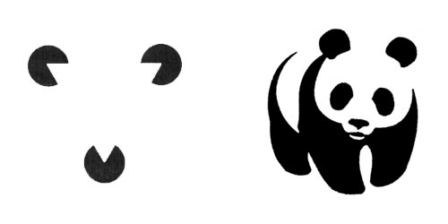

**Definición técnica:**  
El cerebro completa las figuras incompletas para formar un todo reconocible.

**En cristiano:**  
No necesitas mostrar todo. Tu espectador **llenará los vacíos**. Esto permite crear logos e ilustraciones más simples, memorables e inteligentes.

*   **Ejemplo clásico:** El logo de la WWF (el panda). No está completamente delineado, pero tu cerebro une los espacios y ve la figura completa. Es sofisticación visual pura.

---

### Ley de Figura y Fondo: "No se puede ver ambos a la vez"

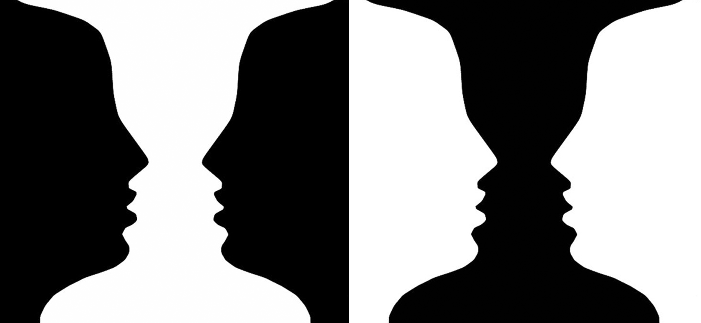

**Definición técnica:**  
El cerebro separa lo que percibe como la figura (el objeto de interés) del fondo (el contexto).

**En cristiano:**  
Es el juego de "¿qué ves?" de la psicología. Tu diseño debe tener una relación figura/fondo clara. Cuando se vuelve ambigua, creas ilusiones ópticas interesantes, pero puedes sacrificar la legibilidad.

*   **Cómo usarla:** Asegúrate de que tu mensaje principal (la figura) tenga suficiente **contraste** con el fondo para "saltar". Jugar con esta ley (como en el famoso jarrón/rostros) es para piezas muy específicas donde la ambigüedad *es* el mensaje.

---

### Ley de la Simetría y el Orden: "El cerebro ama la paz"

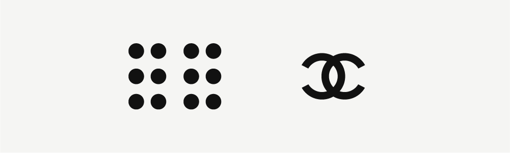

**Definición técnica:**  
El cerebro percibe los elementos simétricos y ordenados como parte de un mismo grupo, y prefiere estas composiciones porque son estables y fáciles de procesar.

**En cristiano:**  
El caos visual estresa al cerebro porque lo obliga a trabajar más para encontrar sentido. La simetría y el orden le dan **paz y claridad instantánea**.

*   **Cómo usarla:** Las retículas (grids) son tu herramienta para imponer orden. No todo tiene que ser perfectamente simétrico, pero una estructura subyacente ordenada hace que cualquier diseño se sienta profesional y considerado.

---

### Ley de la Simplicidad (o Prägnanz): "Menos es más"

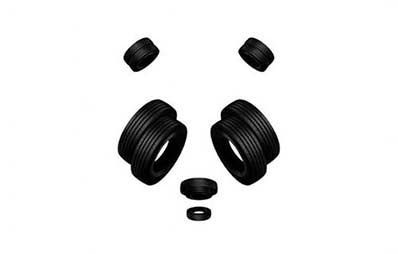

**Definición técnica:**  
El cerebro interpretará las formas ambiguas de la manera más simple y estable posible.

**En cristiano:**  
Esta es la ley madre. El cerebro siempre elige la interpretación **más simple y directa**. Tu diseño debe ser la interpretación más simple del mensaje.

*   **Cómo usarla:** Simplifica. Elimina elementos superfluos. Reduce formas complejas a sus versiones más básicas y reconocibles. Un buen logo es el epítome de esta ley.

---

### 🧠 Eres un Director de Percepción

Lo que hoy has aprendido no son trucos, son **fundamentos**. Las leyes de la Gestalt son la gramática del lenguaje visual. No las violes sin una razón poderosa.
1.  Usa la **Proximidad y Semejanza** para organizar y crear patrones.
2.  Usa la **Continuidad** para guiar.
3.  Usa el **Cierre** para ser ingenioso y memorable.
4.  Mantén clara la relación **Figura/Fondo** para una comunicación nítida.
5.  Busca el **Orden** y la **Simplicidad** para crear paz visual y poder.

Estas leyes rara vez trabajan solas. Un gran diseño suele ser una coreografía donde varias actúan en concierto.

---

### 🔍 Tu Reto de Detective Gestalt

Es hora de entrenar tu ojo para ver el andamiaje invisible.

**Tu misión:**  
Conviértete en un detective visual. Busca **una composición gráfica en el mundo real** (un cartel publicitario, una portada de libro, la interfaz de una app que uses, un folleto) donde identifiques claramente la aplicación de **al menos dos leyes de Gestalt**.

**Ejercicio de ejemplo:**  
Encuentra un sitio web. ¿Cómo agrupa los elementos del menú? (Proximidad). ¿Cómo hace que todos los botones de "Comprar" se vean iguales? (Semejanza). ¿Cómo guía tu mirada de arriba hacia abajo? (Continuidad).

**Toma una captura de pantalla o una foto.** Anota exactamente qué leyes ves en acción y **explica cómo funcionan** para hacer ese diseño efectivo (o inefectivo, si las viola).

Este es el momento en que dejas de ver el mundo como usuario y empiezas a verlo como diseñador. Te prometo que, después de esto, no podrás caminar por la calle sin analizar la Gestalt en cada cartel que veas.

Más adelante volveremos al color, pero ahora con el lente de la psicología y la teoría. Prepárate para entender por qué el rojo te acelera el pulso y el azul te calma.

---

## Teoría del Color: Pintar con Emoción y Ciencia

Hemos hablado de la estructura mental (Gestalt) y de los elementos básicos. Ahora, hablemos del **alma** del diseño: el color. No es solo decoración; es el elemento más visceral, emocional y comunicativo que tienes a tu disposición. Hoy vas a aprender a usarlo no como un pintor, sino como un **psicólogo visual**.

El color es la primera impresión, el que establece el estado de ánimo antes de que se lea una sola palabra. Dominarlo es dominar la emoción de tu mensaje.

---

### El Círculo Cromático: Tu Brújula de Color

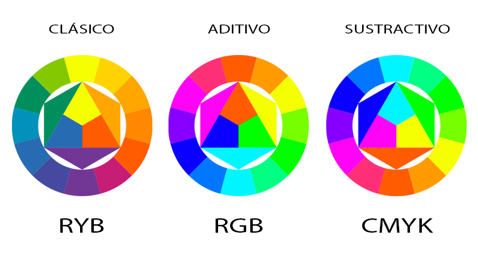

Imagina que es la **rueda de condimentos de un chef maestro**. Te muestra todos los sabores (colores) disponibles y, lo más importante, cómo se relacionan y combinan entre sí para crear armonía o contraste.

**Los Tres Pilares del Círculo CMYK:**

*   **Colores Primarios (Cian, Magenta, Amarillo):** Son los **elementales**. No se pueden crear mezclando otros. Son tu punto de partida absoluto.
*   **Colores Secundarios (Rojo, Verde, Azul):** Nacen de mezclar dos primarios a partes iguales. Son el siguiente eslabón.
*   **Colores Terciarios (Ej.: Amarillo-Verde, Rojo-Lila):** Son la mezcla de un primario con un secundario adyacente. Aquí es donde la paleta gana matices y sofisticación.

---

### La Temperatura del Color: El Termómetro Emocional

El círculo se divide en un espectro emocional que tu cerebro entiende instintivamente.

*   **Colores CÁLIDOS (Rojos, Naranjas, Amarillos, Rosas intensos):**
    *   **Psicología:** Energía, pasión, urgencia, alegría, calidez, pero también agresividad o advertencia.
    *   **Asociación:** Fuego, sol, verano.
    *   **En diseño:** Avanzan visualmente, llaman la atención al instante. Ideales para botones de "Comprar Ya" o destacar elementos críticos.

*   **Colores FRÍOS (Azules, Verdes, Lilas):**
    *   **Psicología:** Paz, tranquilidad, confianza, seguridad, profesionalismo, pero también frialdad o distancia.
    *   **Asociación:** Mar, cielo, bosque, hielo.
    *   **En diseño:** Retroceden visualmente, crean sensación de espacio y calma. Perfectos para fondos, marcas de tecnología o salud.

---

### El Lenguaje Técnico: Matiz y Saturación

Para afinar tu selección, domina estos dos conceptos:

*   **Matiz (Hue):** Es simplemente **el nombre del color** (rojo, azul, verde). En el círculo, es un punto entre 0 y 360 grados.
*   **Saturación:** Es la **intensidad o pureza** de ese color. Un rojo con saturación al 100% es un rojo vibrante y puro. Un rojo con saturación baja se acerca al gris. Controlar la saturación es clave para no abrumar al espectador.

---

### Armonías de Color: Las Fórmulas Probadas

Escoger colores al azar es una receta para el desastre. Usa estas **fórmulas clásicas** (armonías) extraídas directamente del círculo cromático para crear paletas que funcionen.

| Armonía | Cómo se Forma | Sensación que Transmite | Ejemplo Práctico |
| :--- | :--- | :--- | :--- |
| **Monocromática** | Diferentes tonos, sombras y tintes de **un solo color**. | Elegante, cohesivo, minimalista y sofisticado. Muy difícil de equivocarse. |  |
| **Análoga** | Colores que son **vecinos** en el círculo (ej.: amarillo, amarillo-verde, verde). | Armonioso, sereno y natural. Crea una gradación suave y agradable a la vista. | 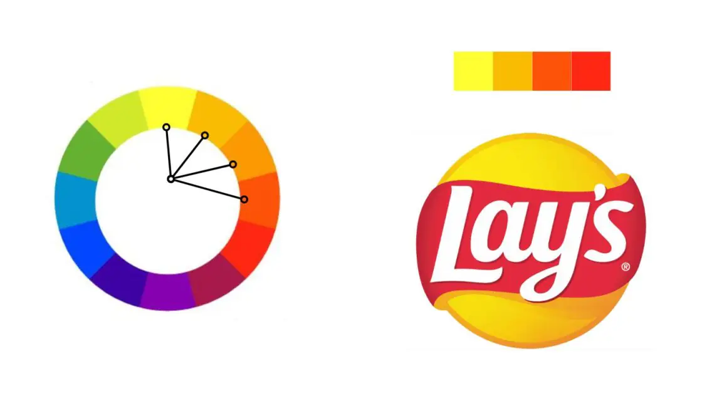 |
| **Complementaria** | Colores que están **opuestos** en el círculo (ej.: azul y naranja, rojo y verde). | Máximo **contraste** y vibración. Llamativo, dinámico y energético. Usar con cuidado. |  |
| **Triádica** | Tres colores **equidistantes** en el círculo (forman un triángulo). | Alegre, vibrante y juguetón, pero requiere más habilidad para equilibrar. |  |

---

### 🧠 El Color es un Verbo

Hoy has aprendido que el color es una decisión estratégica, no decorativa.
1.  **El círculo cromático es tu mapa.** Te muestra las relaciones y te da las fórmulas para la armonía.
2.  **La temperatura es emoción pura.** ¿Quieres excitar o calmar? Elige tu gama.
3.  **La saturación es el volumen.** Controla la intensidad para guiar la atención sin gritar.
4.  **Las armonías son tus atajos.** Úsalas para crear paletas profesionales con bases teóricas sólidas.

El color nunca trabaja solo. Su poder se multiplica cuando se combina con los principios de composición y Gestalt que ya conoces.

---

### 🎨 Tu Reto: La Psicología del Color en Acción

Es hora de entrenar tu sensibilidad cromática. Te propongo dos ejercicios (elige uno, o haz ambos si te sientes ambicioso):

**Opción A (Análisis Emocional):**
Busca **una fotografía o una pintura** que te evoque una emoción poderosa y específica (nostalgia, euforia, melancolía, serenidad). Sácale una captura de pantalla.
**Analiza:** ¿Qué colores dominan? ¿Son cálidos o fríos? ¿Están saturados o desaturados? Escribe un párrafo breve explicando **cómo esa paleta de color genera en ti esa emoción.**

**Opción B (Creación de Paleta):**
Piensa en una **emoción o concepto abstracto** (como "innovación", "tranquilidad", "lujo accesible" o "energía caótica"). Usando cualquier herramienta (desde lápices de colores hasta un selector de color online), crea una **paleta de 3-5 colores** que, en tu opinión, represente visualmente ese concepto. Nómbrala y explica brevemente tu elección.

Este ejercicio conectará la teoría con tu intuición. Te hará consciente de por qué ciertos colores "se sienten" de cierta manera.

Más adelante conectaremos todo lo aprendido y comenzaremos a **construir sistemas visuales coherentes**. Hablaremos de **identidad de marca** y cómo todos estos elementos (forma, espacio, tipografía, color) deben trabajar en equipo para crear una voz inconfundible.

---

## UX y UI: La Diferencia Entre Sentir y Ver

Has aprendido a comunicar con formas, colores y estructuras. Ahora, damos un salto al mundo digital, donde el diseño deja de ser estático y se vuelve una **conversación**. Hoy hablaremos de dos conceptos que definen esta era: **UX y UI**. No son lo mismo, pero son inseparables. Dominar esta diferencia es lo que separa a un artista visual de un **arquitecto de experiencias**.

Piensa en tu aplicación favorita. ¿Qué te hace volver a ella? No es solo su apariencia (eso es parte), es cómo te **sientes** al usarla. Ese sentimiento es el territorio que exploramos hoy.

---

### La Diferencia Fundamental: El Qué y el Cómo

Vamos a destriparlo con una analogía:

Imagina un restaurante de lujo.
*   **La UI (Interfaz de Usuario)** es **todo lo que ves y tocas**: la elegancia de la vajilla, la claridad del menú, la disposición de los cubiertos, la suavidad del mantel. Es el **cómo se presenta**.
*   **La UX (Experiencia de Usuario)** es **cómo te sientes**: la amabilidad del camarero, la lógica de la secuencia de platos, el tiempo de espera, la comodidad de la silla, el recuerdo que te llevas. Es el **qué experimentas**.

   

En digital:
*   **UI (Interfaz):** Son los **objetos de interacción**. Los botones, los menús, los deslizadores, las tipografías, los colores de la pantalla. Es la **capa estética y táctil**.
*   **UX (Experiencia):** Es la **percepción y emoción resultante** de usar esa interfaz. ¿Fue fácil lograr lo que quería? ¿Me sentí frustrado o empoderado? Es la **capa psicológica y funcional**.
   

**La relación es simple:** Una UI hermosa pero confusa arruina la UX. Una UX brillante a menudo se apoya en una UI intuitiva y bien diseñada.

---

### Los Pilares de una Buena Experiencia: Usabilidad y Accesibilidad

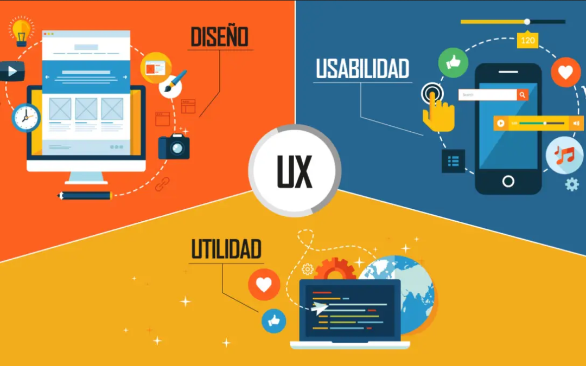

Para que la UX sea positiva, la UI debe construirse sobre dos cimientos inquebrantables:

#### a) Usabilidad: "¿Puedo usarlo sin pensar?"
**Definición:** La facilidad con la que las personas pueden usar tu producto para lograr sus objetivos de manera **eficaz, eficiente y satisfactoria**.

**En cristiano:** Es el arte de la **obviedad amable**. Que el usuario no tenga que descifrar cómo funciona tu app.
*   **Ejemplo bueno:** El icono de una "lupa" para buscar. Todos sabemos lo que hace.
*   **Ejemplo malo:** Un formulario que no te dice qué campo es obligatorio hasta que le das a "enviar".

#### b) Accesibilidad: "¿Puede usarlo *realmente* todo el mundo?"
**Definición:** El diseño de productos para que sean utilizables por personas con la más amplia gama de habilidades, incluyendo aquellas con discapacidades permanentes, temporales o situacionales.

**En cristiano:** No es solo una característica "extra"; es **diseñar con empatía universal**.
*   **Discapacidad permanente:** Una persona ciega que usa un lector de pantalla.
*   **Discapacidad temporal:** Alguien con un brazo escayolado (yeso).
*   **Discapacidad situacional:** Una madre cargando un bebé y usando solo una mano, o alguien en un lugar ruidoso que no puede escuchar el audio.

**Diseñar para la accesibilidad no solo ayuda a unos pocos; mejora la experiencia para todos.**

---

### El Proceso: Del Esqueleto al Ser Vivo

Antes de que una app o web nazca, pasa por tres etapas de planificación visual. Son los planos de la construcción digital.

| Etapa | ¿Qué es? | Analogía | Propósito |
| :--- | :--- | :--- | :--- |
| **Wireframe** 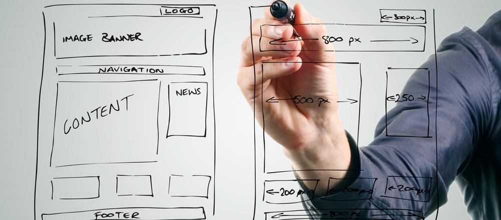 | Un **esquema estructural** en escala de grises. Define la disposición de elementos sin detalles visuales. | Los **planos arquitectónicos** de una casa. Muestra dónde van las puertas y ventanas, pero no el color de las paredes. | Validar la estructura, el flujo de información y la jerarquía de contenido. Es rápido y barato de cambiar. |
| **Mockup**  | Una **maqueta visual estática**. Aplica la identidad visual (colores, tipografías, imágenes, iconos) al wireframe. | La **maqueta a escala** que muestra cómo se verá la casa pintada y decorada, pero no se puede abrir la puerta. | Validar el aspecto visual, la paleta de colores y la tipografía antes de construir. |
| **Prototipo**  | Una **simulación interactiva**. El mockup cobra vida: los botones se pulsan, los menús se desplegan. | La **casa de muestra** en la urbanización, donde puedes abrir los grifos y encender las luces. | Testear la **usabilidad y la experiencia de flujo** con usuarios reales. Descubrir puntos de fricción antes del desarrollo costoso. |

**El flujo sagrado:** Wireframe (estructura) → Mockup (belleza) → Prototipo (comportamiento). Saltarse un paso es construir una casa sin planos.

---

### 🧠 Eres un Diseñador de Emociones

Hoy has dado un paso crucial: del diseño de *cosas* al diseño de *experiencias*.
1.  **UI es lo que se ve. UX es lo que se siente.** Trabajan en simbiosis.
2.  **La usabilidad es sentido común hecho diseño.** Si el usuario tiene que pensar, algo falla.
3.  **La accesibilidad es empatía en acción.** Un buen diseño no deja a nadie fuera.
4.  **Wireframe, Mockup, Prototipo** son tus fases de prueba de realidad. Nunca empieces a construir sin ellas.

Esta mentalidad es aplicable a todo: desde una web hasta el panel de control de un microondas. Siempre estás diseñando para una persona al otro lado de la pantalla.

---

### ✏️ Tu Reto: Arquitecto de Tu Propio Espacio Digital

Es hora de aplicar el proceso. **Tu misión es crear el wireframe de la página web de tu marca personal.**

**Instrucciones:**
1.  **Define tu objetivo:** ¿Quieres que sirva como portafolio, blog, o punto de contacto para clientes?
2.  **Con papel y lápiz o una herramienta digital simple** (como Figma, Sketch, o incluso PowerPoint), dibuja las **vistas principales**:
    *   **Página de Inicio:** ¿Qué verá alguien al llegar?
    *   **Página "Sobre mí":** ¿Cómo te presentarás?
    *   **Portafolio/Caso de estudio:** ¿Cómo mostrarás tu trabajo?
    *   **Página de Contacto:** ¿Cómo te encontrarán?
3.  **Solo estructura:** Usa cajas, líneas y texto genérico (`Logo aquí`, `Título`, `Imagen de proyecto`, `Botón de contacto`). **Sin colores, sin fuentes elegidas, sin imágenes reales.** Solo jerarquía y disposición.
4.  **Pregúntate:** ¿Es claro el camino que quiero que siga el visitante? ¿La información más importante es la más prominente?

Guarda este wireframe. En futuras sesiones, podríamos convertirlo en un mockup y luego en un prototipo. Este es el primer paso para materializar tu presencia digital con intención, no por azar.

Más adelante conectaremos todos los hilos sueltos —tipografía, color, composición, UX/UI— para hablar del **diseño de sistemas** y cómo crear identidades visuales que sean consistentes, escalables y memorables. La verdadera magia comienza cuando todo funciona en armonía.

---

## El Taller Digital: Eligiendo Tus Herramientas de Creación

Has aprendido la teoría, la psicología y el proceso. Ahora es momento de hablar de **el cómo materializas tus ideas**. Las herramientas. En el diseño gráfico y UX/UI, tu software no es solo un programa; es tu estudio, tu taller, tu extensión creativa. Hoy no hablaremos de marcas, sino de **funcionalidades y flujos de trabajo**. Tu elección no te define como diseñador, pero la correcta puede liberarte.

Piensa en esto como elegir el set de llaves de un mecánico: cada una tiene un propósito ligeramente distinto, pero al final, un buen mecánico puede trabajar con casi cualquier set. Tu talento es lo fundamental; la herramienta es el medio.

---

### El Panorama: Más Allá del Nombre de la App

Antes de profundizar, entiende esto: **todas estas herramientas hacen esencialmente lo mismo.** Te permiten crear interfaces (UI), organizar elementos, aplicar estilos y crear prototipos. La diferencia está en los **detalles, el ecosistema y tu forma de trabajar.**

No existe "la mejor". Existe **"la mejor para ti, en este momento, para este proyecto"**.

---

### Tu Kit de Herramientas Digitales

Vamos a desglosar las principales, no como una lista de características, sino como perfiles de personalidad.

#### 🎨 **Figma: El Colaborador Nato**

*   **Su esencia:** Es el **Google Docs del diseño**. Nació en la nube y para la colaboración en tiempo real.
*   **Para quién es:** Equipos distribuidos, diseñadores que trabajan codo a codo con desarrolladores, freelances que presentan trabajo a clientes de forma interactiva. Es la reina de la **accesibilidad y la sencillez**.
*   **Su superpoder:** El **"Dev Mode"** para entregas a desarrollo y las bibliotecas de componentes compartidas que se actualizan en vivo para todo el equipo.
*   **La pega:** Dependes de una buena conexión a internet. Su versión gratuita es increíblemente robusta.

#### ✏️ **Sketch: El Purista de Mac**

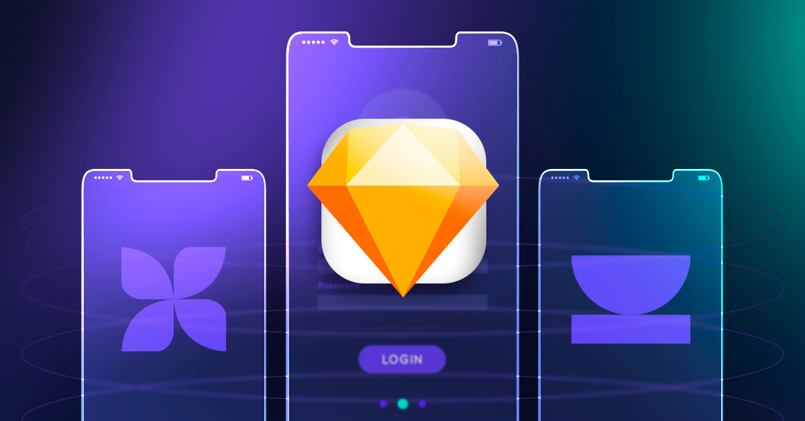

*   **Su esencia:** El **pionero** que democratizó el diseño de interfaces. Es una aplicación nativa de macOS, potente y ágil.
*   **Para quién es:** Diseñadores que trabajan principalmente en entornos Apple, que valoran un software rápido y centrado exclusivamente en el diseño de UI/UX, sin bloat.
*   **Su superpoder:** Un ecosistema masivo de **plugins** que puedes usar para extender sus funciones casi infinitamente. Es estable y predecible.
*   **La pega:** Solo para Mac. La colaboración, aunque ha mejorado, no es tan fluida y en tiempo real como en Figma.

#### 🚀 **Adobe XD: El Integrador**

*   **Su esencia:** El jugador de Adobe que busca unificar el flujo de trabajo. Si vienes de Photoshop o Illustrator, te sentirás en casa.
*   **Para quién es:** Diseñadores ya inmersos en el ecosistema Adobe (Creative Cloud). Ideales para proyectos donde el diseño de interfaz y el material de marketing (creado en otras apps de Adobe) deben coexistir en armonía.
*   **Su superpoder:** La integración **perfecta con Creative Cloud**. Abrir un archivo de Photoshop en XD o usar Adobe Fonts es seamless. Sus herramientas de prototipado son muy sólidas.
*   **La pega:** Ha perdido cuota de mercado frente a Figma. Su comunidad y ecosistema de plugins es más pequeño.

#### ⚡ **InVision Studio & Studio Design: Los Especialistas en Dinámica**

*   **Su esencia:** Herramientas pensadas para llevar los prototipos más allá de lo estático, hacia **micro-interacciones y animaciones complejas**.
*   **Para quién es:** Diseñadores de interacción (IXD) especializados en crear experiencias fluidas y animadas. Para proyectos donde la transición y el movimiento son parte crítica de la comunicación.
*   **Su superpoder:** Un control **granular y avanzado sobre animaciones** que emulan el resultado final de código, sin necesidad de programar.
*   **La pega:** Tienen una curva de aprendizaje más pronunciada para animaciones avanzadas. Su uso principal es más especializado.

---

### La Pregunta Correcta: ¿Cómo Decidir?

No te dejes llevar por el hype. Hazte estas preguntas:

1.  **¿Con quién colaboro?** ¿Necesito que mi cliente o mi team vean y comenten en tiempo real? → **Figma** es imbatible.
2.  **¿En qué sistema operativo trabajo?** ¿Solo uso Mac? → **Sketch** es una opción excelente. ¿Trabajas en Windows o necesitas flexibilidad? → **Figma o Adobe XD**.
3.  **¿De dónde vengo?** ¿Eres un experto en la Suite Adobe? → **Adobe XD** reducirá tu fricción. ¿Eres nuevo y quieres algo sencillo y poderoso? → **Figma**.
4.  **¿Qué profundidad de prototipado necesito?** ¿Bastan enlaces entre pantallas? Cualquiera lo hace. ¿Necesitas animaciones detalladas y avanzadas? → Mira **InVision Studio** o **Principle** (no mencionado, pero clave en animación).

---

### 🧠 La Herramienta es el Medio, No el Fin

Recuerda:
1.  **Tu cerebro es la herramienta más importante.** El software solo ejecuta lo que tú concibes.
2.  **Los principios son transferibles.** Aprender composición, color y tipografía en una app, te sirve para todas.
3.  **La industria es fluida.** Hoy la favorita es Figma, mañana puede surgir otra. Mantén tus fundamentos sólidos y adaptarte será fácil.
4.  **Prueba antes de comprometerte.** Todas tienen versiones de prueba o gratuitas. **¡Úsalas!**

Al final, muchos diseñadores profesionales usan **combinaciones**: Sketch/Figma para diseño estático, Principle para animaciones complejas, y Adobe Illustrator para ilustración e iconos detallados. Conforme crezcas, encontrarás tu propio flujo.

---

### 🛠️ Tu Reto: Exploración Táctica del Taller

No te quedes con la teoría. Te propongo una exploración activa:

**Tu misión es doble:**
1.  **Visita los sitios web oficiales** de al menos **tres** de las herramientas mencionadas (Figma, Sketch, Adobe XD, InVision).
2.  En cada una, busca la sección de **"Showcase"**, "Gallery" o "Community". Observa los proyectos que la gente comparte.

**Luego, responde (para ti mismo o compártelo):**
*   **¿Cuál te atrajo más visualmente y por qué?** (No solo la interfaz del sitio, sino el tipo de trabajos que se muestran hechos con esa herramienta).
*   **Basándote en tu situación actual** (tu sistema operativo, si trabajas solo o en equipo, tus proyectos personales), **¿cuál crees que sería un buen punto de partida para ti?**

Este no es un compromiso de por vida. Es el primer paso para tomar una decisión informada y comenzar a construir *tu* taller digital.

Más adelante haremos una **síntesis magistral**. Conectaremos todos los puntos—desde el boceto hasta el prototipo interactivo—y te daré un marco para afrontar cualquier proyecto de diseño con confianza y método. El viaje de aprender nunca termina, pero tu caja de herramientas ya está completa.

---
## Creatividad: El Motor que Convierte Problemas en Soluciones Memorables

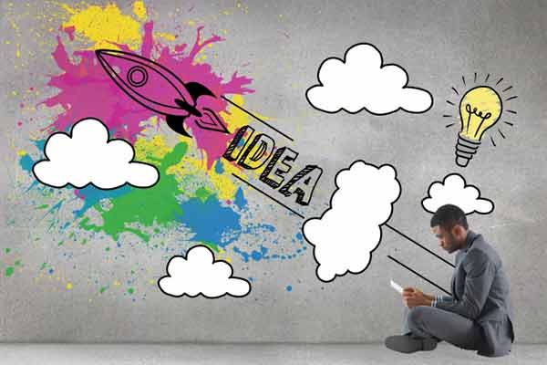

Has dominado las herramientas, la teoría y el proceso. Pero hay un ingrediente que no se puede descargar ni instalar: **la creatividad**. Hoy no hablaremos de píxeles o paletas, sino del combustible que hace que todo cobre vida. La creatividad no es un don mágico reservado para unos pocos; es un **músculo** que se ejercita. Y como todo buen entrenador, te voy a dar las rutinas para fortalecerlo.

Olvida la imagen del genio solitario esperando la inspiración. La creatividad en el diseño es un **deporte de equipo** con reglas, técnicas y un objetivo claro: resolver problemas de forma original y efectiva.

---

### Desmitificando la Creatividad: No Es lo que Crees

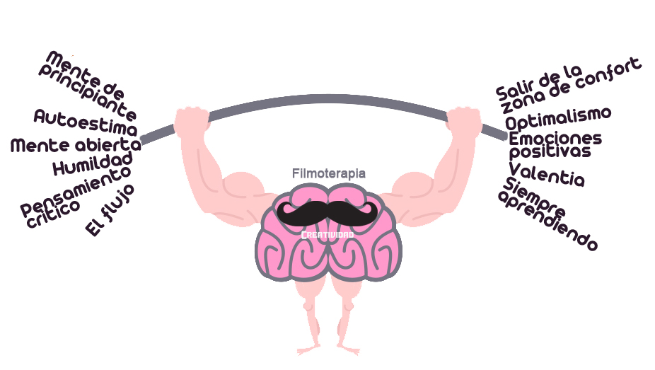

**Definición técnica:**  
La capacidad de generar nuevas ideas con el objetivo de desarrollar una solución original a un problema determinado.

**En cristiano:**  
Creatividad no es hacer "algo bonito". Es encontrar **el camino inesperado que lleva a la mejor solución**. Es la habilidad de conectar puntos que nadie más había relacionado.

Si crees que "no eres creativo", estás equivocado. Estás **desentrenado**. Cualquier persona puede desarrollar su creatividad. Solo necesitas las técnicas adecuadas y la voluntad de jugar.

---

### Tu Gimnasio de Ideas: Técnicas para Ejercitar el Músculo Creativo

Estas no son teorías abstractas. Son **métodos de trabajo** probados que usan las mejores agencias y estudios del mundo. Elige tu rutina.

#### a) Los 6 Sombreros para Pensar (de Edward de Bono)

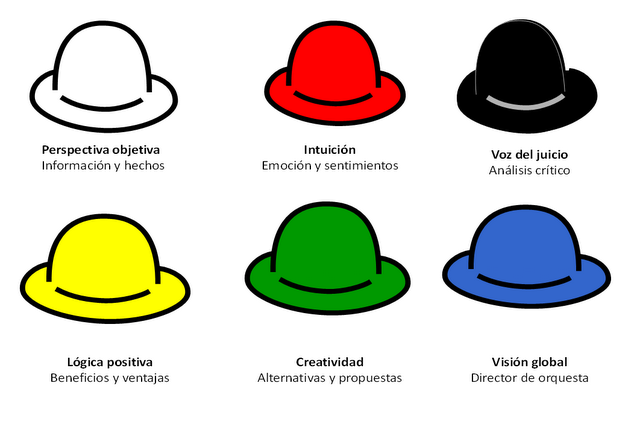

**La esencia:** Un **debate estructurado** donde cada participante adopta un rol (un sombrero) para explorar el problema desde ángulos completamente distintos, sin conflictos de ego.
*   **Sombrero Blanco (Objetivo):** Solo datos y hechos. "¿Qué sabemos?"
*   **Sombrero Rojo (Emocional):** Intuiciones y sentimientos. "¿Qué me hace sentir esto?"
*   **Sombrero Negro (Crítico):** El abogado del diablo. "¿Qué podría salir mal?"
*   **Sombrero Amarillo (Optimista):** El soñador. "¿Qué beneficios podría traer?"
*   **Sombrero Verde (Creativo):** El generador de ideas. "¿Qué alternativas hay?"
*   **Sombrero Azul (Moderador):** El director de orquesta. Gestiona el proceso.

**Por qué funciona:** Evita que la reunión se convierta en una pelea de opiniones. Obliga al equipo a pensar de forma multidimensional.

#### b) Método SCAMPER: La Caja de Herramientas para Modificar

**La esencia:** Una **checklist de verbos de acción** para transformar una idea o producto existente. Es perfecto para rediseñar o iterar.
*   **S**ustituir: ¿Qué podemos cambiar? (Partes, materiales, personas)
*   **C**ombinar: ¿Qué podemos fusionar? (Ideas, propuestas, funciones)
*   **A**daptar: ¿Qué podemos copiar o ajustar de otro contexto?
*   **M**odificar: ¿Qué podemos ampliar, minimizar o distorsionar?
*   **P**ensar en otros usos: ¿Para qué más se puede usar?
*   **E**liminar: ¿Qué podemos quitar o simplificar?
*   **R**evertir/Reordenar: ¿Qué pasa si lo invertimos o cambiamos el orden?

**Por qué funciona:** Da estructura a la lluvia de ideas. Cuando no se te ocurre nada, aplicar uno de estos verbos fuerza nuevas conexiones.

#### c) El Cuestionamiento de Suposiciones

**La esencia:** **Atacar lo "obvio"**. Todo proyecto parte de supuestos no verificados ("Los usuarios prefieren muchos colores", "El logo debe ir arriba a la izquierda").
*   **El proceso:** Lista TODAS las suposiciones sobre tu proyecto. Luego, desafía cada una. ¿Y si el usuario prefiere la simplicidad monocromática? ¿Y si el logo va al centro?

**Por qué funciona:** Destruye las barreras invisibles que limitan tu pensamiento. Lo que das por sentado es tu mayor enemigo creativo.

#### d) Brainstorming & 4x4x4: De lo Individual a lo Colectivo

*   **Brainstorming Clásico:** La regla de oro es **cantidad sobre calidad, y sin juicios**. Anota todo, por descabellado que sea. La crítica viene después. Consejo pro: Empieza en silencio e individual, luego compartan. Así evitas la influencia del más vocal.
   

*   **Técnica 4x4x4:** Un **funnel de ideas**.
    1.  **Individual:** Cada uno escribe sus 4 mejores ideas.
    2.  **En parejas:** Juntan sus 8 ideas y sintetizan 4 nuevas y mejores.
    3.  **En cuartetos:** Juntan sus 8 ideas y eligen las 4 definitivas.

**Por qué funciona:** Combina la diversidad de pensamiento individual con la potencia de la síntesis grupal. Las ideas evolucionan y mejoran.

#### e) Bosquejo en Grupo (Group Sketching)

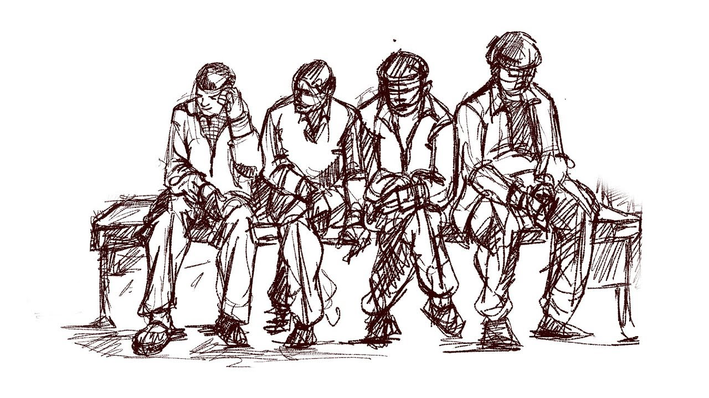

**La esencia:** **Pensar con las manos**. No importa si "no sabes dibujar". Se trata de comunicación visual cruda.
*   **El proceso:** Uno empieza un sketch sobre el problema. Otro lo continúa, añadiendo o modificando. Y así sucesivamente. Al final, se analizan los dibujos en busca de patrones e ideas emergentes.

**Por qué funciona:** Libera el pensamiento del lenguaje verbal y lógico. Muchas soluciones de UI/UX nacen de un garabato compartido.

---

### 🧠 La Creatividad es un Proceso, No un Don

Lo que hoy has aprendido es liberador:
1.  **La creatividad se puede gestionar.** No tienes que esperar a que te visite la musa. Tienes técnicas para convocarla.
2.  **La diversidad de perspectivas es clave.** La mejor idea rara vez nace de una sola mente. Rodéate de personas que piensen distinto y estructura su colaboración.
3.  **La cantidad lleva a la calidad.** No te obsesiones con la idea perfecta en el primer intento. Genera muchas, luego filtra.
4.  **Juega.** El estado lúdico, de exploración sin miedo al error, es donde ocurre la magia. Técnicas como el bosquejo o SCAMPER son, en el fondo, juegos con reglas.

---

### 🎯 Tu Reto: Tu Primera Sesión de Entrenamiento Creativo

Es hora de levantar pesas con tu imaginación.

**Escoge UN problema de diseño simple** (puede ser el wireframe de tu marca personal que empezaste, o un rediseño rápido del logo de tu cafetería favorita).

**Ahora, aplica UNA de estas técnicas durante 20-30 minutos:**
*   **Opción A (SCAMPER):** Toma el diseño existente y aplica sistemáticamente cada verbo. ¿Qué sucede si *Sustituyes* la tipografía? ¿Si *Eliminas* el icono? Anota todas las variantes, por raras que sean.
*   **Opción B (6 Sombreros):** Si tienes un compañero, debate el problema. Si estás solo, **¡ponte tú los sombreros!** Dedica 5 minutos a pensar solo como el Sombrero Rojo (emociones), luego 5 como el Negro (crítico), etc. Te sorprenderá lo que surge.

**Documenta el proceso y los resultados.** No busques la solución final. Busca **cantidad y variedad** de ideas. Guarda estos apuntes; son la prueba de que tu músculo creativo está trabajando.

Has llegado al final de este bloque fundacional. Tienes el **conocimiento** (teoría), las **herramientas** (software) y ahora el **método** (creatividad). Estás listo para afrontar cualquier brief, cualquier problema de diseño, con una caja de herramientas llena y la confianza de saber que no hay desafío que no puedas descomponer y resolver.

El viaje continúa. La siguiente parada: **la especialización y la profundización**. ¿Hacia dónde quieres llevar tu voz visual?

---

## Creatividad sin Fronteras: Tu Taller Virtual Colaborativo

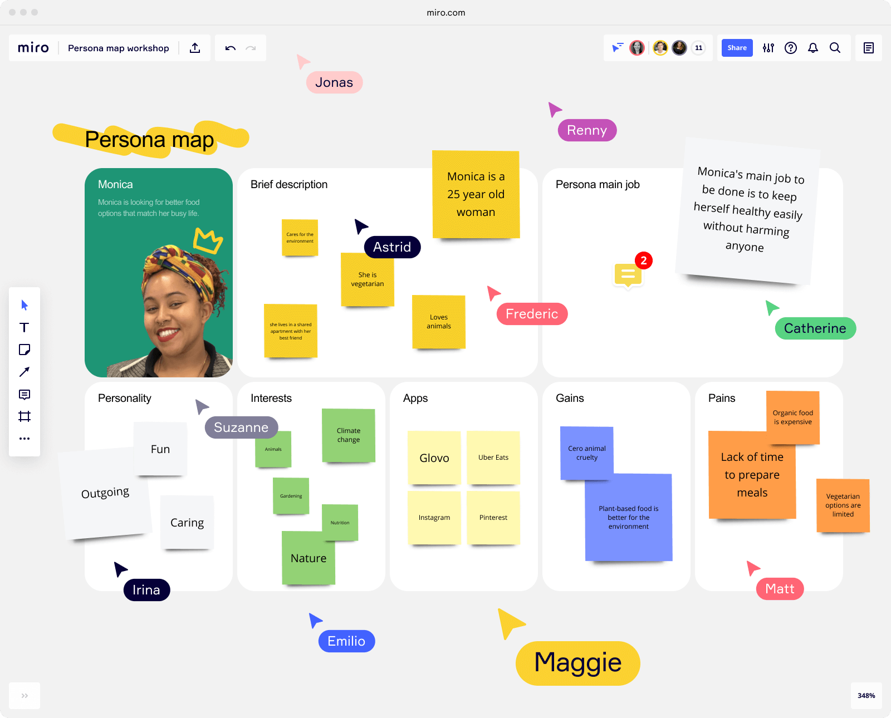

Hemos llegado a un punto crucial en tu formación. Sabes *qué* diseñar y *cómo* pensar de forma creativa. Ahora, debemos hablar del **dónde** en el mundo moderno: el espacio digital colaborativo. El estudio de diseño ya no es solo una habitación con mesas de dibujo; es un **lienzo infinito en la nube** donde equipos distribuidos across el mundo pueden co-crear en tiempo real.

La creatividad no se apaga cuando trabajamos a distancia. Se transforma, y necesita herramientas que repliquen la energía de una sesión de brainstorming presencial: los post-its, las pizarras, la lluvia de ideas espontánea. Hoy te presento tu **kit de supervivencia para la creatividad remota**.

---

### El Nuevo Estudio: Por qué Estas Herramientas son Esenciales

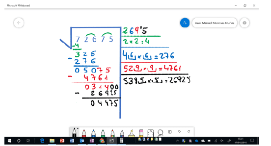

Imagina intentar hacer el ejercicio de "Bosquejo en Grupo" o "Los 6 Sombreros" por correo electrónico. Sería un desastre. Estas plataformas existen para una razón: **hacer que la colaboración creativa a distancia sea tan fluida, o más, que en persona.**

No son solo "pizarras digitales". Son espacios de trabajo vivos donde:
*   La idea de uno puede ser instantáneamente desarrollada por otro.
*   El pensamiento visual se convierte en el lenguaje común.
*   Todo queda documentado, nunca se pierde una idea garabateada en una servilleta.

---

### Tu Arsenal de Colaboración Visual: El Top 5

Todas estas herramientas comparten un ADN similar, pero cada una tiene su personalidad. Tu elección dependerá del sabor de colaboración que prefieras.

#### 🎨 **Mural & Miro: Los Titanes Gemelos**

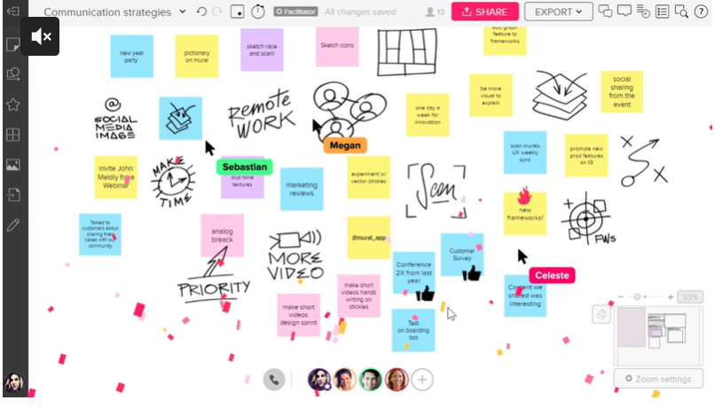

*   **Su esencia:** Son los **Figma de la lluvia de ideas**. Las plataformas más completas y populares para la colaboración visual en tiempo real. Son virtualmente intercambiables en sus funciones básicas.
*   **Lo que ofrecen:** Pizarras infinitas (*boards*), post-its digitales, diagramas, dibujo a mano alzada, votaciones, temporizadores para workshops y una **galaxia de plantillas predefinidas** (para Design Sprints, Mapas de Empatía, Canvas de Negocio, etc.).
*   **Para quién son:** Equipos de UX, diseñadores, product managers y cualquier grupo que necesite estructurar sesiones de ideación complejas. Son el **estándar de la industria**.
*   **La diferencia sutil:** Es como elegir entre Mac y Windows. **Miro** suele sentirse ligeramente más ágil y minimalista. **Mural** a menudo se percibe con un enfoque más guiado hacia facilitadores de workshops. **Prueba ambas**; la elección es de puro gusto personal.

#### ⛈️ **Stormboard: El Organizador Metódico**

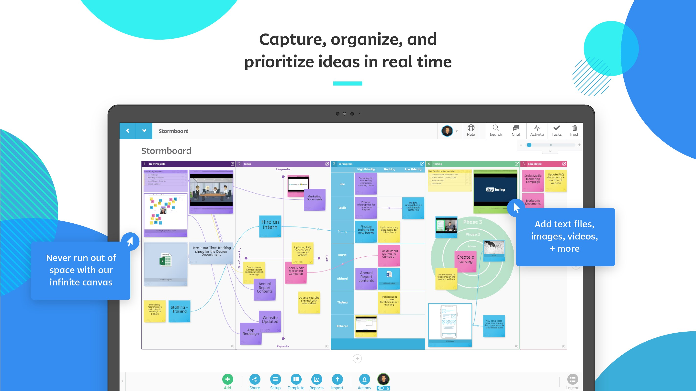
*   **Su esencia:** Como su nombre sugiere, está diseñado para **gestionar la tormenta de ideas** (*brainstorm*) y luego darle estructura.
*   **Lo que ofrece:** Su punto fuerte es cómo te ayuda a **clasificar, agrupar y priorizar** ideas después de generarlas. Facilita el paso del caos creativo al plan de acción.
*   **Para quién es:** Equipos que necesitan un flujo muy claro: "Ideación → Categorización → Votación → Roadmap". Es menos un lienzo libre y más un **sistema de gestión de ideas**.

#### 💡 **Ideaflip: La Simplicidad Elegante**

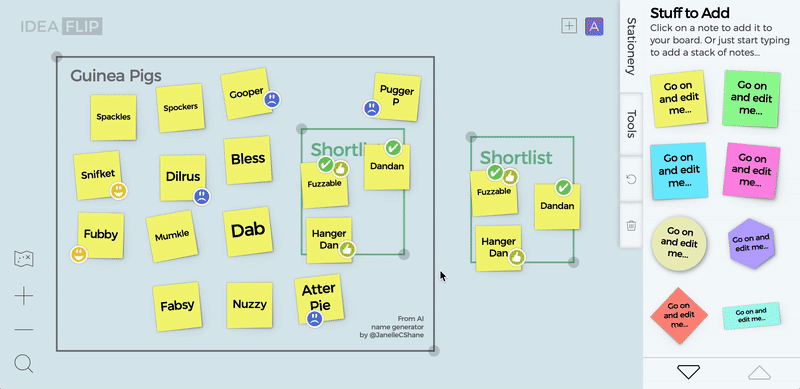

*   **Su esencia:** Una herramienta **minimalista y centrada en lo esencial**: los post-its y su agrupación.
*   **Lo que ofrece:** Una interfaz ultra limpia y visual para hacer brainstorming individual o en grupo. Es menos abrumadora que Miro o Mural, perfecta para sesiones rápidas y focadas.
*   **Para quién es:** Personas o equipos pequeños que quieren una herramienta **sin curva de aprendizaje**, donde la simplicidad no reste potencia. Es el cuaderno de bocetos digital para ideas.

#### 🧪 **Sessionlab: El Maestro de Ceremonias**

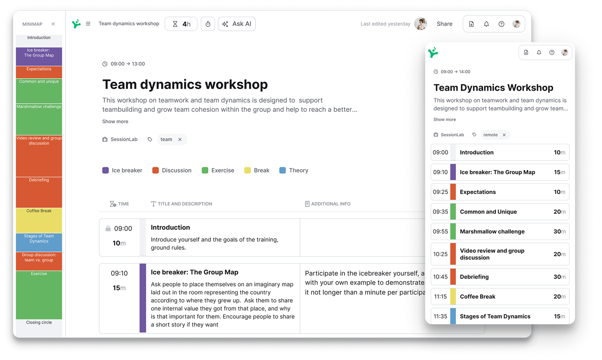

*   **Su esencia:** No es solo una pizarra colaborativa; es un **planificador y biblioteca de técnicas de taller**.
*   **Lo que ofrece:** Su poder está en ayudarte a **diseñar la agenda completa** de tu workshop (presencial o remoto). Te permite arrastrar y soltar diferentes técnicas de creatividad, team building o resolución de problemas, calcular tiempos y compartir la agenda con los participantes. Luego, puedes ejecutarlo usando integraciones con Miro, Mural, etc.
*   **Para quién es:** Facilitadores profesionales, Scrum Masters o cualquier persona que necesite **estructurar y dirigir sesiones de trabajo** de forma impecable. Es el director de orquesta que organiza a los músicos (las otras herramientas).

---

### 🧠 La Colaboración es la Nueva Creatividad

El aprendizaje de hoy va más allá del software:
1.  **La creatividad es un deporte de equipo, sin importar la distancia.** Estas herramientas eliminan las barreras geográficas.
2.  **La elección depende de tu flujo de trabajo.** ¿Necesitas un lienzo infinito (Miro/Mural), un organizador (Stormboard), simplicidad (Ideaflip) o un planificador (Sessionlab)?
3.  **El "cómo" es tan importante como el "qué".** Una sesión creativa bien facilitada con estas herramientas puede superar en productividad a una reunión presencial mal gestionada.
4.  **La documentación es un superpoder.** Nada se pierde. Todo el journey creativo queda guardado para referencia futura.

---

### 🚀 Tu Reto: Exploración y Prueba de Fuego

La teoría queda atrás. Es hora de ensuciarte las manos digitales.

**Tu misión es doble:**
1.  **Explora:** Visita los sitios web de **Miro** y **Mural**. Ambas tienen planes gratuitos muy generosos. Mira sus videos de presentación y recorre sus galerías de plantillas.
2.  **Prueba:** **Crea una cuenta gratuita en la que más te haya gustado.** No necesitas un proyecto complejo. Simula una **mini-sesión de brainstorming para tu marca personal**:
    *   Crea un board nuevo.
    *   Usa la herramienta de post-its y escribe 5-6 ideas para el nombre de tu portfolio.
    *   Usa la herramienta de dibujo para hacer un garabato rápido de un posible logo.
    *   Invita a un amigo o colega (por correo) al board y pídele que añada sus propias ideas.

**La meta no es crear un masterpiece.** La meta es **sentir la fluidez** de la herramienta, entender cómo se colabora en tiempo real y perderle el miedo a la pizarra en blanco infinita.

Has completado el ciclo. Tienes la mentalidad, el conocimiento técnico, los procesos creativos y ahora, el espacio de trabajo digital para ponerlo todo en práctica. **Tu taller está listo. Las herramientas están afiladas. El lienzo te espera.**

Este es el final de esta serie fundacional, pero solo el comienzo de tu viaje. ¿Qué vas a crear?

