# Introducción al diseño gráfico

Bienvenido a tu primera sesión. Si estás aquí es porque quieres dejar de "hacer dibujos" y empezar a comunicar visualmente. Como tu mentor, mi trabajo no es solo enseñarte a usar herramientas, sino a educar tu ojo clínico.

El diseño gráfico no es decoración; es un lenguaje. Vamos a desglosar los cimientos de esta disciplina para que tus ideas tengan pies, cabeza y, sobre todo, impacto.

---

### El Boceto: El Mapa de Guerrilla

Técnicamente, el **boceto** es un esquema simplificado (ya sea en papel o digital) que captura la estructura medular de una idea en cuestión de segundos o minutos. Solo debe contener los trazos esenciales para que el concepto sea comprensible.

En el mundo real, el boceto es tu "seguro de vida". Es ese dibujo rápido que haces para no perder la inspiración antes de que se te escape. No busques la perfección aquí; busca la intención. Si el boceto funciona, el diseño final tendrá una base sólida sobre la cual crecer.

---

### Los Elementos Visuales: Tu Caja de Herramientas

Aquí es donde la técnica se encuentra con la intuición. Estos elementos son los átomos de cualquier composición:

* **El Color:** Se trata de manejar el espectro visible y los neutros para establecer jerarquías y captar la atención. Técnicamente, es una herramienta para inyectar emoción en el diseño.
* *La clave:* Piensa en el color como el "clima" de tu diseño; puede hacer que un mensaje se sienta frío y profesional o cálido y acogedor.

    

* **Las Líneas:** Son el trayecto físico entre dos coordenadas. Sirven para subrayar conceptos o tejer conexiones entre distintos elementos.
* *La clave:* Son las "flechas" invisibles. Úsalas para decirle al espectador exactamente hacia dónde tiene que mirar.

    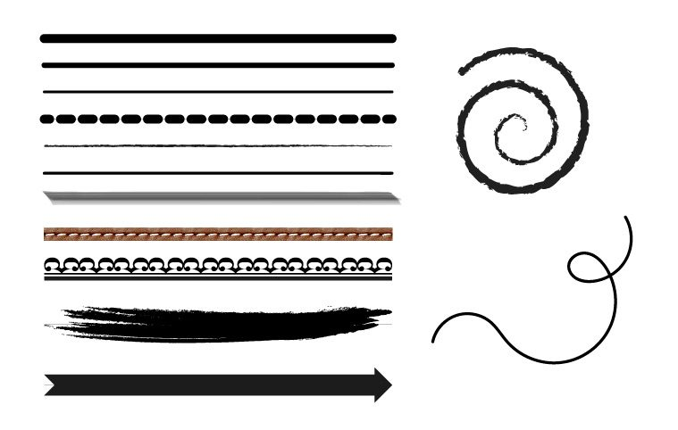

* **El Tamaño y la Escala:** Es la dimensión de un objeto y su relación con los demás. Un objeto de mayor tamaño se percibe automáticamente como más relevante.
* *La clave:* Es el volumen de tu voz. Lo que hagas más grande es lo que estás gritando a los cuatro vientos.

    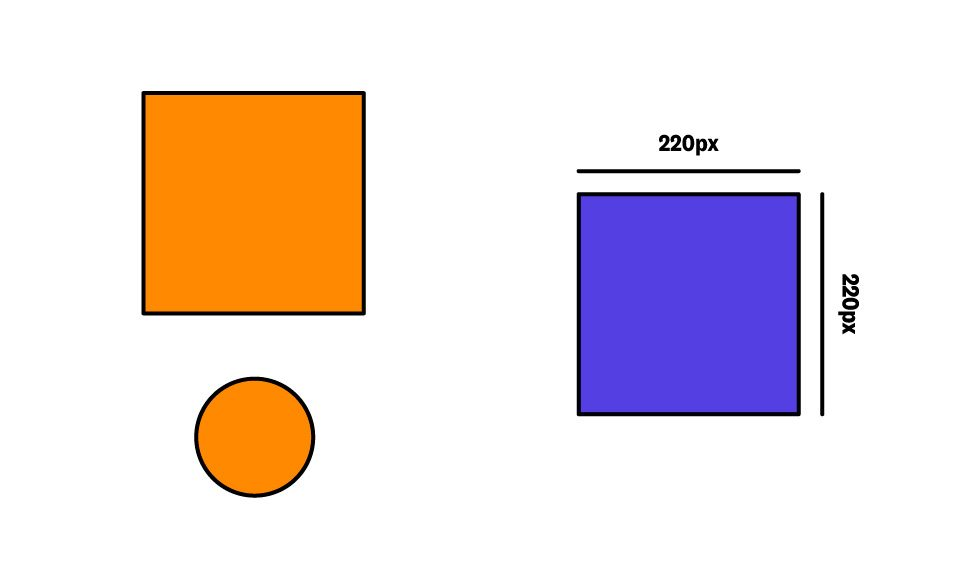

* **La Tipografía:** No es solo elegir una letra bonita; es gestionar la disposición y estética de las fuentes para asegurar la legibilidad y transmitir sentimientos.
* *La clave:* Es la "voz" que lee tu texto. Una fuente puede sonar como un abogado serio o como un amigo contándote un chiste.

    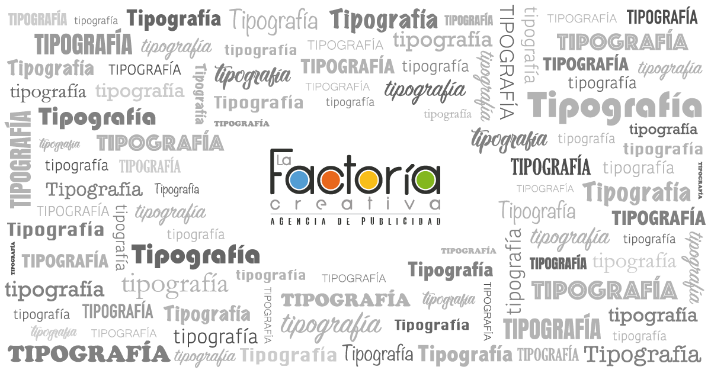

---

### El Orden del Diseño: Alineación y Jerarquía

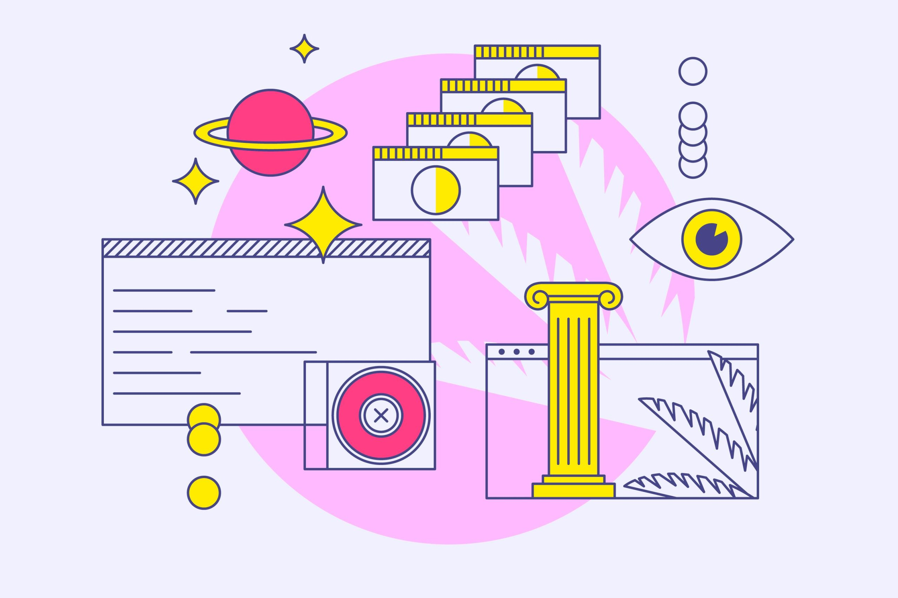
Un diseño sin orden es solo ruido visual. Aquí aplicamos la lógica estructural:

* **Alineación:** Es la disposición técnica de los elementos en el canvas. Si algo no está alineado, el ojo lo detecta como un error molesto. Es lo que separa a un profesional de un aficionado.
* **Contraste:** Se genera al enfrentar elementos opuestos, como colores claros contra oscuros o texturas lisas contra rugosas.
* **Jerarquía:** Es el sistema de prioridades que guía al público, mostrándole primero lo más importante mediante variaciones de tamaño, color o fuente.

Básicamente, la jerarquía es la coreografía del diseño. Tú decides quién es el protagonista y quiénes son los bailarines de fondo para que el espectador no se pierda en el escenario.

---

### Estructura de Control: Retículas y Guías

Para que tus piezas tengan equilibrio, usamos sistemas de medición:

* **Reglas y Guías:** Son herramientas de precisión para colocar cada elemento en su coordenada exacta. Las guías son esas líneas que tú ves para trabajar pero que no salen en el resultado final.
* **Retículas (Grids):** Son mallas de líneas que estructuran todo el contenido.

Míralo así: la retícula es el esqueleto de tu diseño. No se ve, pero es lo que mantiene todo de pie y en su sitio. Sin ella, tu diseño se desparrama.

---

### El Árbol Genealógico de las Marcas

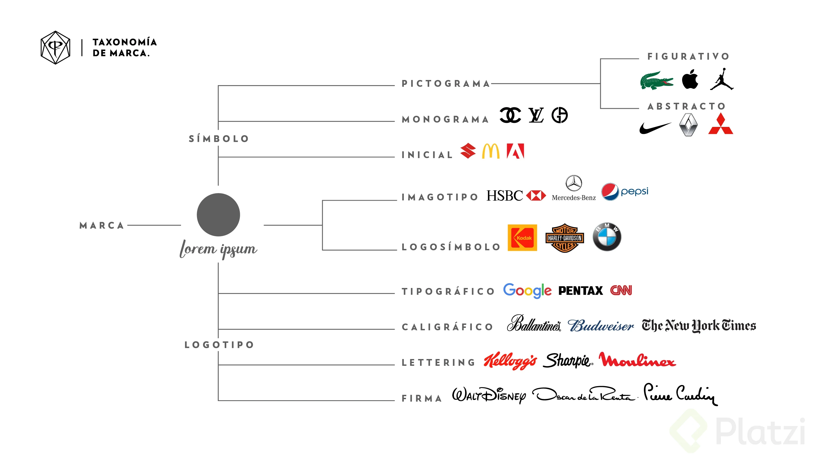

Aprende a diferenciar las especies en el ecosistema de la identidad visual:

| Formato | Definición Técnica | En confianza |
| --- | --- | --- |
| **Logotipo** | Representación tipográfica pura (texto). | Es el nombre de la marca con su propia "letra". |
| **Isotipo** | Símbolo o icono visual sin rastro de texto. | Es el dibujo que te dice quién es la marca sin hablar. |
| **Imagotipo** | Texto e icono que conviven pero están separados. | Son compañeros de piso; se llevan bien pero pueden vivir solos. |
| **Isologo** | Texto e icono fundidos en una sola pieza indivisible. | Es un todo-en-uno; si los separas, se rompe la identidad. |

---

### 🚀 Tu Primer Reto Visual

Te invito a abrir los ojos como nunca antes. Esta semana, mientras navegas por internet, caminas por la calle o hojeas una revista, **busca y captura (con tu celular o tu mirada)**:

- Un isotipo que te hable sin palabras (Pura potencia visual sin letras).
- Un logotipo que adore su tipografía (Tipografía con personalidad propia).
- Un imagotipo donde texto e icono convivan en armonía (Icono y texto que se llevan bien pero no se mezclan).
- Un isologo donde ambos sean uno solo (Donde el texto y el icono son uno solo).

Guarda estas imágenes. En nuestra próxima sesión, las analizaremos y verás cómo la teoría cobra vida.

---

## El Diseño Gráfico: Cuando la Función y la Forma se Dan la Mano

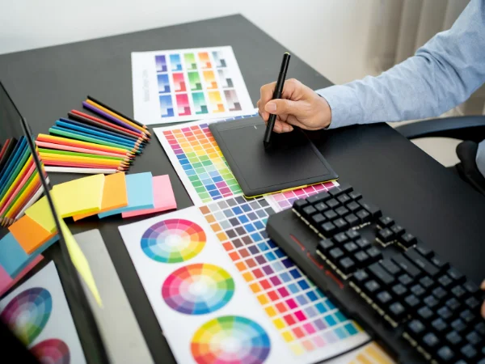

Hoy vamos un paso más allá: vamos a entender **qué es el diseño en su esencia** y cómo el diseño gráfico se convierte en la voz de esa intención. Olvida por un momento los píxeles y los vectores; hoy hablamos de filosofía aplicada.

---

### El Diseño: La Raíz de Todo

**Definición técnica:**  
El diseño es el **proceso de planificación y toma de decisiones** para crear un producto o servicio que resuelva un problema identificado.

**En cristiano:**  
El diseño no es hacer cosas bonitas. Es **hacer cosas que funcionen**. Imagina que eres un arquitecto: primero te aseguras de que la casa no se caiga (función), luego te preocupas por el color de las paredes (estética). El orden es sagrado.

**El error clásico:**  
Un cliente te pide un logo nuevo. Tú, emocionado, creas una obra maestra llena de detalles y efectos. El cliente lo rechaza. ¿Por qué? Porque su problema real era que el logo antiguo era demasiado complejo y difícil de recordar. **Saltaste a la solución sin definir el problema.**  
*La lección:* Un diseño hermoso que no cumple su objetivo es solo un adorno caro.

---

### El Diseño Gráfico: El Traductor Visual

El American Institute of Graphic Arts lo define como *“el arte y la práctica de planificar y proyectar ideas y experiencias con contenido visual y textual”*.

En otras palabras, es **el puente entre una idea abstracta y la mente de tu público**. No es arte por el arte; es comunicación estratégica.

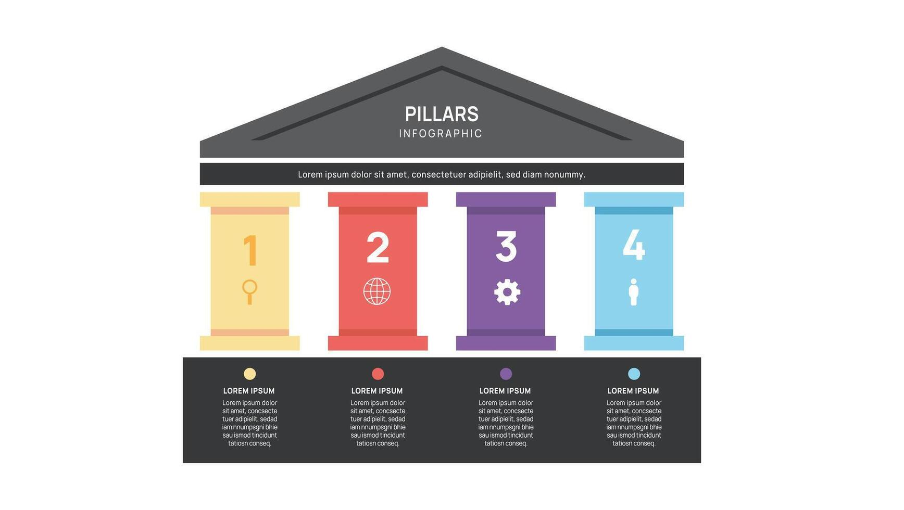

**Los 4 Pilares Irrenunciables del Diseño Gráfico:**

1.  **Cumple un objetivo.** Siempre. Antes del primer boceto, pregúntate: *¿Qué quiero que logre esta pieza?*
2.  **Habla a un público específico.** Un mensaje para adolescentes no se comunica igual que uno para CEOs. Conoce a tu audiencia como a un amigo.
3.  **Comunica un mensaje.** Siempre. Ya sea “compra esto”, “cree en esto” o “haz esto”. Cada color, cada línea, cada fuente está al servicio de esa idea.
4.  **Es funcional.** La estética es su ropa, la funcionalidad es su esqueleto. Si no es útil, no es diseño gráfico.

---

### El Mapa de la Profesión: ¿Dónde Puedes Especializarte?

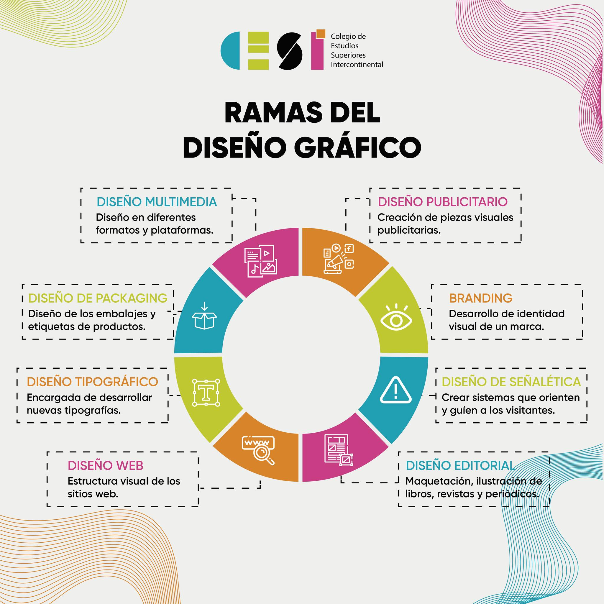

El diseño gráfico es un árbol con muchas ramas. Estas son las principales, para que sepas por dónde camina la industria.

#### a) Diseño Publicitario
*   **Qué es:** La creación de mensajes visuales para **promover** una marca, producto o servicio.
*   **Dónde vive:** Desde el cartel de la parada de autobús hasta el anuncio en tu feed de Instagram. Es diseño con un llamado a la acción claro.
*   **Tu misión:** Captar la atención en segundos y generar deseo.

#### b) Diseño de Identidad e Imagen Corporativa
*   **Qué es:** Construir y gestionar la **personalidad visual** de una marca.
*   **Dónde vive:** En su logotipo, su paleta de colores, su tipografía, y en cómo todo esto se aplica coherentemente en su web, oficinas, uniformes y redes sociales.
*   **Tu misión:** Crear un rostro reconocible y confiable para la marca. Que la gente sienta algo cuando la vea.

#### c) Diseño de Packaging (Envase)
*   **Qué es:** Diseñar la **cáscara** del producto. El primer contacto físico que tiene el consumidor con él.
*   **Dónde vive:** En el estante de una tienda o en la puerta de tu casa cuando pides algo online.
*   **Tu misión:** Proteger el producto, contener información crucial y, sobre todo, **seducir desde la estantería**. Un buen packaging cuenta la historia de la marca antes de que se abra la caja.

#### d) Diseño Editorial
*   **Qué es:** La arquitectura de la **página**. Organizar texto e imágenes para que sean legibles, jerárquicos y hermosos.
*   **Dónde vive:** En libros, revistas, periódicos, e-books y reportes digitales.
*   **Tu misión:** Guiar al lector en un viaje sin tropiezos. Que la lectura sea una experiencia placentera, no un laberinto.

#### e) Diseño de Interfaces (UI - User Interface)
*   **Qué es:** Diseñar la **pantalla** con la que las personas interactúan.
*   **Dónde vive:** En aplicaciones móviles, sitios web, programas de software, kioskos interactivos.
*   **Tu misión:** Hacer que la navegación sea **intuitiva, clara y eficiente**. Que el usuario logre lo que quiere sin tener que pensar cómo.

---

### 🧠 La Dualidad Perfecta

Guarda esto en tu cabeza:
1.  **Función primero, forma después.** Resuelve el problema, luego hazlo bello.
2.  **El diseño gráfico es un servicio, no un cuadro.** Su valor está en el mensaje que transmite y la acción que provoca.
3.  **Elige tu camino.** Ahora conoces las principales especialidades. Prueba, explora y descubre cuál se alinea con tu forma de pensar.

---

### 🔍 Tu Reto de Observación Crítica

Esta semana, activa tu **mirada de diseñador**. Tu tarea es cazar dos ejemplos en la vida real:

1.  **Algo funcional pero NO estético.** Un objeto, cartel o interfaz que cumpla su trabajo, pero sea visualmente descuidado, confuso o feo. *(Ejemplo: una web gubernamental antigua con toda la información, pero un caos total).*
2.  **Algo estético pero NO funcional.** Algo hermoso a la vista, pero que falle en su propósito básico. *(Ejemplo: una botella de agua con una forma tan artística que no cabe en el portavasos del auto).*

**Tómales una foto o haz un screenshot.** Analiza: ¿por qué falla? ¿Qué cambiarías? Este ejercicio entrenará tu ojo para nunca separar la función de la forma.

---

## Composición: El Arte de Orquestar la Mirada

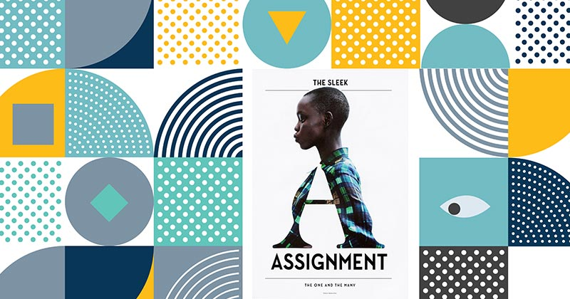

Has aprendido las palabras del vocabulario visual. Ahora es momento de aprender a formar frases con poder. Bienvenido a la **composición**: la ciencia y el arte de organizar elementos dentro de un espacio para contar una historia, guiar una emoción y comunicar con claridad absoluta.

Piensa en la composición como la dirección de orquesta de tu diseño. No se trata de que cada instrumento (elemento) suene fuerte, sino de que suenen **juntos**, en el momento preciso, para crear algo mayor que la suma de sus partes.

---

### Composición Gráfica: El Mapa del Tesoro Visual

Es la disposición estratégica de todos los elementos no textuales: imágenes, iconos, formas, colores. Su objetivo es crear un camino visual que el ojo siga **sin esfuerzo**.

#### a) La Percepción Visual: Tu Primer Filtro

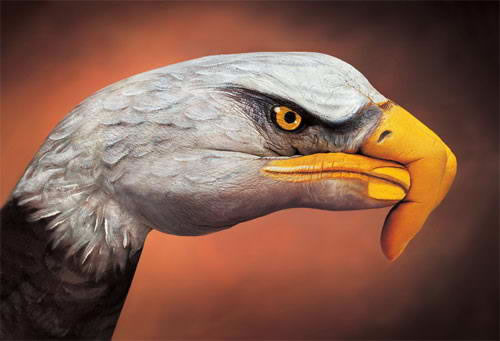

**Definición técnica:**  
Es la capacidad cerebral de interpretar la información que recibimos a través de los ojos.

**En cristiano:**  
No vemos con los ojos, vemos con el **cerebro**. El diseño no es lo que tú pones en la página, es lo que el cerebro del espectador **interpreta**. Tu trabajo es diseñar teniendo en cuenta ese procesamiento.

#### b) El Balance o Equilibrio Visual: La Sensación de Estabilidad

**Definición técnica:**  
Se logra cuando el peso visual de los elementos se distribuye de manera uniforme en el espacio.

**En cristiano:**  
Es como colocar objetos en una balanza. No tiene que ser simétrico (balance simétrico), puede ser asimétrico pero igualmente equilibrado. Un elemento grande y oscuro a la izquierda puede equilibrarse con varios elementos pequeños y vibrantes a la derecha. Si tu diseño se "siente" inclinado o pesado en un lado, has perdido el balance.

#### c) La Teoría de la Gestalt: La Magia de la Simplicidad

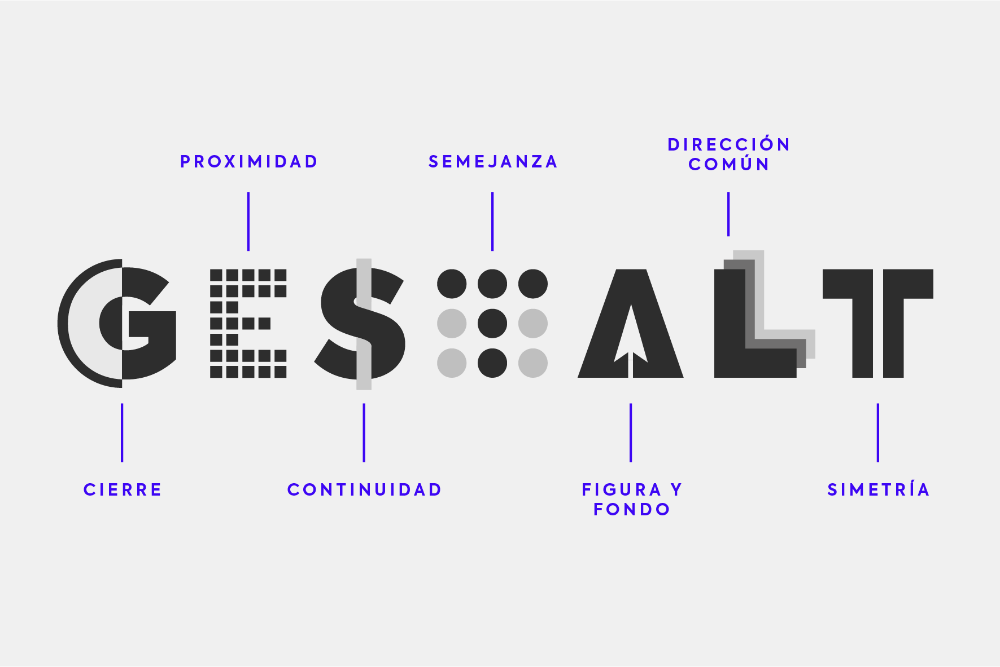

**La premisa fundamental:**  
**"El todo es más que la suma de sus partes".**

**En cristiano:**  
Nuestro cerebro es un buscador de patrones por naturaleza. Agrupa automáticamente lo que ve para simplificar y entender. No vemos manchas de color sueltas; vemos una cara. No vemos líneas separadas; vemos un cuadrado.

Esta teoría psicológica es tu **superpoder secreto**. Con sus leyes (que exploraremos en profundidad mas adelante en el curso), puedes predecir y dirigir cómo se organizará la información en la mente de tu espectador. **El buen diseño juega con estas reglas cerebrales.**

---

### Composición de Texto: La Arquitectura de la Lectura

Si la composición gráfica guía la mirada, la composición de texto guía la **lectura**. Es la disciplina de hacer que las palabras no solo se lean, sino que se **experimenten**.

#### a) La Selección Tipográfica: Elegir la Voz Correcta

No todas las fuentes dicen lo mismo. Su personalidad debe alinearse con tu mensaje. Conoce a las cuatro familias esenciales:

| Familia | También Conocida Como | Apariencia | Personalidad y Uso Común |
| :--- | :--- | :--- | :--- |
| **Serif** | Romanas o con remate | Pequeñas líneas o "pies" al final de los trazos. | **Clásica, formal, confiable.** Ideal para textos largos (libros, periódicos), marquesinas de lujo o instituciones tradicionales. *Ej: Times New Roman.* |
| **Sans Serif** | Palo seco | Trazos limpios, sin remates. | **Moderno, minimalista, neutral, legible.** Rey de la web, interfaces, logotipos modernos y cualquier lugar que busque claridad. *Ej: Arial, Helvetica.* |
| **Script** | Manuscrita o Itálica | Imita la caligrafía o escritura a mano. | **Elegante, personal, emocional, creativo.** Perfecta para invitaciones, logotipos de boutique o para añadir un toque humano. *Ej: Brush Script.* |
| **Display** | Decorativa o Fantasía | Alta personalidad, formas únicas. | **Expresiva, llamativa, temática.** Se usa para titulares, carteles o logotipos muy distintivos. Nunca para bloques de texto largo. *Ej: fuentes con efecto 3D, retro, etc.* |

#### b) Los Espacios que Hablan: Margen, Interletrado e Interlineado

*   **El Margen:** Es el **aire** que rodea tu bloque de texto. Un margen generoso da elegancia y claridad; uno estrecho crea tensión e intensidad. Es el marco de tu pintura verbal.
*   **El Interletrado (Kerning/Tracking):** Es la distancia **entre letras**. Un ajuste fino evita que las letras se amontonen ("AVA" puede parecer "AVA") o se vean desconectadas. Es como ajustar la cercanía entre las personas en una foto grupal.
*   **El Interlineado (Leading):** Es la distancia **entre líneas de texto**. Un interlineado demasiado ajustado sofoca y dificulta la lectura; uno demasiado amplio desconecta las ideas. Es el ritmo respiratorio de tu párrafo.

---

### 🧠 El Poder de la Estructura

Hoy has aprendido que:
1.  **La composición es dirección.** Tu trabajo es ser el guía de la experiencia visual del espectador.
2.  **La mente es tu aliada.** Principios como el balance y las leyes de Gestalt te permiten diseñar *con* el cerebro, no contra él.
3.  **La tipografía tiene voz.** Elegir una fuente no es un capricho estético; es elegir el tono con el que tu mensaje será "escuchado".
4.  **Los espacios son elementos activos.** El aire alrededor y dentro del texto es tan importante como las letras mismas.

---

### ✍️ Tu Reto de Tipografía Expresiva

Es hora de poner en práctica el poder de la palabra visual.

**Tu misión:**  
Crea una **composición de texto única** que utilice las **cuatro familias tipográficas** (Serif, Sans Serif, Script, Display) en una sola pieza.

**Ejercicio de inspiración:**  
Diseña un **póster para un festival de cine imaginario** llamado "Ecléctico". Usa:
- **Display** para el título principal ("ECLÉCTICO").
- **Serif** para los títulos de las secciones ("Sección Oficial", "Cine Independiente").
- **Sans Serif** para toda la información práctica (fechas, lugares, horarios).
- **Script** para una cita inspiradora sobre el cine.

**Las reglas:**  
Juega con los tamaños, el balance, los espacios (márgenes, interlineado) y la alineación. No uses imágenes. Que la tipografía sea la protagonista absoluta. ¿Qué emociones y jerarquías puedes crear solo con letras?

Guarda tu diseño. Este ejercicio entrenará tu ojo para ver la tipografía como la herramienta expresiva y estructural que es.

Más adelante en el curso nos adentraremos en las **leyes de la Gestalt** y descubrirás los atajos mentales que harán que tus diseños sean inmediatamente comprensibles e irresistibles.

